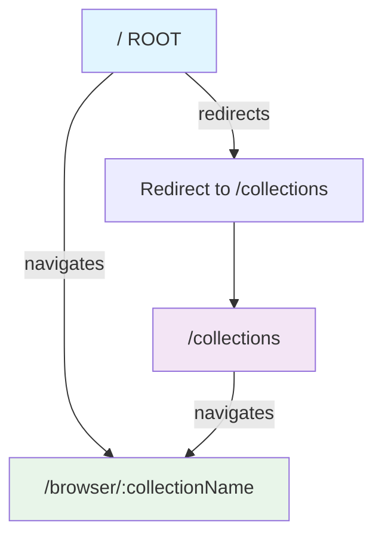
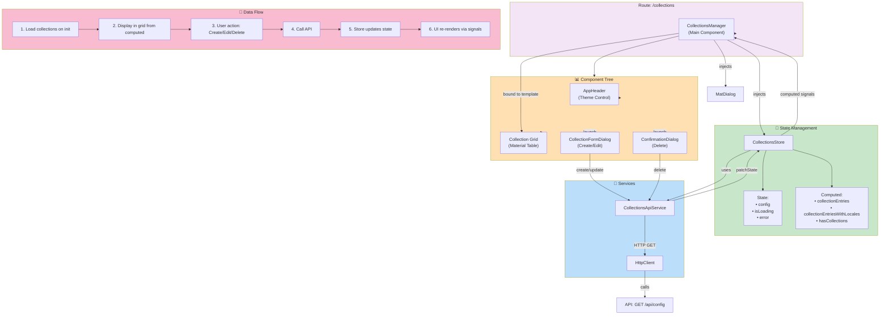
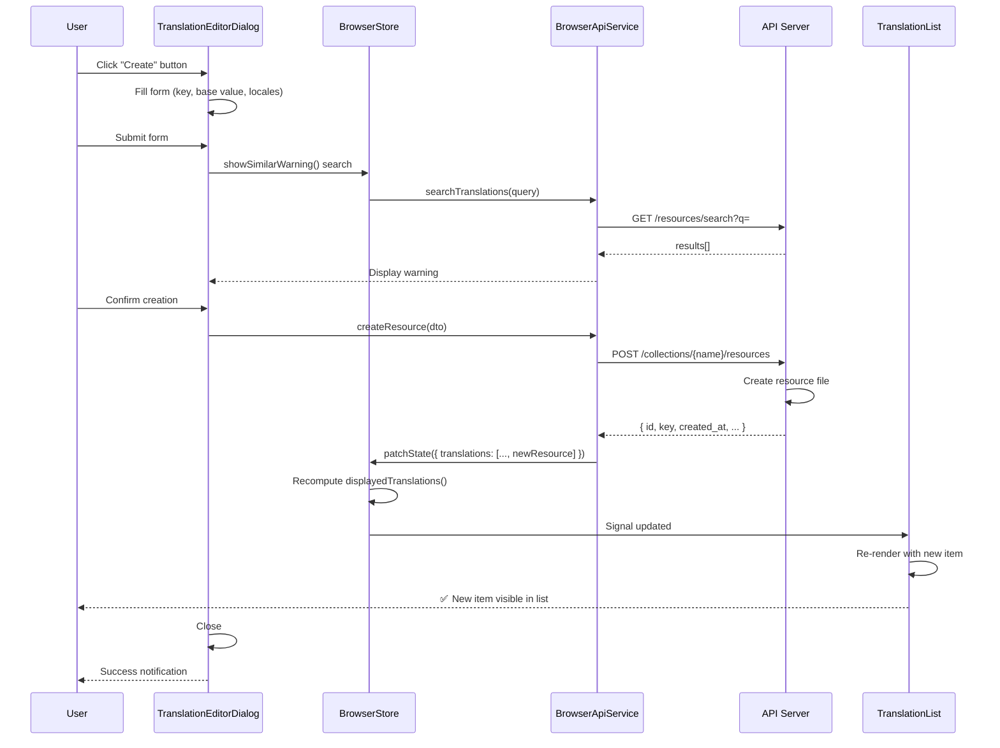
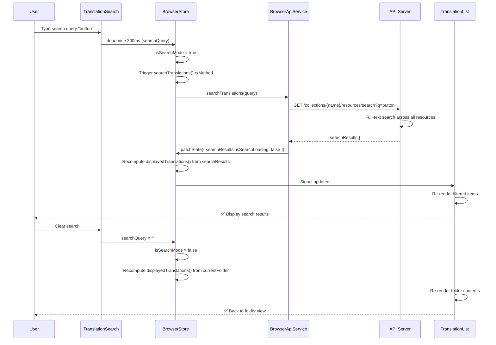
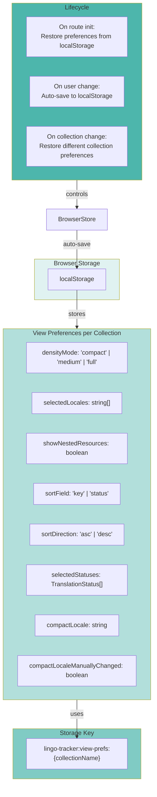

# Angular Routing & Data Flow

## Route Structure



## Route: /collections - Collections Manager



## Route: /browser/:collectionName - Translation Browser

```mermaid
graph TB
    subgraph Route["Route: /browser/:collectionName"]
        COMPONENT["TranslationBrowser<br/>(Master-Detail Layout)"]
    end

    subgraph DataStore["🏪 State Management"]
        COLLECTIONS_STORE["CollectionsStore"]
        BROWSER_STORE["BrowserStore"]
        BROWSER_STATE["Browser State:<br/>• selectedCollection<br/>• currentFolderPath<br/>• translations[]<br/>• searchQuery<br/>• densityMode<br/>• selectedLocales<br/>• selectedStatuses<br/>... (60+ properties)"]
        BROWSER_COMPUTED["Computed:<br/>• breadcrumbs()<br/>• filteredFolders()<br/>• sortedTranslations()<br/>• displayedTranslations()<br/>• isCacheReady()<br/>• translationCount()"]
    end

    subgraph Services["🔌 Services"]
        BROWSER_API["BrowserApiService"]
        COLLECTIONS_API["CollectionsApiService"]
        HTTP["HttpClient"]
        LOCAL_STORAGE["localStorage<br/>(View Prefs)"]
    end

    subgraph Initialization["🚀 Initialization (OnInit)"]
        STEP1["1. Extract collectionName from route"]
        STEP2["2. Load collection config from CollectionsStore"]
        STEP3["3. Restore view preferences from localStorage"]
        STEP4["4. Initialize BrowserStore with collection"]
        STEP5["5. Load root folders"]
        STEP6["6. Trigger cache status check"]
    end

    subgraph Sidebar["📁 Sidebar Components"]
        HEADER["SidebarHeader"]
        SEARCH["TranslationSearch<br/>(Global search input)"]
        FOLDER_TREE["FolderTree<br/>(Hierarchical navigation)"]
        LOCALE_FILTER["LocaleFilter<br/>(Multi-select locales)"]
        STATUS_FILTER["StatusFilter<br/>(Filter by status)"]
    end

    subgraph MainContent["📝 Main Content Components"]
        MAIN_HEADER["TranslationMainHeader<br/>(Breadcrumb, controls)"]
        LIST["TranslationList<br/>(Virtual scrolled list)"]
        ITEMS["TranslationItem[]"]
    end

    subgraph DataLoadingFlow["📡 Data Loading Patterns"]
        PATTERN1["Pattern 1: Folder Navigation<br/>User clicks folder → loadFolderChildren()<br/>→ API: GET /resources/tree?path=<br/>→ Update translations[] → Display"]

        PATTERN2["Pattern 2: Search<br/>User types search → searchTranslations(query)<br/>→ API: GET /resources/search?q=<br/>→ isSearchMode = true<br/>→ Display searchResults[]"]

        PATTERN3["Pattern 3: Filter<br/>User selects filter → setSelectedLocales/Statuses()<br/>→ filteredFolders() recomputes<br/>→ displayedTranslations() filtered → Display"]

        PATTERN4["Pattern 4: Edit/Create<br/>User opens dialog → TranslationEditorDialog<br/>→ similarResourcesWarning searches<br/>→ Submit → API: POST/PATCH /resources<br/>→ patchState BrowserStore<br/>→ Display updates via signals"]
    end

    Route --> COMPONENT
    COMPONENT -->|injects| COLLECTIONS_STORE
    COMPONENT -->|injects| BROWSER_STORE
    COMPONENT -->|effect| STEP1

    STEP1 --> STEP2
    STEP2 --> STEP3
    STEP3 --> STEP4
    STEP4 --> STEP5
    STEP5 --> STEP6

    BROWSER_STORE --> BROWSER_STATE
    BROWSER_STORE --> BROWSER_COMPUTED
    BROWSER_STORE -->|uses| BROWSER_API
    COLLECTIONS_STORE -->|uses| COLLECTIONS_API

    BROWSER_API -->|HTTP| HTTP
    COLLECTIONS_API -->|HTTP| HTTP
    BROWSER_STORE -->|auto-save| LOCAL_STORAGE
    LOCAL_STORAGE -->|auto-restore| BROWSER_STORE

    COMPONENT --> Sidebar
    COMPONENT --> MainContent

    Sidebar --> SEARCH
    Sidebar --> FOLDER_TREE
    Sidebar --> LOCALE_FILTER
    Sidebar --> STATUS_FILTER

    MainContent --> MAIN_HEADER
    MainContent --> LIST
    LIST --> ITEMS

    SEARCH -->|updates| BROWSER_STORE
    FOLDER_TREE -->|selectFolder()| BROWSER_STORE
    LOCALE_FILTER -->|setSelectedLocales()| BROWSER_STORE
    STATUS_FILTER -->|setSelectedStatuses()| BROWSER_STORE

    BROWSER_COMPUTED -->|signals| ITEMS
    BROWSER_STATE -->|signals| LIST

    Sidebar -.->|uses| PATTERN1
    Sidebar -.->|uses| PATTERN2
    ITEMS -.->|uses| PATTERN3
    ITEMS -.->|uses| PATTERN4

    style Route fill:#e8f5e9
    style DataStore fill:#c8e6c9
    style Services fill:#bbdefb
    style Initialization fill:#fff9c4
    style Sidebar fill:#f1f8e9
    style MainContent fill:#fce4ec
    style DataLoadingFlow fill:#ede7f6
```

## Component Tree & Service Injection - Sidebar

```mermaid
graph TB
    BROWSER["TranslationBrowser<br/>(CollectionsStore, BrowserStore)"]

    SIDEBAR["Sidebar"]
    HEADER["SidebarHeader<br/>(BrowserStore)"]
    SEARCH["TranslationSearch<br/>(BrowserStore)"]
    FOLDER_TREE["FolderTree<br/>(BrowserStore)"]
    LOCALE_FILTER["LocaleFilter<br/>(BrowserStore)"]
    STATUS_FILTER["StatusFilter<br/>(BrowserStore)"]

    FOLDER_NODE["FolderNode (Recursive)<br/>(BrowserStore, emit select)"]
    INLINE_INPUT["InlineFolderInput<br/>(BrowserStore)"]

    BROWSER --> SIDEBAR
    SIDEBAR --> HEADER
    SIDEBAR --> SEARCH
    SIDEBAR --> FOLDER_TREE
    SIDEBAR --> LOCALE_FILTER
    SIDEBAR --> STATUS_FILTER

    FOLDER_TREE --> FOLDER_NODE
    FOLDER_NODE -->|recursive| FOLDER_NODE
    FOLDER_NODE --> INLINE_INPUT

    %% Signal Bindings
    HEADER -->|reads| BREADCRUMBS["breadcrumbs()"]
    HEADER -->|reads| COLLECTION["selectedCollection"]

    SEARCH -->|reads| SEARCH_Q["searchQuery"]
    SEARCH -->|writes| "searchTranslations()"

    FOLDER_TREE -->|reads| FOLDERS["rootFolders"]
    FOLDER_TREE -->|reads| EXPANDED["expandedFolders"]
    FOLDER_TREE -->|reads| FILTER["folderTreeFilter"]
    FOLDER_TREE -->|writes| "selectFolder()"

    FOLDER_NODE -->|reads| CHILDREN["children (computed)"]
    FOLDER_NODE -->|reads| IS_SELECTED["isSelected (computed)"]
    FOLDER_NODE -->|emit| SELECT_EVENT["selectFolder()"]

    INLINE_INPUT -->|writes| "createFolder()"

    LOCALE_FILTER -->|reads| LOCALES["filteredLocales()"]
    LOCALE_FILTER -->|reads| SEL_LOC["selectedLocales"]
    LOCALE_FILTER -->|writes| "setSelectedLocales()"

    STATUS_FILTER -->|reads| SEL_STATUS["selectedStatuses"]
    STATUS_FILTER -->|writes| "setSelectedStatuses()"

    style BROWSER fill:#e8f5e9
    style SIDEBAR fill:#f1f8e9
    style FOLDER_TREE fill:#81c784
    style FOLDER_NODE fill:#66bb6a
    style HEADER fill:#a5d6a7
    style SEARCH fill:#c8e6c9
    style LOCALE_FILTER fill:#a1887f
    style STATUS_FILTER fill:#a1887f
```

## Component Tree & Service Injection - Main Content

```mermaid
graph TB
    BROWSER["TranslationBrowser<br/>(CollectionsStore, BrowserStore)"]

    MAIN_CONTENT["Main Content Area"]
    MAIN_HEADER["TranslationMainHeader"]
    LIST["TranslationList<br/>(BrowserStore, BrowserApiService)"]
    ITEM["TranslationItem<br/>(BrowserStore, MatDialog)"]

    ITEM_HEADER["ItemHeader<br/>(Display key, status)"]
    ITEM_LOCALES["ItemLocales<br/>(Display translations)"]
    ITEM_CONTROLS["ItemCompactControls<br/>(Action buttons)"]
    ITEM_ROLLUP["TranslationRollup<br/>(Aggregated locale state)"]

    DIALOGS["Dialogs (lazy-loaded)"]
    EDITOR_DIALOG["TranslationEditorDialog<br/>(Create/Edit, BrowserApiService)"]
    MOVE_DIALOG["MoveResourceDialog<br/>(BrowserApiService)"]
    CONFIRM_DIALOG["ConfirmationDialog<br/>(Delete confirmation)"]

    POPOVERS["Popovers (context menus)"]
    COMMENT_POPOVER["CommentPopover<br/>(View/edit comments)"]
    TAG_POPOVER["TagListPopover<br/>(View/edit tags)"]

    PIPES["Pipes"]
    HIGHLIGHT_PIPE["HighlightPipe<br/>(Search highlighting)"]
    TRUNCATE_PIPE["TruncateKeyPipe<br/>(Key truncation)"]

    UI_COMPONENTS["UI Components"]
    INDEXING_OVERLAY["IndexingOverlay<br/>(Full-screen loading)"]
    SEARCH_INPUT["SearchInput<br/>(Reusable search)"]
    TAG_LIST["TagList<br/>(Display tags)"]

    BROWSER --> MAIN_CONTENT
    MAIN_CONTENT --> MAIN_HEADER
    MAIN_CONTENT --> LIST

    LIST --> ITEM
    ITEM --> ITEM_HEADER
    ITEM --> ITEM_LOCALES
    ITEM --> ITEM_CONTROLS
    ITEM --> ITEM_ROLLUP

    ITEM -.->|launch| DIALOGS
    DIALOGS --> EDITOR_DIALOG
    DIALOGS --> MOVE_DIALOG
    DIALOGS --> CONFIRM_DIALOG

    ITEM_HEADER -.->|show| POPOVERS
    POPOVERS --> COMMENT_POPOVER
    POPOVERS --> TAG_POPOVER

    ITEM_HEADER -->|use| HIGHLIGHT_PIPE
    ITEM_HEADER -->|use| TRUNCATE_PIPE

    MAIN_CONTENT -.->|show| UI_COMPONENTS
    UI_COMPONENTS --> INDEXING_OVERLAY
    UI_COMPONENTS --> SEARCH_INPUT
    UI_COMPONENTS --> TAG_LIST

    %% Signal Bindings for List
    LIST -->|reads| DISPLAYED["displayedTranslations()"]
    LIST -->|reads| SORTED["sortedTranslations()"]
    LIST -->|reads| COUNT["translationCount"]
    LIST -->|reads| LOADING["isTranslationsLoading"]

    %% Signal Bindings for Items
    ITEM -->|reads| KEY["key"]
    ITEM -->|reads| BASE_VALUE["baseValue"]
    ITEM -->|reads| STATUS["status"]
    ITEM -->|reads| TRANSLATIONS["translations { [locale]: value }"]
    ITEM -->|reads| SEARCH_Q["searchQuery (for highlighting)"]
    ITEM -->|reads| COMPACT_LOCALE["compactLocale (single-locale mode)"]

    %% API Calls
    EDITOR_DIALOG -->|POST/PATCH| "BrowserApiService.createResource() / updateResource()"
    MOVE_DIALOG -->|PATCH| "BrowserApiService.moveResource()"
    CONFIRM_DIALOG -->|DELETE| "BrowserApiService.deleteResource()"

    %% State Updates
    "BrowserApiService calls" -->|patchState| "BrowserStore"
    "BrowserStore" -->|recompute| "displayedTranslations()"
    "displayedTranslations()" -->|signal| ITEM

    style BROWSER fill:#e8f5e9
    style MAIN_CONTENT fill:#fce4ec
    style LIST fill:#f48fb1
    style ITEM fill:#ec407a
    style ITEM_HEADER fill:#e91e63
    style ITEM_LOCALES fill:#ad1457
    style ITEM_CONTROLS fill:#c2185b
    style DIALOGS fill:#ede7f6
    style POPOVERS fill:#f3e5f5
    style PIPES fill:#fff9c4
    style UI_COMPONENTS fill:#e0f2f1
```

## State Update Flow - Creating a Translation



## State Update Flow - Searching Translations



## Storage & Persistence


