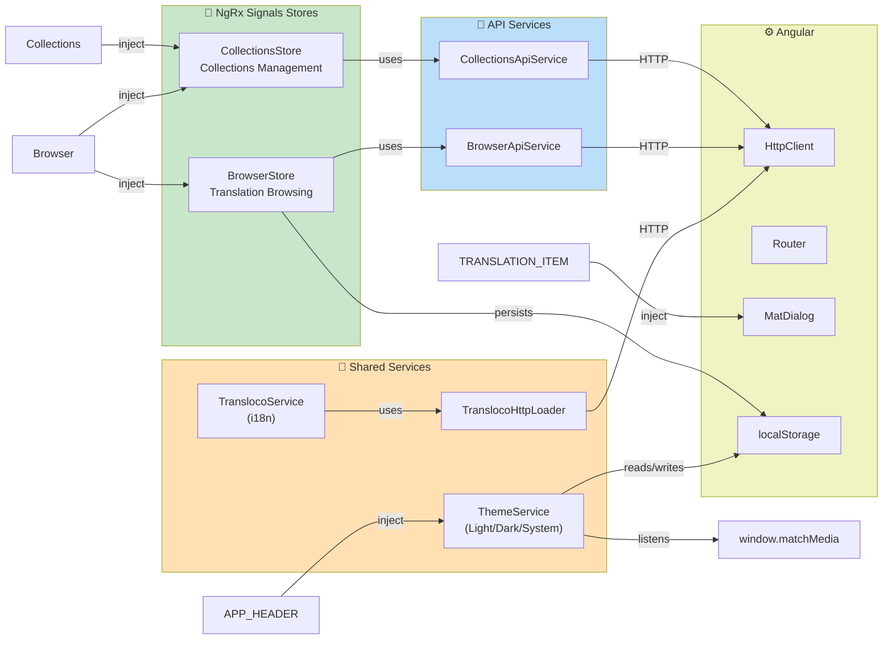
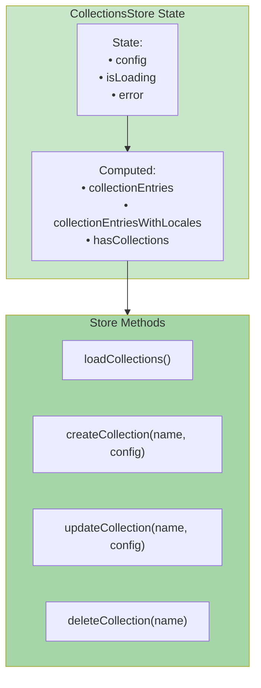
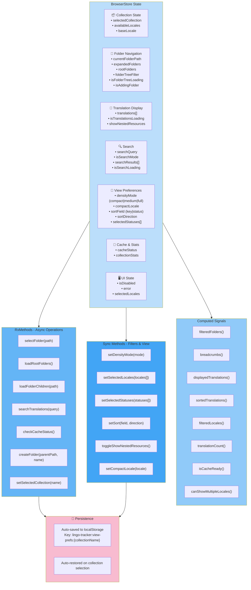
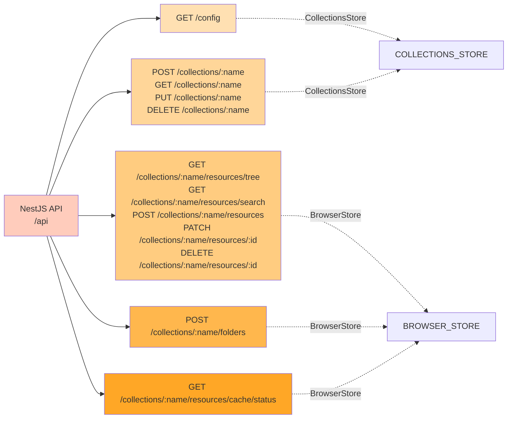

# Angular UI Architecture - Components & Services

## Component Hierarchy

```mermaid
graph TB
    subgraph App["🎯 Root Component"]
        ROOT["app.ts<br/>Router Outlet"]
    end

    subgraph Collections["📋 Collections Module"]
        COLLECTIONS_MGR["CollectionsManager"]
        COLLECTION_FORM["CollectionFormDialog"]
    end

    subgraph Header["🎨 Top Navigation"]
        APP_HEADER["AppHeader"]
        THEME_SWITCHER["Theme Control<br/>(Light/Dark/System)"]
    end

    subgraph Browser["🌐 Translation Browser"]
        BROWSER_ROOT["TranslationBrowser<br/>(Master-Detail Layout)"]

        subgraph Sidebar["📁 Sidebar"]
            SIDEBAR_HEADER["SidebarHeader"]
            FOLDER_TREE["FolderTree<br/>(Hierarchical Navigation)"]
            FOLDER_NODE["FolderNode<br/>(Recursive)"]
            INLINE_FOLDER_INPUT["InlineFolderInput<br/>(Create Folder)"]
            LOCALE_FILTER["LocaleFilter<br/>(Multi-select)"]
            STATUS_FILTER["StatusFilter<br/>(new/translated/stale/verified)"]
            TRANSLATION_SEARCH["TranslationSearch<br/>(Global Search)"]
        end

        subgraph MainContent["📝 Main Content"]
            MAIN_HEADER["TranslationMainHeader<br/>(Breadcrumb & Controls)"]
            TRANSLATION_LIST["TranslationList<br/>(Virtual Scrolled List)"]
            TRANSLATION_ITEM["TranslationItem"]
            ITEM_HEADER["ItemHeader<br/>(Key & Status)"]
            ITEM_LOCALES["ItemLocales<br/>(Translated Values)"]
            ITEM_CONTROLS["ItemCompactControls"]
            TRANSLATION_ROLLUP["TranslationRollup<br/>(Aggregated State)"]
        end

        subgraph Dialogs["💬 Modal Dialogs"]
            EDITOR_DIALOG["TranslationEditorDialog<br/>(Create/Edit)"]
            FOLDER_PICKER["FolderPicker"]
            SIMILAR_WARNING["SimilarResourcesWarning"]
            MOVE_DIALOG["MoveResourceDialog"]
            CONFIRM_DIALOG["ConfirmationDialog<br/>(Delete)"]
        end

        subgraph UIComponents["🔘 UI Components"]
            COMMENT_POPOVER["CommentPopover"]
            TAG_LIST_POPOVER["TagListPopover"]
            INDEXING_OVERLAY["IndexingOverlay<br/>(Loading State)"]
            SEARCH_INPUT["SearchInput"]
            TAG_LIST["TagList"]
        end
    end

    subgraph Pipes["🔄 Pipes"]
        HIGHLIGHT_PIPE["HighlightPipe<br/>(Search Highlighting)"]
        TRUNCATE_PIPE["TruncateKeyPipe<br/>(Key Truncation)"]
    end

    %% App Structure
    ROOT --> Collections
    ROOT --> Header
    ROOT --> Browser

    %% Header
    Header --> APP_HEADER
    APP_HEADER --> THEME_SWITCHER

    %% Collections
    Collections --> COLLECTIONS_MGR
    COLLECTIONS_MGR -.->|launch dialog| COLLECTION_FORM

    %% Browser Structure
    Browser --> BROWSER_ROOT
    BROWSER_ROOT --> Sidebar
    BROWSER_ROOT --> MainContent
    BROWSER_ROOT --> Dialogs
    BROWSER_ROOT --> UIComponents

    %% Sidebar Components
    Sidebar --> SIDEBAR_HEADER
    Sidebar --> FOLDER_TREE
    FOLDER_TREE --> FOLDER_NODE
    FOLDER_NODE -->|recursive| FOLDER_NODE
    FOLDER_NODE --> INLINE_FOLDER_INPUT
    Sidebar --> LOCALE_FILTER
    Sidebar --> STATUS_FILTER
    Sidebar --> TRANSLATION_SEARCH

    %% Main Content
    MainContent --> MAIN_HEADER
    MAIN_HEADER --> TRANSLATION_SEARCH
    MAIN_HEADER --> LOCALE_FILTER
    MAIN_HEADER --> STATUS_FILTER
    MainContent --> TRANSLATION_LIST
    TRANSLATION_LIST --> TRANSLATION_ITEM
    TRANSLATION_ITEM --> ITEM_HEADER
    TRANSLATION_ITEM --> ITEM_LOCALES
    TRANSLATION_ITEM --> ITEM_CONTROLS
    TRANSLATION_ITEM --> TRANSLATION_ROLLUP
    TRANSLATION_ITEM -->|pipes| HIGHLIGHT_PIPE
    TRANSLATION_ITEM -->|pipes| TRUNCATE_PIPE

    %% Dialogs
    TRANSLATION_ITEM -.->|launch| EDITOR_DIALOG
    TRANSLATION_ITEM -.->|launch| MOVE_DIALOG
    TRANSLATION_ITEM -.->|launch| CONFIRM_DIALOG
    EDITOR_DIALOG --> FOLDER_PICKER
    EDITOR_DIALOG --> SIMILAR_WARNING
    FOLDER_PICKER --> FOLDER_TREE

    %% UI Components
    TRANSLATION_ITEM -.->|popover| COMMENT_POPOVER
    TRANSLATION_ITEM -.->|popover| TAG_LIST_POPOVER
    UIComponents --> TAG_LIST
    Browser -.->|full screen| INDEXING_OVERLAY

    style App fill:#e1f5ff
    style Collections fill:#f3e5f5
    style Header fill:#fff3e0
    style Browser fill:#e8f5e9
    style Sidebar fill:#f1f8e9
    style MainContent fill:#fce4ec
    style Dialogs fill:#ede7f6
    style UIComponents fill:#e0f2f1
    style Pipes fill:#fff9c4
```

## Service Dependencies

## Store Architecture - CollectionsStore

## Store Architecture - BrowserStore

## API Endpoints Used by UI

