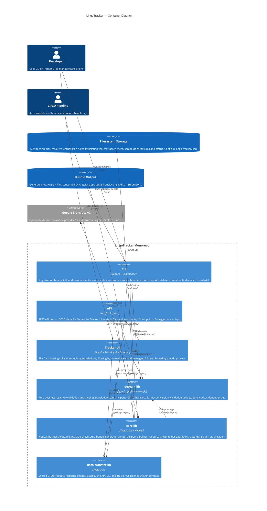

# LingoTracker Architecture

LingoTracker is a translation management system for projects using the [Transloco](https://jsverse.github.io/transloco/) Angular i18n library. It provides three complementary interfaces — a CLI, a REST API, and a web UI — for managing translation resources stored as Git-friendly JSON files, with metadata tracking, ICU format support, and automated staleness detection via MD5 checksums.

---

## Table of Contents

- [Container Diagram](#container-diagram)
- [Start Here](#start-here)
- [Spoke Documents](#spoke-documents)

---

## Container Diagram

<!-- C4 Level 2: major containers and their relationships -->



### Dependency Rules

The libraries form a strict one-way dependency graph:

```
apps (cli, api, tracker)
    └── data-transfer   (DTOs only — no logic)
    └── core            (Node.js logic)
            └── domain  (pure logic — browser-safe, no Node.js)
```

`domain` has zero Node.js dependencies and is safe to import in the browser. `core` depends on `domain` but never the reverse. Apps depend on both; `data-transfer` is leaf-level with no dependencies on `core` or `domain`.

---

## Start Here

### For contributors

1. Read [`monorepo-structure.md`](monorepo-structure.md) to understand the directory layout and the strict one-way dependency graph between `domain`, `core`, and apps.
2. Read [`domain-and-data-model.md`](domain-and-data-model.md) to see how resource keys map to filesystem paths, the exact JSON schemas for `resource_entries.json` and `tracker_meta.json`, and how the translation status lifecycle works.
3. Skim [`cli.md`](cli.md) for the command inventory — the CLI is the fastest way to understand end-to-end flows.
4. Read [`core-library.md`](core-library.md) if you are touching bundle generation, import/export, or checksum staleness detection.

### For users / integrators

1. Start with [`cli.md`](cli.md) for the full command reference.
2. Read [`api.md`](api.md) if you are integrating programmatically via the REST API.
3. Read [`domain-and-data-model.md`](domain-and-data-model.md) if you need to understand the JSON file structure on disk.

### For AI agents

1. Load [`glossary.md`](glossary.md) first — it defines every domain term used across all other documents.
2. Load [`domain-and-data-model.md`](domain-and-data-model.md) for the exact file schemas.
3. Load the spoke doc most relevant to the task (e.g. [`core-library.md`](core-library.md) for file I/O tasks, [`frontend.md`](frontend.md) for Angular UI work).
4. The dependency rule is: `domain` (browser-safe) → `core` (Node.js) → `apps`. Never add Node.js imports to `domain`. Never import `core` from `domain`.

---

## Spoke Documents

| Document | Status | Description |
|---|---|---|
| [`glossary.md`](glossary.md) | Available | Alphabetical definitions of every domain term used across all documents. Start here if any term is unfamiliar. |
| [`monorepo-structure.md`](monorepo-structure.md) | Available | Full directory tree, unidirectional dependency layer graph, library responsibilities and layer rules, and Nx workspace config highlights. |
| [`domain-and-data-model.md`](domain-and-data-model.md) | Available | Resource key anatomy, `resource_entries.json` and `tracker_meta.json` schemas with real examples, ER diagram, ICU vs Transloco format, translation status lifecycle, and checksum-driven staleness detection. |
| [`data-model.md`](data-model.md) | Placeholder | JSON schemas for `resource_entries.json`, `tracker_meta.json`, and `.lingo-tracker.json`. Includes annotated examples. |
| [`user-flows.md`](user-flows.md) | Available | End-to-end sequence diagrams and flowcharts for the six primary user flows: resource lifecycle, import/export, frontend browse-and-edit, search, drag-and-drop move, and cache indexing. |
| [`data-flows.md`](data-flows.md) | Placeholder | Sequence diagrams for import/export pipelines, bundle generation, and the checksum-based staleness detection flow. |
| [`apps-cli.md`](apps-cli.md) | Placeholder | Full CLI command inventory with options, interactive vs. non-interactive modes, and usage examples. |
| [`cli.md`](cli.md) | Available | CLI command table, interactive vs. non-interactive TTY decision flowchart, config loading and collection resolution flow, and shared utilities overview. |
| [`api.md`](api.md) | Available | REST API endpoint reference, NestJS module structure, mapper pattern, collection cache service, and Swagger location. |
| [`apps-tracker.md`](apps-tracker.md) | Placeholder | Angular UI architecture: route structure, NgRx Signal Store feature files, component hierarchy, and Transloco integration. |
| [`frontend.md`](frontend.md) | Available | Tracker UI deep-dive: component trees for both feature areas, BrowserStore feature composition diagram, store feature breakdown, virtual scrolling, optimistic updates, drag-and-drop, lazy dialogs, theming (light/dark/system, Material M2 watercolor palette), and Transloco typed-token integration. |
| [`libs-domain.md`](libs-domain.md) | Placeholder | Pure business logic library: resource key parsing and validation, status helpers, ICU-to-Transloco conversion, validation utilities. |
| [`core-library.md`](core-library.md) | Available | Node.js business logic library: module map, resource CRUD flows, normalization pipeline, auto-translation provider abstraction, import/export pipeline overview, and CI/CD validation. |
| [`bundle-generation.md`](bundle-generation.md) | Available | BundleDefinition schema, collection selection, entry filtering pipeline flowchart, ICU-to-Transloco conversion, per-locale JSON output, and type generation deep-dive. |
| [`libs-data-transfer.md`](libs-data-transfer.md) | Placeholder | DTOs and API contracts shared between the API, CLI, and Tracker UI. Describes each DTO family and the versioning strategy. |
| [`feature-matrix.md`](feature-matrix.md) | Available | Side-by-side comparison of which operations are available on CLI, REST API, and Tracker UI. Includes notable asymmetries (CLI-only, API-only, UI-only) and a full operation table. |
