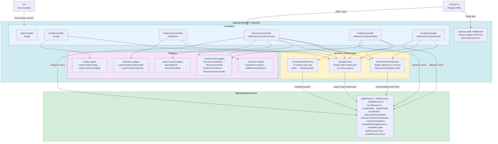
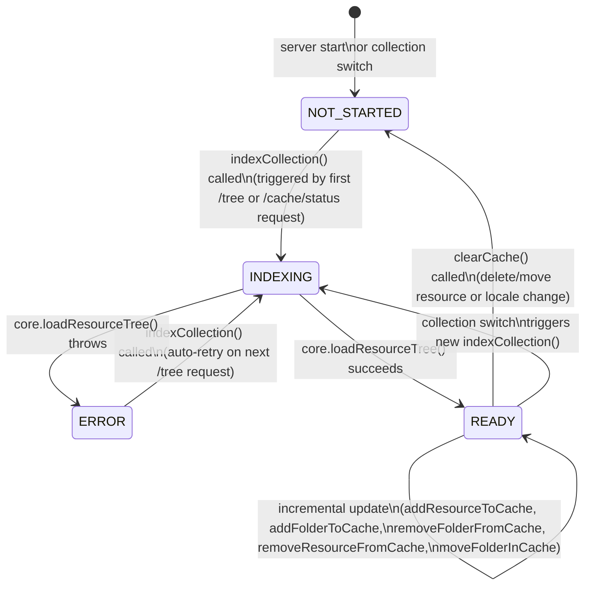
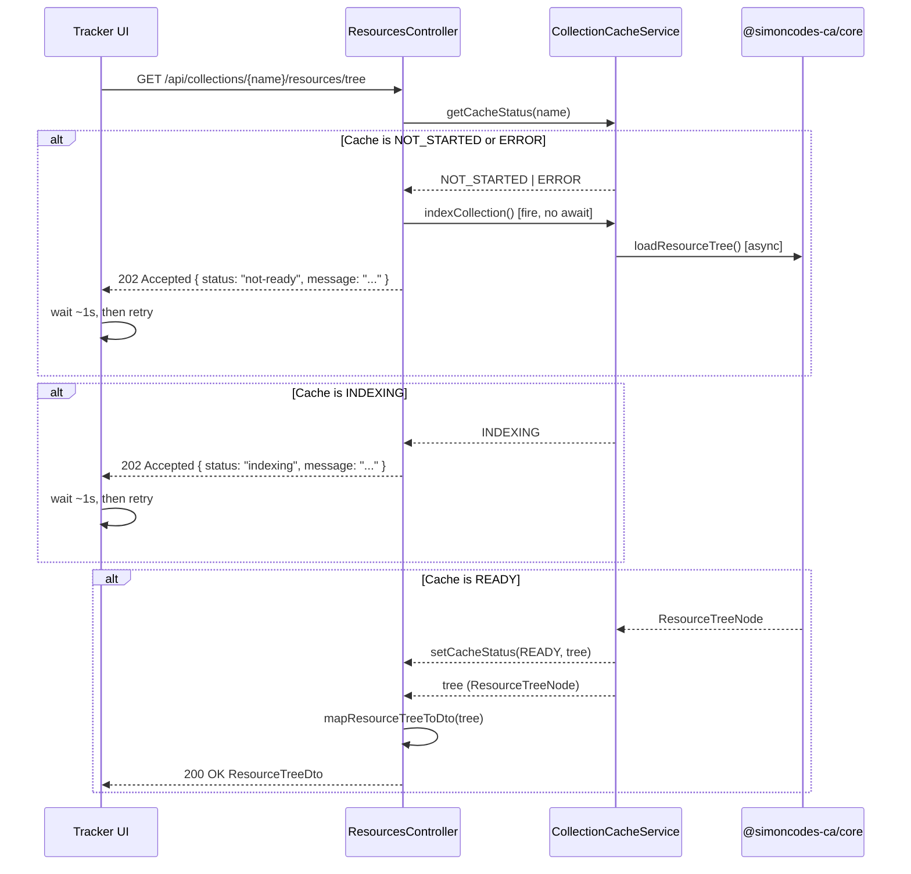
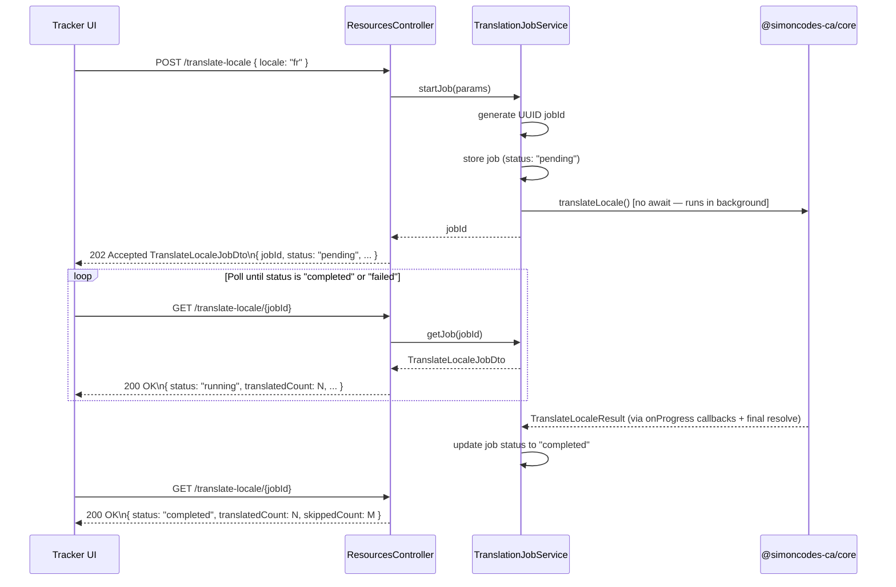

# REST API (`apps/api`)

The NestJS API is LingoTracker's HTTP interface. It exposes all translation management operations over REST, serves the Angular Tracker UI as static files from the same process, and owns two cross-cutting systems: a single-collection in-memory cache that makes the resource tree fast to browse, and an async job runner for long-running locale translation operations. All API routes are prefixed with `/api`; Swagger docs are available at `/api` when the server is running.

Return to [architecture README](README.md).

---

## Table of Contents

- [Endpoint Reference](#endpoint-reference)
- [Component Diagram](#component-diagram)
- [Static File Serving](#static-file-serving)
- [Collection Cache](#collection-cache)
  - [Single-Collection Design](#single-collection-design)
  - [Cache State Machine](#cache-state-machine)
  - [Incremental Updates vs Full Clear](#incremental-updates-vs-full-clear)
  - [Polling Flow from the Frontend](#polling-flow-from-the-frontend)
- [Translation Job System](#translation-job-system)
- [Mapper Layer](#mapper-layer)

---

## Endpoint Reference

All paths are relative to the `/api` global prefix. URL path parameters that contain collection names are URI-decoded inside each controller action to handle names with special characters.

### Health

| Method | Path | Purpose | Request DTO | Response DTO |
|--------|------|---------|-------------|--------------|
| `GET` | `/health` | Liveness check | — | `{ status: string }` |

### Config

| Method | Path | Purpose | Request DTO | Response DTO |
|--------|------|---------|-------------|--------------|
| `GET` | `/config` | Read global config and all collection configs | — | `LingoTrackerConfigDto` |

### Collections

| Method | Path | Purpose | Request DTO | Response DTO |
|--------|------|---------|-------------|--------------|
| `POST` | `/collections` | Create a new [collection](glossary.md#collection) | `CreateCollectionDto` | `{ message: string }` |
| `PUT` | `/collections/:collectionName` | Update a collection's name or settings | `UpdateCollectionDto` | `{ message: string }` |
| `DELETE` | `/collections/:collectionName` | Delete a collection and its config entry | — | `{ message: string }` |

### Resources

| Method | Path | Purpose | Request DTO | Response DTO |
|--------|------|---------|-------------|--------------|
| `POST` | `/collections/:collectionName/resources` | Create one or more [resources](glossary.md#resource) (batch-aware) | `CreateResourceDto \| CreateResourceDto[]` | `CreateResourceResponseDto` |
| `PATCH` | `/collections/:collectionName/resources` | Update a resource's base value, translations, comment, or tags | `UpdateResourceDto` | `UpdateResourceResponseDto` |
| `DELETE` | `/collections/:collectionName/resources` | Delete one or more resources by key | `DeleteResourceDto` | `DeleteResourceResponseDto` |
| `POST` | `/collections/:collectionName/resources/move` | Move or rename resources (single key or wildcard pattern, cross-collection supported) | `MoveResourceDto` | `MoveResourceResponseDto` |
| `POST` | `/collections/:collectionName/resources/translate` | Auto-translate a single resource via the configured provider | `TranslateResourceDto` | `TranslateResourceResponseDto` |
| `GET` | `/collections/:collectionName/resources/tree` | Fetch the resource [tree](glossary.md#resource-tree) (or subtree) from cache | query: `path`, `includeNested` | `ResourceTreeDto \| TreeStatusResponseDto` |
| `GET` | `/collections/:collectionName/resources/cache/status` | Poll the cache [indexing](glossary.md#indexing) state | — | `CacheStatusDto` |
| `GET` | `/collections/:collectionName/resources/search` | Full-text search across the collection | query: `SearchTranslationsDto` | `SearchResultsDto` |
| `POST` | `/collections/:collectionName/resources/translate-locale` | Fire-and-forget: start a bulk locale translation job | `TranslateLocaleRequestDto` | `TranslateLocaleJobDto` (202 Accepted) |
| `GET` | `/collections/:collectionName/resources/translate-locale/:jobId` | Poll a translation job by ID | — | `TranslateLocaleJobDto` |

### Folders

| Method | Path | Purpose | Request DTO | Response DTO |
|--------|------|---------|-------------|--------------|
| `POST` | `/collections/:collectionName/folders` | Create a [folder](glossary.md#folder) (incremental cache update) | `CreateFolderDto` | `CreateFolderResponseDto` |
| `DELETE` | `/collections/:collectionName/folders` | Delete a folder and all its contents (incremental cache update) | `DeleteFolderDto` | `DeleteFolderResponseDto` |
| `POST` | `/collections/:collectionName/folders/move` | Move a folder within or across collections | `MoveFolderDto` | `MoveFolderResponseDto` |

### Locales

| Method | Path | Purpose | Request DTO | Response DTO |
|--------|------|---------|-------------|--------------|
| `POST` | `/collections/:collectionName/locales` | Add a locale to a collection (clears cache) | `AddLocaleDto` | `AddLocaleResponseDto` |
| `DELETE` | `/collections/:collectionName/locales/:locale` | Remove a locale from a collection (clears cache) | — | `RemoveLocaleResponseDto` |

---

## Component Diagram

<!-- C4 Level 3: internal structure of the API process -->



Controllers are the only layer that knows HTTP. They resolve collection config from `ConfigService`, delegate business operations to `@simoncodes-ca/core` (see [core-library.md](core-library.md)), apply mappers at the boundary, and update `CollectionCacheService` incrementally after successful writes.

---

## Static File Serving

The Express server that backs NestJS is configured before NestJS routes are registered. The middleware registration order in `main.ts` is intentional:

1. `express.static(dist/tracker/browser)` — serves the Angular build output (JS bundles, assets) for any URL that matches a real file on disk.
2. A catch-all `GET {*splat}` handler — for any non-`/api` request that did not match a static file, sends `index.html` so the Angular router can handle client-side navigation.
3. NestJS routes under `/api` — registered last; the catch-all explicitly skips requests whose URL starts with `/api` via `next()`.

This means a single `node apps/api/main.js` process serves both the UI and the API with no reverse proxy required. The Angular SPA's `base href` and API client are both configured relative to the same origin.

---

## Collection Cache

### Single-Collection Design

`CollectionCacheService` holds at most one `CachedCollection` at a time, stored in a private field `#cachedCollection`. The constraint is intentional:

**Memory constraints.** A fully-loaded [resource tree](glossary.md#resource-tree) for a large collection (thousands of keys, multiple locales, full translation values and metadata) can be several megabytes of JavaScript heap. Caching multiple collections simultaneously would multiply this linearly with no benefit in the typical usage pattern.

**Typical single-collection usage pattern.** The Tracker UI exposes a collection selector, but users nearly always work within one collection at a time. Switching collections triggers a new cache build for the incoming collection — the outgoing collection's cache is discarded immediately when `setCacheStatus()` is called for a different collection name.

```typescript
// From CollectionCacheService.setCacheStatus()
if (this.#cachedCollection && this.#cachedCollection.collectionName !== collectionName) {
  this.#cachedCollection = null; // evict the previous collection
}
```

There is no LRU strategy or size limit — the single-slot design is the entire eviction policy.

### Cache State Machine

<!-- Cache state machine — CacheStatus enum values and transitions -->



State values are the string literals from the `CacheStatus` enum in `collection-cache.service.ts`:

| State | String value | Meaning |
|-------|-------------|---------|
| `NOT_STARTED` | `"not-started"` | No cache exists for this collection. Indexing has not been requested yet. |
| `INDEXING` | `"indexing"` | `core.loadResourceTree()` is running asynchronously. Read requests must wait. |
| `READY` | `"ready"` | Tree is in memory. Read requests are served instantly from `#cachedCollection.tree`. |
| `ERROR` | `"error"` | The last indexing attempt threw. The error message is stored in `#cachedCollection.error`. The next `/tree` or `/cache/status` request automatically re-triggers indexing. |

### Incremental Updates vs Full Cache Clear

After a successful write operation the cache is updated by one of two strategies:

**Incremental update** — for operations where the exact structural change is known and bounded. The controller calls a targeted method on `CollectionCacheService` that mutates only the affected subtree of `ResourceTreeNode` in memory, leaving the rest of the tree intact. The cache stays in `READY` state throughout.

| Cache method | Triggered by |
|---|---|
| `addResourceToCache()` | `POST /resources` (create), `PATCH /resources` (edit in-place or move-to-new-folder) |
| `removeResourceFromCache()` | `PATCH /resources` (when resource moves folder — removes from old location) |
| `addFolderToCache()` | `POST /folders` |
| `removeFolderFromCache()` | `DELETE /folders` |
| `moveFolderInCache()` | `POST /folders/move` (with `clearCache()` fallback if structural navigation fails) |

**Full cache clear** — for operations where the breadth of changes cannot be tracked in a single incremental call, or where correctness risk outweighs the cost of a re-index. `clearCache()` sets `#cachedCollection` to `null`, returning state to `NOT_STARTED`. The next request to `/tree` or `/cache/status` triggers a fresh `indexCollection()`.

| Operation | Why full clear |
|---|---|
| `DELETE /resources` | Keys may span multiple folders; tracking all removals is error-prone. |
| `POST /resources/move` | Wildcard pattern moves affect an unbounded set of folders. |
| `POST /locales` (add) | Every folder's `tracker_meta.json` gains a new locale entry; the cached tree would be stale everywhere. |
| `DELETE /locales/:locale` | Same — locale removal touches all metadata nodes. |

### Polling Flow from the Frontend

The Tracker UI polls the cache endpoints when it needs the resource tree. For the full sequence, see [user-flows.md — Cache Indexing Flow](user-flows.md#6-cache-indexing-flow). The protocol is:



A 202 Accepted response always means "retry shortly". A 200 OK carries the full or partial tree. The frontend is responsible for the retry loop; there is no server-sent event or WebSocket involved.

---

## Translation Job System

Bulk locale translation (`POST /resources/translate-locale`) can take seconds to minutes depending on collection size. The API uses a fire-and-forget async job pattern to avoid HTTP timeouts.



**Job lifecycle states:** `pending` → `running` → `completed` | `failed`. `TranslationJobService` stores jobs in a plain `Map<string, TranslationJob>` in process memory. Jobs are never evicted — this is appropriate for a single-user development tool. If the process restarts, all jobs are lost and the UI must re-issue any in-progress operations.

**Progress reporting.** `translateLocale()` in `@simoncodes-ca/core` accepts an `onProgress` callback. `TranslationJobService` subscribes to this callback and updates the in-memory job's `translatedCount`, `failedCount`, and `skippedCount` fields on each tick. Polling clients see live progress, not just a final result.

**Error handling.** If `translateLocale()` rejects with a `TranslationError` (API key issue, provider timeout) or any other error, the job transitions to `failed` and the `error` field is set. No retry is attempted. The UI can display the error and offer a manual re-trigger.

---

## Mapper Layer

The mapper layer enforces the boundary between `@simoncodes-ca/core`'s domain models and `@simoncodes-ca/data-transfer`'s DTOs. All transformation happens in `apps/api/src/app/mappers/`. No controller accesses a raw domain model object directly in its response, and no core function receives a DTO as its argument.

For the entity types that mappers transform, see [domain-and-data-model.md](domain-and-data-model.md).

| Mapper file | Direction | Key transformation |
|-------------|-----------|-------------------|
| `resource.mapper.ts` | `CreateResourceDto` → `AddResourceParams` | Flat field-for-field projection; adds `allLocales` when auto-translation is active |
| `resource-tree.mapper.ts` | `ResourceTreeNode` → `ResourceTreeDto` | Flattens `folderPathSegments[]` array to a dot-delimited `path` string; merges `source` (base locale value) into the `translations` record keyed by the base locale string; extracts per-locale `status` from the `metadata` record |
| `resource-tree.mapper.ts` | `ResourceTreeEntry` → `ResourceSummaryDto` | Identifies the base locale by the absence of `status` and `baseChecksum` in the metadata entry; produces a flat `{ key, translations, status, comment, tags }` shape |
| `collection.mapper.ts` | `LingoTrackerCollectionDto` ↔ `LingoTrackerCollection` | Bidirectional; shallow clone of `locales[]` array to prevent aliasing |
| `config.mapper.ts` | `LingoTrackerConfig` → `LingoTrackerConfigDto` | Delegates collection mapping to `collection.mapper`; shallow clone of `locales[]` |
| `search-result.mapper.ts` | `SearchResult` → `SearchResultDto` | Structurally identical types; mapper exists for explicit API boundary documentation |

**Why the base locale detection logic in `resource-tree.mapper.ts`?** The `ResourceTreeEntry` domain model stores the base locale value in a dedicated `source` field and tracks its metadata in the same `metadata` record as translations — distinguished by the absence of `status` and `baseChecksum` fields (the base locale has a checksum but no `baseChecksum` to compare against, and no `status` since it is never `new` or `stale` relative to itself). The DTO flattens this into a single `translations` map for simpler frontend consumption. The mapper performs this denormalization at the API boundary so the domain model stays clean.
