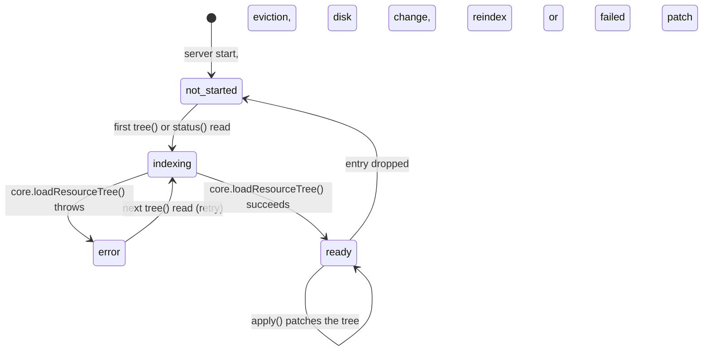
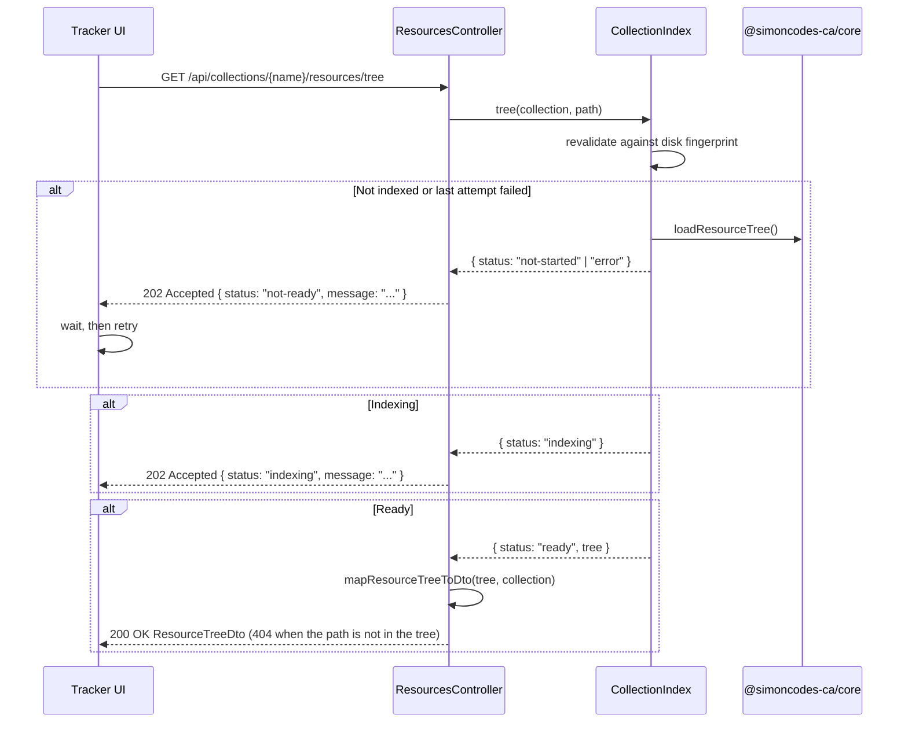
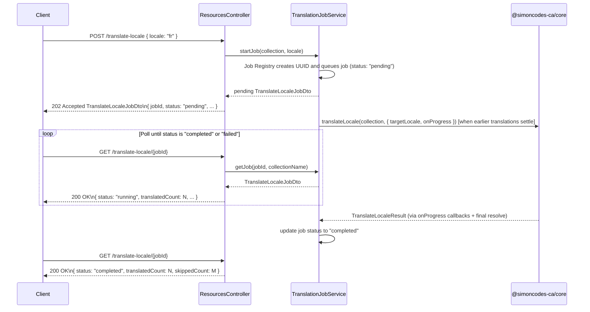

# REST API (`apps/api`)

The NestJS API is LingoTracker's HTTP interface. It exposes all translation management operations over REST, serves the Angular Tracker UI as static files from the same process, and owns two cross-cutting systems: an in-memory [Collection Index](glossary.md#collection-index) that makes the resource tree fast to browse, and the [Job Registry](glossary.md#job-registry) for long-running locale translation and bundle generation. All API routes are prefixed with `/api`; Swagger docs are available at `/api` when the server is running.

Return to [architecture README](README.md).

---

## Table of Contents

- [Endpoint Reference](#endpoint-reference)
- [Component Diagram](#component-diagram)
- [Error Mapping](#error-mapping)
- [Static File Serving](#static-file-serving)
- [Collection Index](#collection-index)
  - [Interface](#interface)
  - [Bounded Multi-Collection Design](#bounded-multi-collection-design)
  - [Index State Machine](#index-state-machine)
  - [Writes: Resource Mutations](#writes-resource-mutations)
  - [Polling Flow from the Frontend](#polling-flow-from-the-frontend)
- [Translation Job System](#translation-job-system)
- [Mapper Layer](#mapper-layer)

---

## Endpoint Reference

All paths are relative to the `/api` global prefix. Express decodes URL path parameters once before handlers run. Controllers use the resulting values verbatim, including names with percent signs. A malformed percent escape is rejected with 400 before a handler runs. Express also parses query values once; clients send plain values to their query encoder, including the resource tree's folder `path`.

### Health

| Method | Path | Purpose | Request DTO | Response DTO |
|--------|------|---------|-------------|--------------|
| `GET` | `/health` | Liveness check | — | `{ status: string }` |

### Config

| Method | Path | Purpose | Request DTO | Response DTO |
|--------|------|---------|-------------|--------------|
| `GET` | `/config` | Read global config and all collection configs, with protected terms resolved from their files. Also carries the preferred terminology rules, the rule file path, and any load error or missing-file warning. | — | `LingoTrackerConfigDto` |
| `PUT` | `/config` | Update the writable top-level globals: `protectedTerms` and `preferredTerminology`. Core [Project Terms Update](glossary.md#project-terms-update) validates both lists, writes each to its own file, and attempts to restore changed files after a failed write. A restore failure stays attached to the original error. `.lingo-tracker.json` stays untouched. `ConfigService` reads it for every request, and a changed snapshot is refused before term files are written. `preferredTerminology` is the full rule list. Invalid rules return `400` with per-row errors. `collections`, `locales`, and `baseLocale` stay excluded. | `UpdateConfigDto` | `{ message: string }` |

### Collections

| Method | Path | Purpose | Request DTO | Response DTO |
|--------|------|---------|-------------|--------------|
| `POST` | `/collections` | Create a new [collection](glossary.md#collection). Core validates its optional `protectedTerms` against the resulting `protectedTermsFile` before either file is written. A list without a file pointer is 400 with `Collection "<name>" has no protected terms file. Set a file path first.` A changed config since this request read it answers 409. | `CreateCollectionDto` | `{ message: string }` |
| `PUT` | `/collections/:collectionName` | Change a collection's settings, optionally renaming it via `name` (core `updateCollection`, through the [Collection Entry](glossary.md#collection-entry)). Patch semantics: a field present in `collection` replaces the stored value, and a field left out keeps its stored value, so a client that never sends `translation`, `exportFolder` or `importFolder` does not drop them. To clear a setting (the collection then inherits the global one), send its empty value: `tags: []`, `readOnly: false`, `locales: []` (inherit the global list, never "no locales"), and `''` for `exportFolder`, `importFolder`, `baseLocale` and `protectedTermsFile`; a value equal to the global one is also stored as inherited. `translation` cannot be cleared through `PUT` (it has no empty value): send a full block to replace it, `enabled: false` to switch auto-translation off, or remove the key from `.lingo-tracker.json`. `null` is never a value: any `collection` field set to `null` is 400. Core seeds the locale files for each added locale and purges each removed one (the base locale is never removed), then writes the config once. Core writes a `protectedTerms` array from the body to the resulting collection's terms file after it writes the config; a refused precondition changes neither file. A body without an object `collection`, a string `translationsFolder`, or with a blank `name` (`InvalidNameError`, core), or with a `null` field, is 400; an unknown collection 404; a rename onto a taken name 409; a collection with no `protectedTermsFile` 400 (`ProtectedTermsFileNotSetError`); a config changed after this request read it 409. | `UpdateCollectionDto` | `{ message: string }` |
| `DELETE` | `/collections/:collectionName` | Delete a collection and its explicit bundle references in one config write; 409 with bundle names if any explicit bundle would become empty; 409 if the config changed after this request read it | — | `{ message: string }` |

Core trims collection rename names and rejects blank targets with `InvalidNameError` (400). A non-string update `name` returns 400 with `name must be a string`. Create-time blank validation remains in the schema. A missing collection returns 404 before core validates a blank rename target.

Renaming a collection through `PUT` updates every explicit bundle reference in that same config write, preserving prefix, rules and order. If a bundle already references the new name, it returns 409 with the affected bundle names before any write. Bundles with `collections: 'All'` are unaffected. The Tracker collections manager shows the server's 409 message through `apiErrorMessage` when a delete is refused.

### Resources

| Method | Path | Purpose | Request DTO | Response DTO |
|--------|------|---------|-------------|--------------|
| `POST` | `/collections/:collectionName/resources` | Create one or more [resources](glossary.md#resource) through core [Resource Batches](glossary.md#resource-batches). Before writing, core refuses malformed keys and folder addresses, unknown locales, duplicate resolved keys within the batch, unreadable folder JSON, existing resolved keys and translation failures. An existing key answers 409 Conflict. It reads folders during preflight but does not create them or establish that a later filesystem write can succeed. Parent/child keys remain allowed at add time. Target locales without a supplied translation are seeded by the collection's rule ([locale seeding](glossary.md#locale-seeding)). The body has no `baseLocale`: the collection's base locale always applies. A translation in a locale the collection does not have answers 400. The response carries `terminology` (the advisory findings core returned for the stored base values, keyed by resource, and any rule-file problem; see [Project Terms](glossary.md#project-terms)) only when there is something to report. | `CreateResourceDto \| CreateResourceDto[]` | `CreateResourceResponseDto` |
| `PATCH` | `/collections/:collectionName/resources` | Update a resource's base value, translations, comment, or tags. `key` is the full, existing key; `moveTo` (a folder path, `''` for the root) moves the entry there, 409 when the destination already has that entry key. When the body supplies a `baseValue`, the response carries `terminology` (findings and rule-file problems from the [Project Terms](glossary.md#project-terms)) if there is something to report. | `UpdateResourceDto` | `UpdateResourceResponseDto` |
| `DELETE` | `/collections/:collectionName/resources` | Delete one or more resources by key | `DeleteResourceDto` | `DeleteResourceResponseDto` |
| `POST` | `/collections/:collectionName/resources/move` | Move or rename resources (single key or wildcard pattern, cross-collection supported). Core reports a missing or read-only destination per operation and continues | `MoveResourceDto` | `MoveResourceResponseDto` |
| `POST` | `/collections/:collectionName/resources/translate` | Auto-translate a single resource through the [Translator](glossary.md#translator) (422 when the collection has auto-translation off). Values are stored in ICU format; `skippedLocales` lists the locales it did not store (complex ICU, a lost placeholder, a dropped protected term, or a value changed on disk during the provider call). `translatedCount` counts written locales, and the resource reflects fresh disk state | `TranslateResourceDto` | `TranslateResourceResponseDto` |
| `GET` | `/collections/:collectionName/resources/tree` | Fetch the resource [tree](glossary.md#resource-tree) (or subtree) from the Collection Index | query: `path`, `includeNested` | `ResourceTreeDto \| TreeStatusResponseDto` |
| `GET` | `/collections/:collectionName/resources/cache/status` | Poll the [Collection Index](glossary.md#collection-index) state (starts indexing) | — | `CacheStatusDto` |
| `GET` | `/collections/:collectionName/resources/search` | [Resource Search](glossary.md#resource-search) across the collection. `mode=text` (default) finds the query in keys and in the values of every locale; `mode=similar` finds base values similar to the query and ranks them by `similarity`. Any other `mode` is a text search. `maxResults` must be a positive integer (at most 500; a larger value is 500); anything else (absent, not a number, `0`, negative, a fraction) is 100. All matches are ranked before `maxResults` applies; `limited` is true when more matches exist. | query: `SearchTranslationsDto` (`query`, `maxResults?`, `mode?`) | `SearchResultsDto` |
| `POST` | `/collections/:collectionName/resources/translate-locale` | Fire-and-forget: start a bulk locale translation job | `TranslateLocaleRequestDto` | `TranslateLocaleJobDto` (202 Accepted) |
| `GET` | `/collections/:collectionName/resources/translate-locale/:jobId` | Poll a translation job by ID. A `failed` job carries `error`, the reason it stopped. | — | `TranslateLocaleJobDto` |

### Folders

| Method | Path | Purpose | Request DTO | Response DTO |
|--------|------|---------|-------------|--------------|
| `POST` | `/collections/:collectionName/folders` | Create a [folder](glossary.md#folder); the returned node path is core's resolved Folder Address (a whitespace-only parent means root) | `CreateFolderDto` | `CreateFolderResponseDto` |
| `DELETE` | `/collections/:collectionName/folders` | Delete a folder and all its contents (404 when it does not exist, 400 for a malformed path) | `DeleteFolderDto` | `DeleteFolderResponseDto` |
| `POST` | `/collections/:collectionName/folders/move` | Move a folder within or across collections (400 for a malformed path or a move into its own descendant, 404 for a missing source; per-resource failures come back in `errors`) | `MoveFolderDto` | `MoveFolderResponseDto` |

### Locales

| Method | Path | Purpose | Request DTO | Response DTO |
|--------|------|---------|-------------|--------------|
| `POST` | `/collections/:collectionName/locales` | Add a locale to a collection (re-indexes) | `AddLocaleDto` | `AddLocaleResponseDto` |
| `DELETE` | `/collections/:collectionName/locales/:locale` | Remove a locale from a collection (re-indexes) | — | `RemoveLocaleResponseDto` |

### Bundles

Bundle definitions live under `bundles` in `.lingo-tracker.json` and are exposed on `GET /config`. Generation runs as an async job (one at a time, in order) that the client polls. Its service has a separate [Job Registry](glossary.md#job-registry) instance from translation jobs.

Bundle create, update, and delete answer 409 if the config changed after this request read it. The [Bundle Definition](glossary.md#bundle-definition) type and its rules are in `@simoncodes-ca/domain`; `BundleDefinitionDto` is an alias of the domain type, so no mapper copies it. The controller does not validate for create and update: it passes the name verbatim and the body definition to core's `addBundleDefinition` / `updateBundleDefinition`, which trim names, normalize definitions, validate and throw typed errors. The dry run passes an unsaved definition to core `planBundle`, which uses [Bundle Run Preparation](glossary.md#bundle-run-preparation) with the full domain check. For generation, the job service prepares the saved bundle synchronously before queuing, checking its name and requested locales only: unknown names (including `constructor`) answer 404 and invalid locale filters answer 400. A saved bundle referencing a deleted collection still answers 202 and completes with a warning. The queued run consumes that prepared result, including its bundle key, root and deprecated type-setting warning. The job service logs that warning even if generation fails. Invalid supplied definitions answer 400 `{ statusCode, message: 'Invalid bundle definition', error, errors[] }`, where `errors` holds every message from the domain rules (see [Error Mapping](#error-mapping)). The Tracker bundle form runs the same check before it submits, and the Tracker store shows a 400 as `Invalid bundle definition: <errors joined by "; ">`.

Core trims create and rename names. A rename to the current name remains a plain update. A blank bundle create name remains 400 with `errors: ['Bundle name is required.']`.

The controller opens a project for dry runs and generation jobs. Both use its `sourceConfig` and `projectRoot`. Core trims supplied dry-run names. Saved generation route names remain unchanged, so `' tracker '` still answers 404.

| Method | Path | Purpose | Request DTO | Response DTO |
|--------|------|---------|-------------|--------------|
| `POST` | `/bundles` | Create a [bundle](glossary.md#bundle) definition. An invalid name or definition (or no `bundle` in the body) returns 400 with `errors[]`; a duplicate name returns 409. | `CreateBundleDto` | `{ message: string }` |
| `PUT` | `/bundles/:name` | Replace a bundle definition, optionally renaming it via `name` in the body. A present but blank `name` answers 400 (`InvalidNameError`). 404 when missing, then 400 when invalid, then 409 when the new name is taken (core checks in that order). | `UpdateBundleDto` | `{ message: string }` |
| `DELETE` | `/bundles/:name` | Remove a bundle definition (404 when missing) | — | `{ message: string }` |
| `POST` | `/bundles/dry-run` | Plan a bundle from the request body without writing anything (`planBundle` with config and `cwd` from the [Opened Project](glossary.md#opened-project); generation jobs use that same project root). The definition does not have to be saved, so the UI can preview unsaved edits. Core normalizes and validates it with the domain rules (400 with `errors[]`). | `BundleDryRunRequestDto` | `BundleDryRunResultDto` |
| `POST` | `/bundles/:name/generate` | Fire-and-forget: start a generation job for a saved bundle (404 `BundleNotFoundError` when missing). Optional `locales` must be a subset of the project locales (400 otherwise). | `GenerateBundleRequestDto` | `BundleGenerateJobDto` (202 Accepted) |
| `GET` | `/bundles/jobs/:jobId` | Poll a bundle generation job by ID | — | `BundleGenerateJobDto` |

---

## Component Diagram

<!-- C4 Level 3: internal structure of the API process -->


```mermaid
graph TD
    TRACKER["Tracker UI\n(Angular SPA)"]
    CLI["CLI\n(Commander)"]

    subgraph api["apps/api (NestJS + Express)"]
        subgraph controllers["Controllers"]
            APPC["AppController\n/health"]
            CONFIGC["ConfigController\n/config"]
            COLLC["CollectionsController\n/collections"]
            RESC["ResourcesController\n/collections/:name/resources"]
            FOLDC["FoldersController\n/collections/:name/folders"]
            LOCALEC["LocalesController\n/collections/:name/locales"]
        end

        subgraph services["Services / Infrastructure"]
            CONFIGS["ConfigService\ncore loadConfig() on every request\n(errors → 404 / 500)"]
            INDEX["CollectionIndex\ntree · search · status · apply\nin-memory ResourceTreeNode per collection"]
            JOBS["TranslationJobService · BundleJobService\nJob Registry per service\nserial queue · UUID → job"]
        end

        subgraph mappers["Mappers"]
            TREEMP["resource-tree.mapper\nResourceTreeNode → ResourceTreeDto\nResourceTreeEntry + Collection → ResourceSummaryDto"]
            COLMAP["collection.mapper\nLingoTrackerCollectionDto ↔ LingoTrackerCollection"]
            CFGMAP["config.mapper\nLingoTrackerConfig → LingoTrackerConfigDto"]
            SRCHMAP["search-result.mapper\nQuery → SearchRequest\nSearchPage + Collection → SearchResultsDto"]
            RESMAP["resource-response.mapper\nCore results → Resource response DTOs"]
            STATUSMAP["index-status.mapper\nIndex read status → Retry body"]
        end

        STATIC["Express static middleware\nServes Angular SPA from\ndist/tracker/browser/"]
    end

    subgraph core["@simoncodes-ca/core"]
        COREOPS["addResource · addResources · editResource · deleteResource\nmoveResource · moveResources · createFolder · deleteFolder\nmoveFolder · addLocaleToCollection\nremoveLocaleFromCollection · readCollection\ntranslateExistingResource · translateLocale\nloadResourceTree · searchResources · treeResources"]
    end

    TRACKER -->|"REST /api/*"| controllers
    TRACKER -->|"Static files"| STATIC
    CLI -.->|"Some flows use API"| controllers

    RESC --> INDEX
    RESC --> CONFIGS
    RESC --> JOBS
    FOLDC --> INDEX
    FOLDC --> CONFIGS
    LOCALEC --> INDEX
    LOCALEC --> CONFIGS
    COLLC --> CONFIGS
    CONFIGC --> CONFIGS

    RESC --> TREEMP
    RESC --> SRCHMAP
    RESC --> RESMAP
    RESC --> STATUSMAP
    FOLDC --> TREEMP
    CONFIGC --> CFGMAP
    COLLC --> COLMAP

    CONFIGS -->|"reads .lingo-tracker.json"| COREOPS
    INDEX -->|"core.loadResourceTree()"| COREOPS
    RESC -->|"delegate writes"| COREOPS
    FOLDC -->|"delegate writes"| COREOPS
    LOCALEC -->|"delegate writes"| COREOPS
    JOBS -->|"translateLocale()"| COREOPS

    style api fill:#d1ecf1,stroke:#17a2b8,color:#000
    style controllers fill:#e8f4fd,stroke:#17a2b8,color:#000
    style services fill:#fff3cd,stroke:#ffc107,color:#000
    style mappers fill:#f3e5f5,stroke:#9c27b0,color:#000
    style core fill:#d4edda,stroke:#28a745,color:#000
```

Controllers and the exception filter construct HTTP responses. Core errors declare domain facts. The API owns all HTTP statuses and message transforms.

`@RouteCollection()` (`collections/route-collection.ts`) supplies an `OpenedCollection` with the config snapshot and project root to each resource, folder, and locale handler. Its injectable `RouteCollectionPipe` reads the current config once through `ConfigService` (a thin wrapper over core `loadConfig()` that returns Nest exceptions for missing or malformed config), calls core `openCollection()`, and maps source-collection missing or read-only errors to Nest 404 or 403 exceptions. The pipe also runs in test modules without the app-level exception filter, so it must return the same HTTP body there. The pipe attaches `CollectionIndex.sink` when it opens a writable handle. Handlers delegate business operations to `@simoncodes-ca/core` (see [core-library.md](core-library.md)), which inherits that sink, and apply response mappers at the boundary. Express decodes route params once and controllers use them verbatim. For cross-collection moves, resource and folder handlers pass the opened source `Collection`, the plain `toCollection` name from the DTO, and its config in the last options argument; core resolves the destination with that snapshot. Which locales get what on create or edit is core's [locale seeding](glossary.md#locale-seeding), not the controller's.

Config-writing routes use `ConfigService.openProject()` or an opened collection to pass the request's config snapshot to core's guarded write. `PUT /config` opens the config through `ConfigService` for both protected terms and preferred terminology, so missing and malformed config use the same mapped read errors as other routes. Core errors reach the global exception filter (see [Error Mapping](#error-mapping)).

**Read-only enforcement.** `@RouteCollection()` defaults `writable` to true for any method other than `GET`; `{ writable: false }` can override it. `RouteCollectionPipe` is the single API choke point for source collection resolution and read-only enforcement. A missing collection answers 404 before a read-only check. The `Collections` controller does not use this decorator: updating a collection's config entry or unregistering it (`PUT`/`DELETE /collections/:name`) is permitted even when its resources are read-only. Core defaults `readOnly` to true for new `node_modules` paths when the DTO omits it.

---

## Error Mapping

Config-writing routes open the config through `ConfigService`: `PUT /config`; `POST /collections`; `PUT` and `DELETE /collections/:collectionName`; `POST /collections/:collectionName/locales`; `DELETE /collections/:collectionName/locales/:locale`; and `POST`, `PUT`, and `DELETE /bundles` (with the name parameter on updates and deletes). A missing config file answers 404 `Configuration file not found`; malformed JSON answers 500 `Invalid configuration file format`. Collection creation and deletion, and bundle create, update, and delete previously returned 500 with core's read error message for these cases.

`POST` and `PATCH /collections/:collectionName/resources` pass translation statuses to core. A translation value can omit its status; core infers `new` for a base copy or `translated` for another value. An unchanged PATCH value with no status writes nothing. Core checks each supplied status before it writes. An unknown value raises `InvalidTranslationStatusError`, which the filter maps to HTTP 400 with the bad value and valid statuses in the message.

`LingoTrackerExceptionFilter` (`errors/lingo-tracker-exception.filter.ts`) uses `APP_FILTER` in `app.module.ts` for global registration. It maps each core [typed error](glossary.md#typed-errors) by its required `kind`. The default statuses are `not-found` → 404, `forbidden` → 403, `conflict` → 409, and `invalid` → 400. The remaining defaults are `unavailable` → 422, `upstream` → 502, and `internal` → 500.

The API owns one `HTTP_BY_CODE` table for message transforms, status overrides, and the decision to include domain `details` as response `errors`. Each rule also checks the expected `kind`, so an unrelated error with a provider code keeps its default response. The filter has no checks for specific error subclasses. `exposeMessage: false` takes precedence over these rules and keeps the generic 500 body.

`TranslationError` is the only core error with kind `upstream`. The core error spec reserves that kind for translation failures. The filter uses it for the provider prefix and the default 502, including unknown provider codes. The same code table holds the translation status overrides. Core keeps its original message and provider code.

`toHttpException(error)` holds the mapping and is exported for controller specs. The filter passes the result to the Nest `BaseExceptionFilter`. Mapped responses normally contain `{ statusCode, message, error }`. The status table uses Nest exception classes and `HttpException.createBody` for 429, which has no dedicated class. Bundle and preferred-terminology validation errors supply domain `details`. Their code rules add this list as response `errors` under the existing fixed API message.

An unexpected error or a `CoreOperationError` returns a generic 500 without a `message`: `{ statusCode, error }`. Other typed 500 responses keep their deliberate messages. For example, `InvalidConfigError` identifies a problem in `.lingo-tracker.json`, and translation configuration errors identify an unconfigured provider. The client shows these messages.

| Thrown | Status | Body `message` |
|---|---|---|
| `HttpException` (thrown by a controller or guard) | its own | its own |
| `CollectionNotFoundError`, `ResourceNotFoundError`, `FolderNotFoundError`, `BundleNotFoundError` | 404 (`NotFoundException`) | error message |
| `ReadOnlyCollectionError` | 403 (`ForbiddenException`) | error message |
| `BundleAlreadyExistsError`, `ResourceAlreadyExistsError`, `CollectionAlreadyExistsError`, `CollectionRequiredByBundleError`, `CollectionRenameBundleConflictError`, `ConfigChangedError` | 409 (`ConflictException`) | error message |
| `AutoTranslationDisabledError` | 422 (`UnprocessableEntityException`) | error message |
| `InvalidFolderPathError`, `FolderMoveIntoDescendantError` | 400 (`BadRequestException`) | `Validation error: <message>` |
| `InvalidResourceKeyError`, `InvalidLocaleError`, `InvalidTranslationStatusError`, `LocaleNotFoundError`, `LocaleAlreadyExistsError`, `BaseLocaleImmutableError`, `InvalidCollectionError`, `InvalidProjectTermsEditError`, `ProtectedTermsFileNotSetError`, `ParentDirectoryMissingError` | 400 (`BadRequestException`) | error message; project-term edit and missing-file messages name no CLI flag |
| `InvalidNameError` | 400 (`BadRequestException`) | `name must be a non-empty string`; a blank collection or bundle rename target |
| `InvalidBundleDefinitionError` | 400 (`BadRequestException`) | `Invalid bundle definition`, with `errors: string[]` in the body |
| `PreferredTerminologyValidationError` | 400 (`BadRequestException`) | `Invalid preferred terminology rules`, with `errors` (one per invalid row, indexed by submitted row) in the body |
| `TranslationError` with code `INVALID_REQUEST` | 400 (`BadRequestException`) | `Translation provider error: <message>` |
| `TranslationError` with code `MISSING_API_KEY`, `UNKNOWN_PROVIDER`, or `AUTH_ERROR` (server misconfiguration) | 500 (`InternalServerErrorException`) | `Translation provider error: <message>` |
| `TranslationError` with code `RATE_LIMIT` | 429 (`HttpException`, error `Too Many Requests`) | `Translation provider error: <message>` |
| `TranslationError` with any other code (for example `SERVER_ERROR`) | 502 (`BadGatewayException`) | `Translation provider error: <message>` |
| `ProtectedTermsFileError` (a malformed protected-terms file on the server, from the [Translator](glossary.md#translator) or `GET /config`) | 500 (`InternalServerErrorException`) | error message (names the file) |
| `InvalidConfigError` (a `.lingo-tracker.json` the server cannot use: a malformed `preferredTerminologyFile` pointer on `PUT /config`, a missing or malformed required field on any config write, a config file that cannot be read or written) | 500 (`InternalServerErrorException`) | error message (fixed text naming the field or pointer, never a path or an fs message) |
| `InvalidImportLocaleError` (a non-migration import into the base locale) | 500 (`InternalServerErrorException`) | error message; retains the pre-kind fallback status |
| `CoreOperationError` (a former plain core failure) | 500 (`InternalServerErrorException`) | none: the body is `{ statusCode: 500, error: 'Internal Server Error' }` |
| any other `LingoTrackerError` | status selected by `kind`; an unrecognized runtime kind gives 500 | error message |
| any other `Error` (message and stack logged on the server) | 500 (`InternalServerErrorException`) | none: the body is `{ statusCode: 500, error: 'Internal Server Error' }` |
| an error with its own numeric `statusCode` (for example from body-parser) | Nest default | Nest default |

Statuses that are kept from before the filter, although they do not match the class name:

- `LocaleNotFoundError` and `LocaleAlreadyExistsError` answer **400**, not 404 / 409. Bundle and collection conflicts answer 409.
- The `Collections` and `Config` controllers have no catch of their own: `CollectionNotFoundError` from `DELETE`/`PUT /collections/:name` is 404; `CollectionAlreadyExistsError`, `CollectionRequiredByBundleError` on delete, and `CollectionRenameBundleConflictError` on rename are 409 with their messages. `PreferredTerminologyValidationError` from core `updateProjectTerms` is 400 with `{ message, errors }`. Core checks both config lists; invalid input maps to 400. For `POST`/`PUT /collections`, the controller checks the HTTP shape (`body` and `collection` are objects, `name` is a non-empty string for create, or an optional string for update). Core rejects blank rename targets with `InvalidNameError`. Core `assertCollectionFields`, called by `collection.mapper.ts`, checks null fields and requires a string `translationsFolder` in the body, and the filter keeps the existing `collection.<field>` 400 messages. A malformed `preferredTerminologyFile` pointer in the config is `InvalidConfigError`, 500 with its message; an untyped failure is a generic 500 without one.
- The `Bundles` controller lets untyped failures reach the global filter, which answers a generic **500**. Express decodes the bundle name route param once; a malformed percent encoding gets Express's own 400 `Failed to decode param`, before the controller runs.
- The route pipe maps source collection errors to 404 `Collection "x" not found` or 403 with the core read-only message. It supplies its own HTTP body even without `APP_FILTER`. Core resolves move destinations; its typed errors reach the exception filter in the app, where a missing destination gives 404 `Destination collection "x" not found` and a read-only destination gives 403 with the core message. `ConfigService` throws Nest exceptions directly for 404 `Configuration file not found` or 500 `Invalid configuration file format`. Callers pass them through, so these responses also work without the global filter. An untyped read failure becomes `InvalidConfigError` with 500 `Failed to read configuration file`. Every config writer uses the request's opened snapshot. Config writes whose source file changed raise `ConfigChangedError`, mapped to 409 with `The configuration file changed after it was read; run the command again`.

---

## Static File Serving

The Express server that backs NestJS is configured before NestJS routes are registered. The middleware registration order in `main.ts` is intentional:

1. `express.static(dist/tracker/browser)` — serves the Angular build output (JS bundles, assets) for any URL that matches a real file on disk.
2. A catch-all `GET {*splat}` handler — for any non-`/api` request that did not match a static file, sends `index.html` so the Angular router can handle client-side navigation.
3. NestJS routes under `/api` — registered last; the catch-all explicitly skips requests whose URL starts with `/api` via `next()`.

This means a single `node apps/api/main.js` process serves both the UI and the API with no reverse proxy required. The Angular SPA's `base href` and API client are both configured relative to the same origin.

---

## Collection Index

`CollectionIndex` (`apps/api/src/app/cache/collection-index.service.ts`) is a singleton Nest provider. It holds an in-memory copy of each open collection's [resource tree](glossary.md#resource-tree), so the Tracker can browse and search a collection without reading the disk on each request.

### Interface

```typescript
tree(collection: Collection, path?: string): TreeRead;          // { status: 'ready', tree | null } | { status: 'not-started' | 'indexing' | 'error' }
searchPage(collection: Collection, request: SearchRequest): SearchPage; // ranked page with true totalFound
status(collection: Collection): CacheStatusDto;                  // for GET .../cache/status
readonly sink: MutationSink;                                 // attached to writable collections as onMutation
apply(changes: readonly ResourceMutation[]): void;              // used by sink and tests
```

Controllers do not know how the index works. They read with `tree()`, `searchPage()` and `status()`. Writable collections carry `sink` as their default `onMutation`, so core writes inherit it. These items are internal to the index:

- **Indexing.** `tree()` indexes a collection that is not indexed or whose last attempt failed. `status()` indexes only a collection that is not indexed, and reports `error` as it is. Both report the state that they found, so the first read answers `not-started` (and `/tree` returns `202`). `searchPage()` never starts indexing. It runs [Resource Search](glossary.md#resource-search) over `treeResources(tree)` when the collection is indexed, and over the disk (`readCollection(collection).resources`) until then. On the disk path it logs the folders the reader could not read with one `Logger.warn` per problem, using `describeFolderProblem` with the collection name. The tree loader also sends problems through `onProblem` to this logger; core does not print them. Direct resource and folder operations reject linked addresses with `InvalidCollectionFolderError` (`invalid`, HTTP 400); folder move/delete refusals name the operation and target. Both sources give the same results, because the same matcher ranks every match before the limit applies. `searchRequestFromQuery` in `search-result.mapper.ts` maps `mode=similar` to core's `similar-value` and parses `maxResults` with `Number`. It calls `normalizeSearchRequest` with default 100. Core caps valid limits at 500. A blank query returns an empty page. Core `searchPage` reports `limited` and the true `totalFound` before slicing; `totalFound` was previously the returned page size when limited.
- **Revalidation.** Before each read, a ready entry compares a stat-only disk fingerprint (`computeTreeFingerprint`) with the fingerprint from its last index or own write. If they differ, the entry is dropped and indexed again. This makes CLI commands, `git checkout` and hand edits visible without a restart. Filesystem watching is not used, because inotify does not fire for Windows-side writes on a WSL `/mnt/c` mount, and the same is true for some network and container mounts. The check runs at most once per `LINGO_TRACKER_REVALIDATE_INTERVAL_MS` (default 2000 ms) for each entry.
- **Own writes.** After `apply()` patches an entry, the index refreshes that entry's fingerprint at the end of the tick. Each delivered mutation calls `apply`; the pending timer collapses all patches in a tick into one fingerprint scan. A read that comes before the refresh adopts the new fingerprint, so an own write is never read as an outside change.
- **Patching.** One tree-walk helper applies each mutation to the tree. When a mutation does not match the tree (for example, a `remove` of a key that the index does not have), the index drops that collection. The next read indexes it again. A wrong patch never stays in memory.

### Bounded Multi-Collection Design

The index holds a `Map` of entries keyed by collection name. The map is capped at `LINGO_TRACKER_MAX_CACHED_COLLECTIONS` (default 4). When the cap is reached, the least recently used entry is evicted.

**Why more than one.** Opening a second collection in another browser tab is a real usage pattern. With a single slot, each tab's 2-second `/cache/status` poll evicted the other tab's entry, so neither reached `ready`, both polled forever, and the server re-indexed continuously. Independent entries remove the contention.

**Why bounded.** A fully loaded tree for a large collection (thousands of keys, many locales, full values and metadata) can use tens of megabytes of JavaScript heap, and that cost multiplies per collection. The cap is a memory budget. Set it to 1 to get the old single-slot behaviour.

**Eviction.** Each read or patch increments the entry's `accessSequence` (a monotonic counter, not a clock, because several collections can be touched in the same millisecond). When a new entry is added at the cap, the entry with the lowest `accessSequence` is dropped.

**Per-entry state.** The fingerprint, the revalidation throttle stamp and the deferred fingerprint-refresh timer are stored on the entry. A read of one collection cannot postpone the staleness check of a different collection.

### Index State Machine

<!-- Index state machine — status values reported by tree() and status() -->


```mermaid
stateDiagram-v2
    [*] --> not_started : server start,
eviction, disk change,
reindex or failed patch

    not_started --> indexing : first tree() or status() read
    error --> indexing : next tree() read (retry)

    indexing --> ready : core.loadResourceTree() succeeds
    indexing --> error : core.loadResourceTree() throws

    ready --> not_started : entry dropped
    ready --> ready : apply() patches the tree
```

| State | Meaning |
|-------|---------|
| `not-started` | The index has no entry for this collection. The read that reported it has started indexing. |
| `indexing` | `core.loadResourceTree()` is running. `loadResourceTree()` is synchronous, so in practice the read that starts indexing also finishes it; the state is part of the HTTP contract. |
| `ready` | The tree is in memory. Reads are served from it. |
| `error` | The last attempt threw. The message is reported by `status()`. The next `tree()` read tries again. |

### Writes: Resource Mutations

Each core write with mutation support, including `addResources`, `moveResources`, and `translateLocale`, accepts `onMutation` in its last object argument. `openCollection` also accepts a default sink and exposes it on the returned `Collection`. One core helper, `resolveMutationSink`, selects `options.onMutation ?? collection.onMutation`, so explicit callbacks still win. `RouteCollectionPipe` attaches `CollectionIndex.sink` when it opens a writable collection; resource, folder, and locale controllers inherit it. Collection update and delete routes open their own handles with the same sink, preserving their registration-specific access rules. `createCollection` now reports a benign `reindex` mutation for the newly registered folder after its config write. The translation job service receives the same writable route collection and inherits its sink. Core delivers each mutation synchronously after its disk operation returns or throws, so the index follows disk order even when requests overlap. A successful Resource Folder save delivers an `upsert` or `remove`; one that throws delivers `reindex`, since one JSON file may already be on disk. Earlier completed batch items remain delivered if a later item fails. The sink catches and logs any index error, so indexing cannot fail a write. There is no rollback. The index matches mutations by absolute `translationsFolder`, including both sides of a cross-collection move.

| Mutation | Delivered by | Index action |
|---|---|---|
| `upsert` (key, entry) | `addResource` / `addResources`, `editResource` (after each source save and at the destination after a `moveTo`), `translateExistingResource`, `moveResource` / `moveResources` / `moveFolder` (destination) | Insert or replace the entry. Missing folders are created, as on disk. |
| `remove` (key) | `deleteResource`, `moveResource` / `moveResources` / `moveFolder` (source), `editResource` with a `moveTo` (source) | Remove the entry. Missing entry → drop the collection. |
| `add-folder` (path) | `createFolder` | Create the folder node (and missing parents). |
| `remove-folder` (path) | `deleteFolder`, `moveFolder` (every removed source folder, deepest first) | Remove the folder node. Missing folder → drop the collection. |
| `reindex` | `addLocaleToCollection`, `removeLocaleFromCollection`, `updateCollection`, `deleteCollection`, `translateLocale`, API `createCollection`; a move, folder create/delete, or Resource Folder save whose write failed part-way | Drop the collection. Every folder's metadata changed, or the change is not known. |

A relocation delivers a `remove` for every moved key first, then an `upsert` for every moved key. A folder move then delivers `remove-folder` for each folder it removes, deepest first. Removes come first because one batch can move an entry into a key that another entry of the same batch leaves (`a.*` to `a.b`). Thus the index follows partial moves, merges into an existing folder, and `nestUnderDestination: false` in the same way as the disk. The translate-locale job inherits the sink from its opened route collection.

A metadata-derived HTTP spec exercises every POST, PUT, PATCH, and DELETE route in the collections controllers against a real temporary project and checks that the Collection Index receives mutations for the route collection’s absolute translations folder and both folders of cross-collection moves. Translation calls replace only the external provider and await job completion. A new writing route requires a successful fixture to keep this invariant covered.

The remaining gap is for writes outside the API, such as CLI commands or direct file edits. The CLI opens collections without a sink, so its core writes have no mutation consumer. The API index sees CLI writes and direct file edits through disk-fingerprint revalidation.

### Polling Flow from the Frontend

The Tracker UI polls the index endpoints when it needs the resource tree. For the full sequence, see [user-flows.md — Cache Indexing Flow](user-flows.md#6-cache-indexing-flow). The protocol is:


```mermaid
sequenceDiagram
    participant UI as Tracker UI
    participant API as ResourcesController
    participant Index as CollectionIndex
    participant Core as @simoncodes-ca/core

    UI->>API: GET /api/collections/{name}/resources/tree
    API->>Index: tree(collection, path)
    Index->>Index: revalidate against disk fingerprint

    alt Not indexed or last attempt failed
        Index->>Core: loadResourceTree()
        Index-->>API: { status: "not-started" | "error" }
        API-->>UI: 202 Accepted { status: "not-ready", message: "..." }
        UI->>UI: wait, then retry
    end

    alt Indexing
        Index-->>API: { status: "indexing" }
        API-->>UI: 202 Accepted { status: "indexing", message: "..." }
    end

    alt Ready
        Index-->>API: { status: "ready", tree }
        API->>API: mapResourceTreeToDto(tree, collection)
        API-->>UI: 200 OK ResourceTreeDto (404 when the path is not in the tree)
    end
```

A 202 Accepted response always means "retry shortly". A 200 OK carries the full or partial tree. The route uses `@Res({ passthrough: true })` only to set the 202 status; Nest serializes the returned DTO. The frontend owns the retry loop, in one place: `BrowserApiService.getResourceTree` asks again (5 times, 1 s apart) and hands its callers only a tree, or a `CollectionIndexNotReadyError` when the index is still not ready. There is no server-sent event or WebSocket.

Every resource in the tree, in a search result, and in the translate and update responses is a [Resource Summary](glossary.md#resource-summary) (`ResourceSummaryDto`): an explicit address (`fullKey`, `folderPath`, `entryKey`), `base: { locale, value }`, and one `targets` row per target locale of the collection with `value`, `status`, `needsWork` and `sameAsBase`. With `includeNested=true`, `resources` also lists every resource below the folder, each with its own full address.

---

## Translation Job System

Bulk locale translation (`POST /resources/translate-locale`) can take seconds to minutes depending on collection size. The API uses a fire-and-forget async job pattern to avoid HTTP timeouts.


```mermaid
sequenceDiagram
    participant UI as Client
    participant RC as ResourcesController
    participant JS as TranslationJobService
    participant Core as @simoncodes-ca/core

    UI->>RC: POST /translate-locale { locale: "fr" }
    RC->>JS: startJob(collection, locale)
    JS->>JS: Job Registry creates UUID and queues job (status: "pending")
    JS-->>RC: pending TranslateLocaleJobDto
    RC-->>UI: 202 Accepted TranslateLocaleJobDto\n{ jobId, status: "pending", ... }

    JS->>Core: translateLocale(collection, { targetLocale, onProgress }) [when earlier translations settle]

    loop Poll until status is "completed" or "failed"
        UI->>RC: GET /translate-locale/{jobId}
        RC->>JS: getJob(jobId, collectionName)
        JS-->>RC: TranslateLocaleJobDto
        RC-->>UI: 200 OK\n{ status: "running", translatedCount: N, ... }
    end

    Core-->>JS: TranslateLocaleResult (via onProgress callbacks + final resolve)
    JS->>JS: update job status to "completed"

    UI->>RC: GET /translate-locale/{jobId}
    RC-->>UI: 200 OK\n{ status: "completed", translatedCount: N, skippedCount: M }
```

**Starting a job.** The handler receives the collection from `@RouteCollection()`, then calls core `assertCanTranslateLocale(collection, locale)` synchronously before `startJob(collection, locale)`. The precondition raises typed errors for disabled auto-translation (422), the base locale (400), or a locale outside the collection's configured locales (400). The job calls `translateLocale(collection, { targetLocale, onProgress })`, inheriting `collection.onMutation`. Core delivers a `reindex` after every folder save attempt, including a partial failure, before the job is marked completed or failed. A run with no saved folder delivers none.

**Start and lookup protocol.** Registry `start` returns the initial pending DTO snapshot directly. The services return it to controllers, which use `@HttpCode(202)` and Nest's return handling. Registry `get` returns a fresh snapshot or raises API-local `JobNotFoundError` (kind `not-found`). Translation lookup supplies the route collection as an owner check; a wrong owner has the same 404 as an unknown or evicted ID. The filter maps kind `not-found` to Nest's `NotFoundException`, preserving `{ statusCode: 404, message, error: "Not Found" }` and the existing bundle/translation job messages. Bundle preparation stays in the bundle service; translation preconditions stay in the controller.

**Job lifecycle states:** `pending` → `running` → `completed` | `failed`. The [Job Registry](glossary.md#job-registry) owns the map, queue, timestamps, error text, and DTO snapshots for both services. Each service has one registry instance: translations run serially with translations, and bundles run serially with bundles. A bundle and a translation may run concurrently. Bundle generation reads resource folders and writes its configured `dist` and optional type output; translation writes resource folders. Their usual output paths do not overlap, so this avoids two jobs writing the same files. Output paths are configurable and are not checked for overlap; a bundle may also read resources while translation writes them. Finished jobs older than 30 minutes are evicted on the next start; when the count would exceed 100, the oldest finished jobs are evicted first. Queued and running jobs are never evicted. If the process restarts, all jobs are lost and the UI must re-issue any in-progress operations.

**Progress reporting.** `translateLocale()` in `@simoncodes-ca/core` accepts an `onProgress` callback. `TranslationJobService` subscribes to this callback and updates the in-memory job's `translatedCount`, `failedCount`, and `skippedCount` fields on each tick. Polling clients see live progress, not just a final result.

**Unreadable folders.** `translateLocale` returns a `warnings` line for each folder the Collection Reader could not read (its resources are not translated). The service logs each one with `Logger.warn`; the DTO does not carry them.

**Skips.** `skippedCount` and `skippedKeys` cover every resource the Translator did not store: complex ICU, a lost placeholder, a translation that dropped a [protected term](glossary.md#protected-term), or a base or target value changed during the provider call. The DTO does not carry the reason.

**Error handling.** If `translateLocale()` rejects with a `TranslationError` (a missing API key, which is only checked when some resource needs work) or any other error, the job transitions to `failed` and its `error` is set: the error's message, or `An unexpected error occurred` for a rejection that is not an `Error`. `TranslateLocaleJobDto.error` carries it, so a polling client can show why the job failed. The DTO has `error` only when it is set. A provider or folder write failure in one batch does not reject: that batch's resources are listed in `failures`, and later batches continue. No retry is attempted.

**Clients.** The Tracker does not start or poll translate-locale jobs today; it translates one resource at a time (`POST /resources/translate`). The job endpoints serve other clients (scripts, tools). A client shows `error` for a `failed` job and can offer a manual re-trigger.

---

## Mapper Layer

The mapper layer enforces the boundary between `@simoncodes-ca/core`'s domain models and `@simoncodes-ca/data-transfer`'s DTOs. Response transformations happen in `apps/api/src/app/mappers/`. Request DTOs whose types already match core inputs pass through directly, including resource creation, deletion, move operations, and folder requests. Update requests still adapt `locales` to core `translations` inline. Controllers map domain responses to DTOs. Bundle definitions are the one exception: `BundleDefinitionDto` is an alias of the domain `BundleDefinition`, so the bundles controller passes it to core as it is.

For the entity types that mappers transform, see [domain-and-data-model.md](domain-and-data-model.md).

| Mapper file | Direction | Key transformation |
|-------------|-----------|-------------------|
| `resource-tree.mapper.ts` | `ResourceTreeNode` + `Collection` → `ResourceTreeDto` | Flattens `folderPathSegments[]` array to a dot-delimited `path` string; turns every resource into a Resource Summary |
| `resource-tree.mapper.ts` | `ResourceTreeEntry` + folder path + `Collection` → `ResourceSummaryDto` | Resolves the entry's full key against the folder it is relative to and calls the domain `buildResourceSummary`. The base locale, the target locales and the `inheritedTags` come from the opened `Collection`; nothing is guessed from the metadata. The translate and update response mappers call `buildResourceSummary` with the full key from the request or result. |
| `collection.mapper.ts` | `LingoTrackerCollectionDto` ↔ `LingoTrackerCollection` | Bidirectional; shallow clone of `locales[]` and `tags[]` arrays to prevent aliasing. Carries the `protectedTermsFile` setting in both directions. Drops resolved `protectedTerms` on the way back to config, because terms live in a file and the collection lifecycle writes them there. |
| `config.mapper.ts` | `LingoTrackerConfig` → `LingoTrackerConfigDto` | Delegates collection mapping to `collection.mapper`; bundles pass through unmapped (the DTO is the domain `BundleDefinition`); shallow clone of `locales[]`. Takes an optional `ResolvedProtectedTerms` and `projectName` (basename of the API's working directory) from the controller, so the mapper itself reads no files. |
| `bundle.mapper.ts` | `BundlePlan` → `BundleDryRunResultDto`; `GenerateBundleResult` → `BundleGenerateJobResultDto` | No definition mapping: `BundleDefinitionDto` is the domain type, and the domain `normalizeBundleDefinition` does the trimming. The plan mapper drops `absolutePath` and caps `conflictKeys` at 50. The job-result mapper copies core's written paths, includes type metadata when the type outcome is `written`, and restores the previous warning text for failed or skipped type generation so the Tracker sees it. |
| `search-result.mapper.ts` | `SearchResult` + `Collection` → `SearchResultDto` | The hit's Resource Summary (from its `key`, `source`, `translations` and `metadata`) plus `matchType` (`'similar-value'` for `mode=similar`), `matchedLocales`, and `similarity` (0..1) when the search was in similar mode |
| `resource-response.mapper.ts` | Resource create, update, translate, delete and move results → endpoint response DTOs | Keeps each endpoint's optional-field rules. Supplies the full key and collection for Resource Summaries. Copies terminology findings and problems. |
| `search-result.mapper.ts` | `SearchQuery` → `NormalizedSearchRequest`; `SearchPage` or blank outcome → `SearchResultsDto` | Translates the mode, parses the limit, and delegates normalization to core. Preserves the original query in the response. |
| `resource-tree.mapper.ts` | Tree endpoint result + `includeNested` → `ResourceTreeDto` | Includes nested entries only for `includeNested=true`. Resolves their addresses against the requested folder, including the collection root. |
| `index-status.mapper.ts` | Unavailable `TreeRead` status → `TreeStatusResponseDto` | Supplies the existing retry status and message. The controller sets HTTP 202. |

The request and index-status adapters belong in `mappers/` because they translate API contracts. The Collection Index continues to own reads and indexing.

The resource response mappers preserve the existing endpoint differences. Translate always includes `skippedLocales`, including an empty array, and omits empty `warnings`. Create omits empty `skippedLocales`. Update always includes `skippedLocales`, `message`, and `resource` as object fields, even when their values are `undefined`. JSON serialization omits those undefined values. Create and update omit `terminology` only when both findings and problems are empty or absent.

Delete always includes the `errors` object field, even when its value is `undefined`. Move always includes `warnings` and `errors`, including empty arrays. Blank search responses use `query || ''`; normal search responses use `query ?? ''`. These rules remain unchanged.

The translate-locale job service already returns a DTO. The controller passes it to `response.status(202).json(job)` without another mapper. The route decorators, HTTP statuses, and headers remain unchanged.

**Why does `config.mapper.ts` take resolved terms as an argument?** Protected terms live in JSON files outside `.lingo-tracker.json`. Building the DTO therefore requires reading the filesystem.

The mapper keeps no file access. Instead `ConfigController.getConfig()` calls `resolveProtectedTermsForConfig(config)` from core, which reads every scope in one pass, and hands the result to the mapper. The mapper stays a pure projection.

The resolved terms and their file paths then reach the UI as read-only DTO fields, `protectedTerms` and `protectedTermsFilePath`. The writable `protectedTermsFile` setting travels alongside them.

**Why is `ResourceSummaryDto` declared in domain?** The summary is JSON-shaped and its rules (`needsWork` is the [staleness rule](glossary.md#staleness-rule)'s `needsTranslation`; `sameAsBase` is `isUntranslatedCopy` on trimmed values) must be the same wherever an entry is shown. So `libs/domain/src/lib/resource-summary.ts` owns the type and the builder, and `data-transfer` re-exports the type as the DTO, like `TranslationStatus`. The mapper only supplies the full key and the `Collection`. The old mapper found the base locale by looking for the metadata entry without `status` and `baseChecksum`; any other locale with that shape was mistaken for it.

`PUT /config` sends its protected-terms and preferred-terminology arrays to core `updateProjectTerms()` for one validation and write. Both kinds of request open the config through `ConfigService`; a missing file answers 404 and malformed JSON answers 500 with the standard read message. Invalid preferred-terminology replacement shape answers 400 with `Preferred terminology replacement must be an array of rules`; invalid rules keep their row details. `POST` and `PUT /collections` check the protected-terms array before writing the collection entry, so a malformed list answers 400 with the config file unchanged.
