# Bundle Generation

Bundle generation is the pipeline that aggregates resources from one or more collections into deployment-ready locale JSON files and an optional TypeScript constant file. It is the primary integration point between LingoTracker's internal storage format and the Angular application that consumes translations at runtime. Every bundle run converts [ICU format](glossary.md#icu-format) values to [Transloco](glossary.md#transloco) syntax, flattens dot-delimited [resource keys](glossary.md#resource-key) into a nested JSON object, and — when configured — emits a type-safe TypeScript constant tree so the Angular app can reference translation keys without string literals.

Return to [architecture README](README.md).

---

## Table of Contents

- [Where Bundle Generation Lives](#where-bundle-generation-lives)
- [BundleDefinition Schema](#bundledefinition-schema)
  - [Top-Level Fields](#top-level-fields)
  - [Collection Selection: `'All'` vs `CollectionBundleDefinition`](#collection-selection-all-vs-collectionbundledefinition)
  - [EntrySelectionRule](#entryselectionrule)
  - [Annotated Real-World Example](#annotated-real-world-example)
- [Entry Filtering Pipeline](#entry-filtering-pipeline)
  - [Pipeline Flowchart](#pipeline-flowchart)
  - [Pattern Matching](#pattern-matching)
  - [Tag Filtering](#tag-filtering)
  - [Merge Strategy](#merge-strategy)
- [ICU-to-Transloco Conversion at Bundle Time](#icu-to-transloco-conversion-at-bundle-time)
- [Output Artefacts](#output-artefacts)
  - [Per-Locale JSON Files](#per-locale-json-files)
  - [TypeScript Type File](#typescript-type-file)
- [Type Generation Deep-Dive](#type-generation-deep-dive)
  - [Why Type Generation Exists](#why-type-generation-exists)
  - [Key-to-Constant-Name Transformation Rules](#key-to-constant-name-transformation-rules)
  - [Hierarchy Building](#hierarchy-building)
  - [TypeScript `as const` Output Format](#typescript-as-const-output-format)
  - [Constant and Type Name Derivation](#constant-and-type-name-derivation)
- [Priority Chain for Overridable Settings](#priority-chain-for-overridable-settings)
- [Cross-Links](#cross-links)

---

## Where Bundle Generation Lives

Bundle generation is a sub-module of `@simoncodes-ca/core`. The entry point is `generateBundle()` in `libs/core/src/lib/bundle/generate-bundle.ts`. For the module map of the full core library and its internal dependency graph, see [core-library.md](core-library.md).

```
libs/core/src/lib/bundle/
├── generate-bundle.ts          # generateBundle(): main entry point, GenerateBundleParams, GenerateBundleResult
├── resource-loader.ts          # loadCollectionResources(): flat FlatResource list per locale
├── hierarchy-builder.ts        # buildHierarchy(): dot-keys → nested JSON object
├── pattern-matcher.ts          # matchesPattern(): glob-style key filtering
├── tag-filter.ts               # matchesTags(): AND/OR tag filter logic
└── type-generation/
    ├── generate-types.ts       # generateBundleTypes(): orchestrates type file generation
    ├── hierarchy-builder.ts    # buildTypeHierarchy(), serializeHierarchy()
    ├── key-transformer.ts      # segmentToPropertyName(), bundleKeyToConstantName(), constantNameToTypeName()
    └── file-header.ts          # generateFileHeader(): auto-generated file comment block
```

---

## BundleDefinition Schema

A [bundle](glossary.md#bundle) is declared under the `bundles` key in `.lingo-tracker.json`. Each bundle has a unique string key (e.g. `"main"`, `"tracker"`) and a `BundleDefinition` object as its value.

### Top-Level Fields

| Field | Type | Required | Description |
|---|---|---|---|
| `bundleName` | `string` | Yes | Output filename pattern. Use `{locale}` as a placeholder. Example: `"{locale}"` → `en.json`, `fr-ca.json`. |
| `dist` | `string` | Yes | Output directory (absolute or relative to project root). |
| `collections` | `'All'` \| `CollectionBundleDefinition[]` | Yes | Which collections to pull from. `'All'` includes every collection in the project without filtering. |
| `typeDistFile` | `string` | No | Path to the generated `.ts` type file. Must end in `.ts`. Omit to skip type generation. |
| `tokenCasing` | `'upperCase'` \| `'camelCase'` | No | Casing for property names in the generated type constant. Overrides the global setting. Default: `'upperCase'` (SCREAMING_SNAKE_CASE). |
| `tokenConstantName` | `string` | No | Explicit name for the TypeScript `const` in the generated type file (e.g. `"APP_TRANSLATION_TOKENS"`). Defaults to `<BUNDLE_KEY>_TOKENS` (e.g. `"MAIN_TOKENS"`). |
| `transformICUToTransloco` | `boolean` | No | Whether to convert ICU `{varName}` → Transloco `{{ varName }}` in output. Overrides the global setting. Default: `true`. |

### Collection Selection: `'All'` vs `CollectionBundleDefinition`

Setting `collections` to the string `'All'` is a shorthand that iterates every entry in `config.collections` and includes all resources without any key or tag filtering. Each collection is treated as if it had `entriesSelectionRules: 'All'` and no `bundledKeyPrefix`.

When `collections` is an array, each element is a `CollectionBundleDefinition`:

| Field | Type | Required | Description |
|---|---|---|---|
| `name` | `string` | Yes | Must match an existing collection key in `config.collections`. |
| `entriesSelectionRules` | `'All'` \| `EntrySelectionRule[]` | Yes | `'All'` includes every resource. An array applies pattern and tag filters. |
| `bundledKeyPrefix` | `string` | No | Dot-segment prepended to every key from this collection. Useful when merging collections with overlapping key namespaces. Example: prefix `"ds"` transforms `"button.ok"` → `"ds.button.ok"` in the bundle. |
| `mergeStrategy` | `'merge'` \| `'override'` | No | How to handle key collisions across collections. `'merge'` (default): first collection wins. `'override'`: this collection's values replace any previously seen value for the same key. |

### EntrySelectionRule

Each element in an `entriesSelectionRules` array is an `EntrySelectionRule`:

| Field | Type | Required | Description |
|---|---|---|---|
| `matchingPattern` | `string` | Yes | Key glob pattern. See [Pattern Matching](#pattern-matching) for syntax. |
| `matchingTags` | `string[]` | No | Tags to filter by. Omit to skip tag filtering. Special value `"*"` matches any tagged entry (untagged entries are excluded). |
| `matchingTagOperator` | `'All'` \| `'Any'` | No | `'All'`: entry must carry every tag in `matchingTags`. `'Any'` (default): entry must carry at least one. |

### Annotated Real-World Example

The following is the actual `bundles` section from this project's `.lingo-tracker.json`, annotated inline:

```jsonc
{
  "bundles": {

    // Bundle key: "main"
    // Pulls from every collection, no filtering.
    // Output: dist/i18n/en.json, dist/i18n/fr-ca.json, …
    // Type file: dist/i18n-types/main.ts  (constant: MAIN_TOKENS)
    "main": {
      "bundleName": "{locale}",          // {locale} replaced with each locale code
      "dist": "./dist/i18n",
      "collections": "All",              // 'All' shorthand — no selection rules needed
      "typeDistFile": "./dist/i18n-types/main.ts"
    },

    // Bundle key: "tracker"
    // Pulls only from the "trackerResources" collection, all entries.
    // Output: apps/tracker/src/assets/i18n/en.json, …
    // Type file: apps/tracker/src/i18n-types/tracker-resources.ts
    "tracker": {
      "bundleName": "{locale}",
      "dist": "./apps/tracker/src/assets/i18n",
      "collections": [
        {
          "name": "trackerResources",
          "entriesSelectionRules": "All"  // Include every resource in this collection
          // No bundledKeyPrefix — keys appear as-is in the bundle
          // No mergeStrategy — defaults to "merge" (only one collection anyway)
        }
      ],
      "typeDistFile": "./apps/tracker/src/i18n-types/tracker-resources.ts"
    }
  }
}
```

A more complex example demonstrating `bundledKeyPrefix`, filtered rules, and tag-based selection — not from the project config but illustrating all schema features:

```jsonc
{
  "bundles": {
    "app-shell": {
      "bundleName": "shell.{locale}",
      "dist": "./dist/i18n",
      "collections": [
        {
          // Pull common UI strings and prefix them under "shared"
          "name": "designSystem",
          "bundledKeyPrefix": "shared",
          "entriesSelectionRules": [
            {
              "matchingPattern": "buttons.*",    // Any key under "buttons"
              "matchingTags": ["ui"],            // Must have the "ui" tag
              "matchingTagOperator": "Any"
            },
            {
              "matchingPattern": "labels.title", // Exact key match
              "matchingTags": ["critical", "ui"],
              "matchingTagOperator": "All"        // Must have BOTH tags
            }
          ],
          "mergeStrategy": "merge"
        },
        {
          // App-specific strings override the design system if keys collide
          "name": "appResources",
          "entriesSelectionRules": "All",
          "mergeStrategy": "override"
        }
      ],
      "tokenCasing": "camelCase",
      "typeDistFile": "./src/generated/shell-tokens.ts"
    }
  }
}
```

---

## Entry Filtering Pipeline

For each locale, `generateBundle()` iterates over each `CollectionBundleDefinition`, loads resources, applies the filtering pipeline, and merges results into a single flat key-value map. The pipeline for a single collection runs as follows.

### Pipeline Flowchart

```mermaid
flowchart TD
    START([generateBundle called\nfor one locale]) --> RESOLVE_COLLECTIONS

    RESOLVE_COLLECTIONS{"collections === 'All'?"}
    RESOLVE_COLLECTIONS -- Yes --> EXPAND["Expand: create a CollectionBundleDefinition\nfor each entry in config.collections\nwith entriesSelectionRules: 'All'"]
    RESOLVE_COLLECTIONS -- No --> USE_DEFINED["Use the explicit\nCollectionBundleDefinition array"]

    EXPAND --> FOR_EACH_COLLECTION
    USE_DEFINED --> FOR_EACH_COLLECTION

    FOR_EACH_COLLECTION["For each CollectionBundleDefinition\n(sequential loop)"]

    FOR_EACH_COLLECTION --> LOAD_RESOURCES

    LOAD_RESOURCES["loadCollectionResources()\nWalk translationsFolder via walkFolders()\nFor each resource_entries.json:\n  → base locale: read entry.source\n  → other locales: read entry[locale]\n  → fall back to base if translation absent\nReturns FlatResource[]\n  { key, value, tags }"]

    LOAD_RESOURCES --> RULES_ALL{"entriesSelectionRules\n=== 'All'?"}

    RULES_ALL -- Yes --> ALL_PASS["All resources pass\n(no filtering)"]
    RULES_ALL -- No --> APPLY_RULES

    APPLY_RULES["For each FlatResource:\nApply matchesAnyRule(resource, rules)"]

    APPLY_RULES --> FOR_EACH_RULE["For each EntrySelectionRule\n(short-circuit on first match)"]

    FOR_EACH_RULE --> PATTERN_CHECK

    subgraph filter["Per-rule filter (matchesPattern + matchesTags)"]
        PATTERN_CHECK["matchesPattern(key, rule.matchingPattern)\n'*' → always true\n'prefix.*' → prefix or startsWith(prefix + '.')\nexact string → strict equality"]

        PATTERN_CHECK -- No match --> NEXT_RULE["Try next rule\n(or exclude if no rules match)"]
        PATTERN_CHECK -- Match --> TAG_CHECK

        TAG_CHECK["matchesTags(entry.tags, rule.matchingTags, operator)\nNo matchingTags → always true\n'*' → entry must have at least one tag\noperator 'All' → entry has every tag\noperator 'Any' (default) → entry has any tag"]

        TAG_CHECK -- No match --> NEXT_RULE
        TAG_CHECK -- Match --> RESOURCE_INCLUDED(["Resource included"])
    end

    ALL_PASS --> APPLY_PREFIX
    RESOURCE_INCLUDED --> APPLY_PREFIX

    APPLY_PREFIX["Apply bundledKeyPrefix (if set)\nfinalKey = prefix + '.' + resource.key"]

    APPLY_PREFIX --> ICU_CONVERT

    ICU_CONVERT["transformICUToTransloco?\nicuToTransloco(value) from @simoncodes-ca/domain\n{varName} → {{ varName }}\nComplex ICU (plural/select) → unchanged\nMalformed ICU → pass through + warning"]

    ICU_CONVERT --> MERGE_CHECK

    MERGE_CHECK{"Key already in\nbundleData?"}

    MERGE_CHECK -- No --> ADD_KEY["Add key to bundleData\nbundleData[finalKey] = finalValue"]
    MERGE_CHECK -- Yes, strategy='override' --> OVERWRITE["Overwrite existing value\nbundleData[finalKey] = finalValue"]
    MERGE_CHECK -- Yes, strategy='merge' --> SKIP_KEY["Skip\n(first collection wins)"]

    ADD_KEY --> NEXT_COLLECTION
    OVERWRITE --> NEXT_COLLECTION
    SKIP_KEY --> NEXT_COLLECTION

    NEXT_COLLECTION["Next collection\n(or continue to output)"]

    NEXT_COLLECTION --> BUILD_HIERARCHY

    BUILD_HIERARCHY["buildHierarchy(bundleData)\nFlat { 'a.b.c': 'val' }\n→ Nested { a: { b: { c: 'val' } } }"]

    BUILD_HIERARCHY --> WRITE_JSON

    WRITE_JSON["writeBundleFile()\nWrite <dist>/<bundleName>.json\nCreate output directory if absent"]

    WRITE_JSON --> TYPE_GEN_CHECK{"typeDistFile\nconfigured?"}

    TYPE_GEN_CHECK -- No --> DONE(["Bundle complete for this locale"])
    TYPE_GEN_CHECK -- Yes --> GENERATE_TYPES["generateBundleTypes()\n(runs once per bundle, not per locale)\nSee Type Generation section"]

    GENERATE_TYPES --> DONE

    style filter fill:#e8f4fd,stroke:#17a2b8,color:#000
    style RESOURCE_INCLUDED fill:#d4edda,stroke:#28a745,color:#000
    style NEXT_RULE fill:#fff3cd,stroke:#ffc107,color:#000
    style SKIP_KEY fill:#fff3cd,stroke:#ffc107,color:#000
    style DONE fill:#d4edda,stroke:#28a745,color:#000
```

<!-- Entry filtering pipeline: pattern matching → tag filtering → merge strategy → output -->



### Pattern Matching

`matchesPattern(key, pattern)` in `pattern-matcher.ts` supports three forms:

| Pattern form | Example | Matches |
|---|---|---|
| `'*'` | `'*'` | Every key unconditionally |
| Exact string | `'apps.common.buttons.ok'` | Only that exact key |
| Prefix glob | `'apps.*'` | `'apps'` exactly, or any key starting with `'apps.'` |

Any other pattern form (e.g. `'*.suffix'`, `'apps.*.buttons'`) is not supported and will always return `false`. The trailing `.*` is the only supported wildcard position.

### Tag Filtering

`matchesTags(entryTags, matchingTags, operator)` in `tag-filter.ts` short-circuits in the following order:

1. If `matchingTags` is absent or empty — the resource always passes (no tag filter).
2. If `matchingTags` is `['*']` — the resource passes only if it has at least one tag (untagged resources are excluded).
3. If `operator` is `'All'` — the resource must carry every tag in `matchingTags`.
4. If `operator` is `'Any'` (default) — the resource must carry at least one tag in `matchingTags`.
5. If the resource has no tags but `matchingTags` is non-empty — always excluded.

### Merge Strategy

When two `CollectionBundleDefinition` entries (or one collection iterated by `'All'`) produce the same final key, the `mergeStrategy` on the **second** definition controls the outcome:

- `'merge'` (default) — the first value written wins. Subsequent collections that produce the same key are silently skipped.
- `'override'` — the later collection's value unconditionally replaces the previously written value.

This allows a layered composition pattern: a base design-system collection uses `'merge'`, and an app-specific collection uses `'override'` to patch specific keys.

---

## ICU-to-Transloco Conversion at Bundle Time

LingoTracker stores translation values in [ICU format](glossary.md#icu-format) internally. At bundle time, `icuToTransloco()` from `@simoncodes-ca/domain` converts them to the syntax Angular's Transloco library expects. For the full explanation of why ICU is the internal storage format, see [domain-and-data-model.md — ICU vs Transloco Format](domain-and-data-model.md#icu-vs-transloco-format).

**Conversion happens per value, after filtering, before merging into `bundleData`.**

The conversion rules applied by `icuToTransloco()`:

| Internal ICU value | Emitted in bundle | Notes |
|---|---|---|
| `Hello {name}` | `Hello {{ name }}` | Simple placeholder — double-braced with spaces |
| `{count, plural, one {# item} other {# items}}` | `{count, plural, one {# item} other {# items}}` | Complex ICU — passed through unchanged; Transloco's messageformat pipe handles it |
| `{gender, select, male {him} other {them}}` | `{gender, select, male {him} other {them}}` | Complex ICU — passed through unchanged |
| `It''s {day}` | `It's {day}` | ICU apostrophe escaping unescaped |

**The `transformICUToTransloco` flag** (resolved via CLI override → bundle config → global config → default `true`) controls whether `icuToTransloco()` is called at all. Setting it to `false` emits raw ICU values — useful when the bundle consumer is not Transloco, or when you want to inspect the raw stored values.

**Malformed ICU handling**: before calling `icuToTransloco()`, the pipeline calls `validateICUSyntax()` from `@simoncodes-ca/domain`. If validation fails and the value contains `{`, a warning is pushed to `GenerateBundleResult.warnings` and the value is included as-is rather than being dropped.

---

## Output Artefacts

### Per-Locale JSON Files

For each locale in `config.locales` (or the `--locale` CLI override), one JSON file is written to `<dist>/<bundleName>.json`. The `{locale}` placeholder in `bundleName` is replaced with the locale code before the path is resolved.

Example for the `"main"` bundle with `bundleName: "{locale}"` and `dist: "./dist/i18n"`:

```
dist/i18n/
├── en.json
├── fr-ca.json
├── es.json
├── ru.json
├── de.json
└── ja.json
```

Each file is a hierarchical JSON object. Dot-delimited keys are expanded into nested objects by `buildHierarchy()`. Example:

Input flat map (after filtering and ICU conversion):

```json
{
  "browser.addTranslationButton": "Add Translation",
  "browser.dialog.deleteResource.title": "Delete Resource",
  "app.footer.madeBy": "Made by Simon"
}
```

Output nested JSON (`en.json`):

```json
{
  "browser": {
    "addTranslationButton": "Add Translation",
    "dialog": {
      "deleteResource": {
        "title": "Delete Resource"
      }
    }
  },
  "app": {
    "footer": {
      "madeBy": "Made by Simon"
    }
  }
}
```

**Locale fallback**: if a [resource entry](glossary.md#resource-entry) has no translation for the target locale, `loadCollectionResources()` omits that key from `FlatResource[]` — it does not silently fall back to the base locale value. The base locale value is read from `entry.source`; all other locale values are read from `entry[locale]`. An entry without a value for the requested locale simply does not appear in the bundle.

### TypeScript Type File

When `typeDistFile` is set on a `BundleDefinition`, `generateBundleTypes()` emits a single `.ts` file. This file is written once per bundle run, not once per locale (keys are locale-independent). The file contains:

1. An auto-generated header comment block (includes `eslint-disable`, `prettier-ignore`, and a `DO NOT EDIT` warning).
2. An `export const` declaration: the key tree as an `as const` object.
3. An `export type` declaration: the type alias derived from the `const`.

The type file is written to the path specified by `typeDistFile`, resolved with `path.resolve()`. The output directory is created if it does not already exist.

---

## Type Generation Deep-Dive

### Why Type Generation Exists

Angular components access translations via Transloco's `translate()` service or the `transloco` pipe, both of which accept a plain string key:

```typescript
// Without type generation — typos only fail at runtime
translate('browser.addTranslationButton');
translate('browser.adTranslationButton'); // typo: silent failure
```

The generated TypeScript constant file turns every translation key into a typed property reference:

```typescript
import { TRACKER_TOKENS } from './i18n-types/tracker-resources';

// With type generation — typos are TypeScript errors
translate(TRACKER_TOKENS.BROWSER.ADDTRANSLATIONBUTTON);
//                                ^--- IntelliSense and type-checking apply here
```

This eliminates an entire class of silent runtime failures — misspelled or renamed keys — while making the full key inventory discoverable via IDE autocompletion. The type file is regenerated automatically each time `lingo-tracker bundle` runs, so it stays in sync with the current resource tree without manual maintenance.

For how the Tracker UI consumes these tokens, see [frontend.md — i18n — Transloco Integration](frontend.md#i18n--transloco-integration).

### Key-to-Constant-Name Transformation Rules

Each dot-delimited key segment is converted to a TypeScript property name by `segmentToPropertyName()` in `key-transformer.ts`. The conversion depends on the `tokenCasing` setting:

**`'upperCase'` (default — SCREAMING_SNAKE_CASE):**

| Input segment | Output property |
|---|---|
| `buttons` | `BUTTONS` |
| `addTranslationButton` | `ADDTRANSLATIONBUTTON` |
| `file-upload` | `FILE_UPLOAD` |
| `my-XMLParser` | `MY_XMLPARSER` |

Rule: replace hyphens with underscores, uppercase the entire segment.

**`'camelCase'`:**

| Input segment | Output property |
|---|---|
| `buttons` | `buttons` |
| `addTranslationButton` | `addTranslationButton` |
| `file-upload` | `fileUpload` |
| `my-XMLParser` | `myXMLParser` |
| `FILE-upload` | `FILEUpload` |

Rule: if no hyphens, return the segment unchanged (preserving original casing). If hyphens are present, remove them and uppercase only the first character of each subsequent part; the first part keeps its original casing.

### Hierarchy Building

`buildTypeHierarchy(sortedKeys, casing)` in `type-generation/hierarchy-builder.ts` constructs an intermediate `TypeHierarchyNode` tree:

```typescript
interface TypeHierarchyNode {
  children: Record<string, TypeHierarchyNode>;
  value?: string;  // The full original dot-key (set only on leaf nodes)
}
```

For each key, the segments are iterated left to right. At each level, a child node is created (or reused if already present) under the property name produced by `segmentToPropertyName()`. The final segment sets `node.value` to the **full original key string** — this is what Angular's `translate()` receives at runtime.

Keys are sorted alphabetically before hierarchy building, so the generated file has a deterministic order regardless of the order resources were added.

Example traversal for keys `["common.buttons.cancel", "common.buttons.ok"]` with `tokenCasing: 'upperCase'`:

```
root
└── COMMON
    └── BUTTONS
        ├── CANCEL  (value: "common.buttons.cancel")
        └── OK      (value: "common.buttons.ok")
```

### TypeScript `as const` Output Format

`serializeHierarchy(node, constantName)` converts the tree to a TypeScript source string. The output format:

```typescript
/* eslint-disable */
// prettier-ignore
/**
 * Auto-generated translation keys for bundle: tracker
 *
 * DO NOT EDIT THIS FILE MANUALLY
 * Changes will be overwritten on next generation
 *
 * To regenerate: lingo-tracker bundle
 */

export const TRACKER_TOKENS = {
  APP: {
    FOOTER: {
      GITHUBLABEL: 'app.footer.githubLabel',
      GITHUBTITLE: 'app.footer.githubTitle',
      MADEBY: 'app.footer.madeBy',
    },
    SKIPTOMAINCONTENT: 'app.skipToMainContent',
  },
  BROWSER: {
    ADDTRANSLATIONBUTTON: 'browser.addTranslationButton',
    DIALOG: {
      DELETERESOURCE: {
        MESSAGEX: 'browser.dialog.deleteResource.messageX',
        TITLE: 'browser.dialog.deleteResource.title',
      },
    },
  },
} as const;

export type TrackerTokens = typeof TRACKER_TOKENS;
```

Key structural properties:

- The object uses `as const` so TypeScript infers each value as a string literal type rather than `string`. This allows callers to accept `typeof TRACKER_TOKENS.BROWSER.ADDTRANSLATIONBUTTON` (literal `'browser.addTranslationButton'`) rather than a wider `string`.
- Leaf values are the **full original dot-key string** — the exact string `translate()` expects.
- Intermediate nodes are plain objects with no direct string value.
- `eslint-disable` and `prettier-ignore` prevent linting/formatting tools from modifying the generated file.

### Constant and Type Name Derivation

The TypeScript constant name and its companion type alias follow a three-step resolution:

1. **CLI `--token-constant-name` flag** (highest priority) — must be a valid JavaScript identifier; validated by `validateJavaScriptIdentifier()`.
2. **`tokenConstantName` in `BundleDefinition`** — same validation applies.
3. **Derived from the bundle key** (fallback) — `bundleKeyToConstantName()`: replaces hyphens with underscores, uppercases, appends `_TOKENS`. Example: `"core-ui"` → `"CORE_UI_TOKENS"`.

The companion `export type` name is derived from the resolved constant name by `constantNameToTypeName()`:

| Constant name | Type name |
|---|---|
| `TRACKER_TOKENS` | `TrackerTokens` |
| `MY_APP_TOKENS` | `MyAppTokens` |
| `myKeys` | `MyKeys` |
| `TOKENS` | `Tokens` |
| `$myTokens` | `$MyTokens` |

Rule: if the name contains underscores, split on `_`, title-case each segment, join. If it is a single all-uppercase word with no underscores, title-case it. Otherwise (camelCase or PascalCase), capitalize the first character only.

---

## Priority Chain for Overridable Settings

Three bundle settings can be overridden at multiple levels. The resolution order for each is:

```
CLI flag  →  BundleDefinition field  →  global config field  →  hard default
```

| Setting | CLI flag | BundleDefinition field | Global config field | Default |
|---|---|---|---|---|
| Token casing | `--token-casing` | `tokenCasing` | `tokenCasing` | `'upperCase'` |
| Constant name | `--token-constant-name` | `tokenConstantName` | *(none)* | `<BUNDLE_KEY>_TOKENS` |
| ICU transformation | `--transform-icu-to-transloco` | `transformICUToTransloco` | `transformICUToTransloco` | `true` |

---

## Cross-Links

- [core-library.md](core-library.md) — bundle generation is a sub-module of `@simoncodes-ca/core`; see the module map and the Bundle Generation section for the high-level summary.
- [domain-and-data-model.md](domain-and-data-model.md) — ICU format, resource entry structure (`ResourceEntry`, `TrackerMetadata`), and the full explanation of internal vs. bundle-time format.
- [frontend.md](frontend.md) — how the Tracker UI imports and uses the generated type constants via Transloco.
- [cli.md](cli.md) — the `bundle` CLI command that invokes `generateBundle()`, including interactive bundle selection and locale filtering.
- [api.md](api.md) — the REST API does not expose a bundle endpoint; bundle generation is CLI-only.
- [glossary.md](glossary.md) — definitions for [bundle](glossary.md#bundle), [resource key](glossary.md#resource-key), [ICU format](glossary.md#icu-format), [Transloco](glossary.md#transloco), [collection](glossary.md#collection), [base locale](glossary.md#base-locale).
