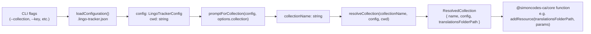

# CLI (`apps/cli`)

The LingoTracker CLI is a Node.js command-line binary built with [Commander](https://github.com/tj/commander.js). It provides every day-to-day translation management operation — from project initialization and resource CRUD through bundle generation, import/export, and CI/CD validation — as a single `lingo-tracker` executable. Commands are thin orchestration shells: they handle user interaction (TTY detection, prompts, output formatting) and then delegate all business logic to `@simoncodes-ca/core`. No filesystem logic lives in the CLI layer itself.

Return to [architecture README](README.md).

---

## Table of Contents

- [Command Inventory](#command-inventory)
- [Interactive vs Non-Interactive Mode](#interactive-vs-non-interactive-mode)
  - [TTY Detection](#tty-detection)
  - [Interactive Mode Flowchart](#interactive-mode-flowchart)
- [Config Loading and Collection Resolution](#config-loading-and-collection-resolution)
  - [Config Loading](#config-loading)
  - [Collection Resolution](#collection-resolution)
  - [Resolution Flowchart](#resolution-flowchart)
- [Shared Utilities](#shared-utilities)
  - [Prompts Wrapper (`prompt-utils.ts`)](#prompts-wrapper-prompt-utilsts)
  - [Collection Prompts (`collection-prompts.ts`)](#collection-prompts-collection-promptsts)
  - [Output Formatting (`console-formatter.ts`)](#output-formatting-console-formatterts)
  - [Error Messages (`error-messages.ts`)](#error-messages-error-messagests)
  - [Config Loader (`config-loader.ts`)](#config-loader-config-loaderts)
  - [Collection Resolver (`collection-resolver.ts`)](#collection-resolver-collection-resolverts)
  - [String Parsers (`string-parsers.ts`)](#string-parsers-string-parsersts)
  - [Result Aggregator (`result-aggregator.ts`)](#result-aggregator-result-aggregatorts)

---

## Command Inventory

All commands are registered in `apps/cli/src/main.ts`. Each row below lists the exact Commander command name, the flags it accepts, and the `@simoncodes-ca/core` function the command action calls.

| Command | Key Options / Flags | Core Function Called |
|---|---|---|
| `init` | `--collection-name`, `--translations-folder`, `--base-locale`, `--locales`, `--setup-bundle`, `--bundle-dist`, `--bundle-name`, `--token-casing`, `--type-dist-file`, `--enable-auto-translation`, `--translation-provider`, `--translation-api-key-env` | Writes `.lingo-tracker.json` directly (no `@simoncodes-ca/core` function — uses `CONFIG_FILENAME`, `DEFAULT_CONFIG` constants) |
| `add-collection` | `--collection-name`, `--translations-folder`, `--base-locale`, `--locales` | `addCollection()` |
| `delete-collection` | `--collection-name` | `deleteCollectionByName()` |
| `add-locale` | `--collection`, `--locale` | `addLocaleToCollection()` |
| `remove-locale` | `--collection`, `--locale` | `removeLocaleFromCollection()` |
| `add-resource` | `--collection`, `--key`, `--value`, `--comment`, `--tags`, `--target-folder`, `--translations <json>` | `addResource()` |
| `edit-resource` | `--collection`, `--key`, `--base-value`, `--comment`, `--tags`, `--target-folder`, `--locale`, `--locale-value` | `editResource()` |
| `delete-resource` | `--collection`, `--key`, `--yes` | `deleteResource()` |
| `move` | `--collection`, `--source`, `--dest`, `--override`, `--verbose` | `moveResource()` |
| `normalize` | `--collection`, `--all`, `--dry-run`, `--json` | `normalize()` |
| `translate-locale` | `--collection`, `--locale`, `--verbose` | `translateLocale()` |
| `bundle` | `--name`, `--locale`, `--verbose`, `--token-casing`, `--token-constant-name`, `--no-transform-icu-to-transloco` | `generateBundle()` |
| `export` | `-f/--format`, `-c/--collection`, `-l/--locale`, `-s/--status`, `-t/--tags`, `-o/--output`, `--structure`, `--rich`, `--include-base`, `--include-status`, `--include-comment`, `--include-tags`, `--filename`, `--dry-run`, `--verbose` | `exportToJson()` / `exportToXliff()` |
| `import` | `-f/--format`, `-s/--source`, `-l/--locale`, `-c/--collection`, `--strategy`, `--update-comments`, `--update-tags`, `--preserve-status`, `--create-missing`, `--validate-base`, `--dry-run`, `--verbose` | `importFromJson()` / `importFromXliff()` |
| `validate` | `--allow-translated` | `validateResources()`, `generateValidationSummary()` |
| `find-similar` | `--collection`, `--value`, `--max-results` | `searchTranslations()` |
| `install-skill` | `--collection <spec>` (repeatable), `--dir`, `--token-casing` | No core call — generates a `.claude/` skill file by template |

For the full description of what each core function does internally, see [core-library.md](core-library.md).

For the import and export sequence diagrams showing the full end-to-end flow, see [user-flows.md](user-flows.md).

---

## Interactive vs Non-Interactive Mode

### TTY Detection

The CLI is designed to run in two modes. A single boolean check determines which mode is active:

```typescript
// apps/cli/src/utils/prompt-utils.ts
export function isInteractiveTerminal(): boolean {
  return Boolean(process.stdin.isTTY && process.stdout.isTTY);
}
```

Both `stdin` and `stdout` must be TTY for interactive mode. A single pipe or redirect (e.g., `lingo-tracker add-resource | tee log.txt`) drops the CLI into non-interactive mode, which is identical to CI/CD behavior.

**Interactive mode** — the terminal is attached to a real user. Any option not supplied as a CLI flag triggers a `prompts` question. The user fills in missing fields at runtime.

**Non-interactive mode (CI/CD)** — all required options must be supplied as flags. If any required flag is absent the command fails immediately with a clear `--option-name` error message rather than hanging waiting for input.

### Interactive Mode Flowchart

The diagram below shows the decision path that every command follows. Step 1 (config loading) and Step 2 (collection resolution) are deterministic — no prompts involved. The interactive branch point occurs at Step 3, when the command checks whether any required fields were omitted.

```mermaid
flowchart TD
    START([Command invoked\ne.g. lingo-tracker add-resource]) --> LOAD_CONFIG

    LOAD_CONFIG["loadConfiguration()\nRead .lingo-tracker.json\nfrom cwd / INIT_CWD"]
    LOAD_CONFIG --> CONFIG_OK{"Config found\nand valid?"}
    CONFIG_OK -- No --> EXIT_CONFIG(["Exit 1\n❌ Run lingo-tracker init first"])
    CONFIG_OK -- Yes --> RESOLVE_COLLECTION

    RESOLVE_COLLECTION["promptForCollection()\nRead --collection flag"]
    RESOLVE_COLLECTION --> HAS_COLLECTION{"--collection\nprovided?"}
    HAS_COLLECTION -- Yes --> VALIDATE_COLLECTION
    HAS_COLLECTION -- No --> SINGLE_COLLECTION{"Exactly one\ncollection in config?"}
    SINGLE_COLLECTION -- Yes --> AUTO_SELECT["Auto-select the\nonly collection"]
    SINGLE_COLLECTION -- No --> CHECK_TTY_COLLECTION

    CHECK_TTY_COLLECTION{"process.stdout.isTTY?"}
    CHECK_TTY_COLLECTION -- No --> EXIT_COLLECTION(["Throw:\n❌ Missing required option: --collection"])
    CHECK_TTY_COLLECTION -- Yes --> PROMPT_COLLECTION["prompts: select\nfrom available collections"]
    PROMPT_COLLECTION --> VALIDATE_COLLECTION
    AUTO_SELECT --> VALIDATE_COLLECTION

    VALIDATE_COLLECTION["resolveCollection()\nVerify collection exists in config\nCompute translationsFolderPath"]
    VALIDATE_COLLECTION --> COLLECTION_OK{"Collection\nfound?"}
    COLLECTION_OK -- No --> EXIT_RESOLVE(["Exit\n❌ Collection not found"])
    COLLECTION_OK -- Yes --> CHECK_FLAGS

    CHECK_FLAGS["Check which required fields\nare missing from CLI flags\n(key, value, locale, etc.)"]
    CHECK_FLAGS --> ALL_FLAGS{"All required\nfields present?"}
    ALL_FLAGS -- Yes --> CALL_CORE

    ALL_FLAGS -- No --> CHECK_TTY_MAIN{"isInteractiveTerminal()\nstdin.isTTY && stdout.isTTY?"}

    CHECK_TTY_MAIN -- No --> NON_INTERACTIVE["Non-interactive path:\nvalidate required fields\nfrom CLI options only"]
    NON_INTERACTIVE --> MISSING_FLAGS{"Any required\nflags missing?"}
    MISSING_FLAGS -- Yes --> EXIT_FLAGS(["Throw:\n❌ Missing required options:\n--flag1, --flag2"])
    MISSING_FLAGS -- No --> CALL_CORE

    CHECK_TTY_MAIN -- Yes --> INTERACTIVE["Interactive path:\nprompts() for each\nmissing required field"]
    INTERACTIVE --> USER_INPUT{"User completes\nall fields?"}
    USER_INPUT -- "Ctrl+C / cancel" --> EXIT_CANCEL(["Throw:\n❌ Operation cancelled"])
    USER_INPUT -- Completes --> CALL_CORE

    CALL_CORE["Call @simoncodes-ca/core function\ne.g. addResource() / normalize() / validateResources()"]
    CALL_CORE --> FORMAT_OUTPUT["ConsoleFormatter:\n✅ success / ❌ error / ⚠️ warning"]
    FORMAT_OUTPUT --> DONE([Exit 0 on success\nExit 1 on failure])

    style EXIT_CONFIG fill:#f8d7da,stroke:#dc3545,color:#000
    style EXIT_COLLECTION fill:#f8d7da,stroke:#dc3545,color:#000
    style EXIT_RESOLVE fill:#f8d7da,stroke:#dc3545,color:#000
    style EXIT_FLAGS fill:#f8d7da,stroke:#dc3545,color:#000
    style EXIT_CANCEL fill:#f8d7da,stroke:#dc3545,color:#000
    style AUTO_SELECT fill:#d4edda,stroke:#28a745,color:#000
    style CALL_CORE fill:#d1ecf1,stroke:#17a2b8,color:#000
    style DONE fill:#d4edda,stroke:#28a745,color:#000
```



---

## Config Loading and Collection Resolution

### Config Loading

`loadConfiguration()` in `apps/cli/src/utils/config-loader.ts` is called at the top of nearly every command. It centralizes `.lingo-tracker.json` discovery and parse error handling so no command duplicates that logic.

Key behaviors:

- **Directory resolution** — reads `process.env.INIT_CWD` first, falling back to `process.cwd()`. `INIT_CWD` is set by pnpm and points to the user's project root even when pnpm changes directory to the package location during script execution. The `getCwd()` helper centralizes this logic and is used wherever an absolute path is needed.
- **File not found** — logs `❌ Configuration file .lingo-tracker.json not found. Run "lingo-tracker init" to initialize a project.` then exits with code 1 (or returns `null` when `exitOnError: false`).
- **Parse error** — logs the raw JSON parse error message and exits or returns `null`.
- **Return type** — `ConfigLoadResult` carries `{ config, configPath, cwd }` so callers never repeat path resolution.

The `exitOnError` option (default `true`) allows commands like `add-resource` to do their own error handling without the process terminating mid-operation.

### Collection Resolution

After loading config, most commands call `promptForCollection()` followed by `resolveCollection()`. These two steps are always sequential and together constitute the standard collection resolution flow.

`promptForCollection()` in `collection-prompts.ts` applies smart auto-selection:

1. If `--collection` was provided, return it immediately.
2. If exactly one [collection](glossary.md#collection) exists in config, auto-select it (no prompt, no TTY check needed).
3. If multiple collections exist and `process.stdout.isTTY` is false, throw `Missing required option: --collection`.
4. If multiple collections exist and TTY is true, show an interactive `select` prompt.

`resolveCollection()` in `collection-resolver.ts` then validates the selected name against `config.collections`, logs `❌ Collection "name" not found.` if absent, and computes the absolute `translationsFolderPath` by joining `baseDirectory` with `collectionConfig.translationsFolder`.

### Resolution Flowchart



The `translationsFolderPath` from `ResolvedCollection` is the first argument passed to every core resource operation. This means commands never construct filesystem paths themselves — path construction is fully delegated to `config-loader.ts` and `collection-resolver.ts`.

---

## Shared Utilities

All shared utilities live in `apps/cli/src/utils/` and are re-exported from `apps/cli/src/utils/index.ts` as a flat namespace. Commands import from `'../utils'`.

### Prompts Wrapper (`prompt-utils.ts`)

`executePromptsWithFallback(params)` is the primary entry point for commands that have multiple optional fields. It accepts a `questions` array (prompts definitions), `currentValues` (the parsed CLI options), and `requiredFields` (field names that must be present in non-interactive mode).

- In TTY mode: runs `prompts(questions, { onCancel })`, merges results with `currentValues`, and throws `"Operation cancelled"` on Ctrl+C.
- In non-TTY mode: skips all prompts, checks that every `requiredField` is non-null in `currentValues`, and throws a `Missing required options: --field1, --field2` error if any are absent.

`processMultiselectWithAll(selectedValues, allAvailableItems)` handles multiselect prompts that include an "All" option. If the sentinel `__ALL__` is among the selected values, it returns `undefined` (meaning "process everything"), otherwise returns the selected subset.

`multiselectResultToString(items)` converts `string[] | undefined` to a comma-separated string or `undefined`, which is the format expected by options like `--locale` and `--name` on the bundle and export commands.

### Collection Prompts (`collection-prompts.ts`)

`promptForCollection(config, currentValue)` is the smart collection selector described above. It is the only place that reads `process.stdout.isTTY` directly for collection selection; all other TTY checks go through `isInteractiveTerminal()`.

### Output Formatting (`console-formatter.ts`)

`ConsoleFormatter` is a `const` object with six methods used by every command for terminal output:

| Method | Prefix | Use |
|---|---|---|
| `ConsoleFormatter.success(msg)` | `✅` | Operation completed successfully |
| `ConsoleFormatter.error(msg)` | `❌` | Operation failed |
| `ConsoleFormatter.warning(msg)` | `⚠️` | Non-fatal issue |
| `ConsoleFormatter.info(msg)` | `ℹ️` | Informational message |
| `ConsoleFormatter.progress(msg)` | `🔄` | In-progress activity |
| `ConsoleFormatter.section(title)` | `📊` | Section header with a `─` separator line |
| `ConsoleFormatter.indent(msg, level)` | *(spaces)* | Indented detail line (2 spaces per level) |
| `ConsoleFormatter.keyValue(key, value, indent)` | *(spaces)* | `Key: Value` pair at a given indent level |

All methods write to `console.log`. The object is `as const` so TypeScript enforces the exact method set at every call site.

### Error Messages (`error-messages.ts`)

`ErrorMessages` is a `const` object of string constants and factory functions. It centralizes every user-facing error string so wording is consistent across commands and tests assert against a single source of truth.

Selected entries:

```typescript
ErrorMessages.CONFIG_NOT_FOUND            // static string
ErrorMessages.COLLECTION_NOT_FOUND(name)  // factory → "❌ Collection "name" not found."
ErrorMessages.MISSING_OPTION(option)      // factory → "❌ Missing required option: --option"
ErrorMessages.MISSING_OPTIONS(options[])  // factory → "❌ Missing required options: --a, --b"
ErrorMessages.OPERATION_CANCELLED(op)     // factory → "❌ Op cancelled."
ErrorMessages.OPERATION_FAILED(op, why?)  // factory → "❌ Op failed: reason"
ErrorMessages.RESOURCE_NOT_FOUND(key)     // factory → "❌ Resource key "key" not found."
```

### Config Loader (`config-loader.ts`)

`loadConfiguration(options?)` — described in detail in [Config Loading](#config-loading) above.

`getCwd()` — returns `process.env.INIT_CWD ?? process.cwd()`. Used by any code that needs to construct an absolute path relative to the user's project root.

### Collection Resolver (`collection-resolver.ts`)

`resolveCollection(collectionName, config, baseDirectory)` — validates existence of the named [collection](glossary.md#collection) in `config.collections` and returns a `ResolvedCollection` with the computed absolute `translationsFolderPath`. Returns `null` (after logging an error) if the collection is not found, so callers use a `if (!collection) return;` guard pattern.

### String Parsers (`string-parsers.ts`)

`parseCommaSeparatedList(input)` — splits a comma-separated string into a trimmed, non-empty `string[]`. Returns `undefined` for empty or missing input. Used by commands that accept multi-value flags like `--locale en,fr,de` and `--key key1,key2`.

`parseCommaSeparatedListRequired(input, fieldName)` — same, but throws if the result is empty. Used when at least one value is mandatory.

### Result Aggregator (`result-aggregator.ts`)

`aggregateNumericFields<T>(results, numericFields)` — sums a specified list of numeric fields across an array of result objects. Used by `normalize` (which processes multiple collections) to compute combined totals before printing the summary. Eliminates boilerplate `reduce` patterns and ensures new metric fields are not silently missed in the aggregate.

---

*For glossary definitions of terms used above: [collection](glossary.md#collection), [base locale](glossary.md#base-locale), [bundle](glossary.md#bundle), [resource key](glossary.md#resource-key).*
