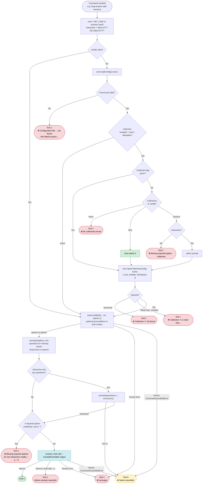
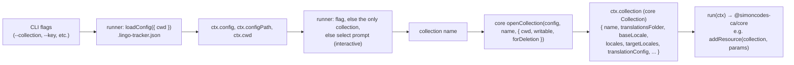

# CLI (`apps/cli`)

The LingoTracker CLI is a Node.js command-line binary built with [Commander](https://github.com/tj/commander.js). It provides every day-to-day translation management operation — from project initialization and resource CRUD through bundle generation, import/export, and CI/CD validation — as a single `lingo-tracker` executable. Each command is a prompt schema plus a call to `@simoncodes-ca/core`, run by one [Command Runner](glossary.md#command-runner). The runner owns config loading, collection resolution, the interactive rule, cancellation and exit codes. The command owns its preconditions, its questions, its core call and its output formatting. Resource files are read and written only through core. The CLI itself writes a few files of its own: `init` calls core `initConfig` for `.lingo-tracker.json`, `export` and `import` write their summary files, `glossary` writes its JSON output, and `install-skill` writes the skill templates.

Return to [architecture README](README.md).

---

## Table of Contents

- [Command Inventory](#command-inventory)
- [Command Runner](#command-runner)
  - [Defining a Command](#defining-a-command)
  - [What Each Command Opens](#what-each-command-opens)
- [Interactive vs Non-Interactive Mode](#interactive-vs-non-interactive-mode)
  - [The Interactive Rule](#the-interactive-rule)
  - [Runner Flowchart](#runner-flowchart)
- [Errors and Exit Codes](#errors-and-exit-codes)
- [Config Loading and Collection Resolution](#config-loading-and-collection-resolution)
  - [Config Loading](#config-loading)
  - [Collection Resolution](#collection-resolution)
  - [Resolution Flowchart](#resolution-flowchart)
- [Testing Commands](#testing-commands)
- [Shared Utilities](#shared-utilities)
  - [Selection (`prompt-utils.ts`)](#selection-prompt-utilsts)
  - [Prompt helpers](#prompt-helpers)
  - [Output Formatting (`console-formatter.ts`)](#output-formatting-console-formatterts)
  - [String Parsers (`string-parsers.ts`)](#string-parsers-string-parsersts)

---

## Command Inventory

All commands are registered in `apps/cli/src/main.ts`. Each row below lists the exact Commander command name, the flags it accepts, and the `@simoncodes-ca/core` function the command action calls.

| Command | Key Options / Flags | Core Function Called |
|---|---|---|
| `init` | `--collection-name`, `--translations-folder`, `--base-locale`, `--locales`, `--setup-bundle`, `--bundle-dist`, `--bundle-name`, `--token-casing`, `--type-dist-file`, `--enable-auto-translation`, `--translation-provider`, `--translation-api-key-env` | Calls core `initConfig()` to validate and write `.lingo-tracker.json`; keeps the same default JSON bytes |
| `add-collection` | `--collection-name`, `--translations-folder`, `--base-locale`, `--locales` | `addCollection()` |
| `delete-collection` | `--collection-name`, `--yes` | `deleteCollection()`. Interactive, it first asks `Delete collection "x" (translations folder: …)?` unless `--yes`; a decline prints `❌ Delete collection cancelled.` and exits 0. Non-interactive, it does not ask. The registration and explicit bundle references are removed in one config write; the files stay. If a bundle would become empty, it prints the conflict and exits 1 |
| `edit-collection` | `<name>` (argument), `--add-tag` (repeatable), `--remove-tag` (repeatable), `--set-tags` | The command checks flag combinations and splits `--set-tags`; `editCollectionTags()` normalizes the array edit. This CLI command does not rename collections; core and API renames update explicit bundle references |
| `add-locale` | `--collection`, `--locale` | `addLocaleToCollection()` |
| `remove-locale` | `--collection`, `--locale` | `removeLocaleFromCollection()` |
| `add-resource` | `--collection`, `--key`, `--value`, `--comment`, `--tags`, `--target-folder`, `--translations <json>`, `--override` | `addResource()` (locales without a `--translations` value are seeded by core: [locale seeding](glossary.md#locale-seeding)). An existing key exits 1 with `❌ Resource already exists: <key>` in non-interactive mode; `--override` replaces it, while interactive mode asks for confirmation. `--translations` is parsed inside the command; malformed JSON, or anything but an array of `{ locale, value, status? }`, exits 1 with `❌ Invalid --translations …` |
| `edit-resource` | `--collection`, `--key` (full key), `--base-value`, `--comment`, `--tags`, `--target-folder` (moves the entry into this folder; core `moveTo`), `--locale`, `--locale-value` | `editResource()` |
| `delete-resource` | `--collection`, `--key`, `--yes` | `deleteResource()` |
| `move` | `--collection`, `--source`, `--dest`, `--dest-collection`, `--override` | `moveResource()` for one key or pattern. Core resolves the plain `--dest-collection` name with `config` and the CLI `cwd`; `--dest` is then a key in that collection. An unknown or read-only destination exits 1. The missing-destination line says `Destination collection "x" not found`; the read-only line keeps the core message. It is never prompted for. Core keeps values, checksums, and statuses for shared locales, drops unconfigured locales, and seeds missing target locales as new copies of the base. A base-locale mismatch returns an error. |
| `normalize` | `--collection`, `--all`, `--dry-run`, `--json`, `--yes` | `normalize()` |
| `translate-locale` | `--collection`, `--locale`, `--verbose` | `translateLocale(collection, { targetLocale, onProgress })` (through the [Translator](glossary.md#translator)); the summary prints `Skipped (needs human translation)` for complex ICU, lost placeholders and dropped protected terms |
| `bundle` | `--name`, `--locale`, `--quiet`, `--verbose`, `--token-casing`, `--token-constant-name`, `--no-transform-icu-to-transloco`, `--debug-keys` | `generateBundles()` (with the project `cwd`) |
| `export` | `-f/--format`, `-c/--collection`, `-l/--locale`, `-s/--status`, `-t/--tags`, `-o/--output`, `--structure`, `--rich`, `--include-base`, `--include-status`, `--include-comment`, `--include-tags`, `--base-property-name`, `--filename`, `--no-protect-notes`, `--dry-run`, `--verbose` | `runExport()` |
| `import` | `-f/--format`, `-s/--source`, `-l/--locale`, `-c/--collection`, `--strategy`, `--update-comments`, `--update-tags`, `--preserve-status`, `--create-missing`, `--validate-base`, `--no-validate-base`, `--dry-run`, `--verbose` | `runImport()` |
| `validate` | `--allow-translated`, `--skip-locales`, `--skip-icu`, `--skip-placeholders`, `--require-portable-plurals` | Command Runner opens every collection → `runValidate()` ([Validate Run](glossary.md#validate-run)) |
| `find-similar` | `--collection`, `--value`, `--max-results` | `readCollection()` → `searchResources(…, { mode: 'similar-value', limit })` ([Resource Search](glossary.md#resource-search)) |
| `glossary` | `--text`, `--input`, `--output`, `--stdout`, `--collection`, `--locales`, `--include-all`, `--extractor` | `buildGlossary()` ([Term Glossary](glossary.md#term-glossary)) |
| `protected-terms` | `--collection`, `--add` (repeatable), `--remove` (repeatable), `--set`, `--list`, `--file` | Checks flags, splits `--set`, then calls `planProjectTermsUpdate()` for the view and edit |
| `preferred-terminology` | `--list`, `--add <discouraged>`, `--preferred`, `--reason`, `--remove <discouraged>` | Checks flags, builds a rule edit, then calls `planProjectTermsUpdate()` for display, validation and write |
| `install-skill` | `--collection <spec>` (repeatable), `--dir`, `--token-casing` | No core call — generates a `.claude/` skill file by template |

`add-resource` and `edit-resource` print the `terminology` core returned (one `⚠️  Preferred terminology: consider "X" instead of "Y"` per finding, the rule's reason on the next line, and one warning per rule-file problem) through `printTerminologyFindings` in `utils/terminology-findings.ts`; `edit-resource` only when the edit supplied a base value. They also print, as warnings, a named protected-terms file that does not exist when auto-translation ran (core adds it to `terminology.problems`); `translate-locale` prints it with the run's other `warnings`. `import` and `export` pass no terms: the run reads the collection's [Project Terms](glossary.md#project-terms) and reports a term-file problem in its `warnings` (deduped), which the summary prints; `export` with protect notes on (the default) reports a broken protected-terms file in `errors` instead and exits 1, while `--no-protect-notes` reads no terms file and cannot fail on one. The [Validate Run](glossary.md#validate-run) reads the Project Terms of every collection and returns each problem once in `warnings`; the command prints them to stderr: a missing named file or a broken protected-terms file is only a warning (validate checks translations, not protected terms), and a broken rule file becomes a terminology validation failure. Core also resolves target and skipped locales and returns the summary or a failure with the no-target-locales hint. The command opens collections, prints the result, and sets the exit code. `protected-terms` prints a named terms file that does not exist as a warning (on `--list` and on every write).

### `protected-terms` scoping

The command includes `--file` in the structured edit passed to `planProjectTermsUpdate()`. `--file x.json --add Foo` therefore names the new file first during `apply()`, then writes into it. Core restores the pointer and the files it changed if the update fails. The command prints the pointer line after a successful preview. If apply later fails, it warns that the printed pointer change was reverted.

Both scopes read through the plan's `view`. The command prints warnings and lists, then calls `apply()`; it raises the original flag usage messages before planning. Core validates the structured edit and uses the shared list merge with protected-term normalization.

- **Global** — the plan reads the configured protected-terms file, or `.lingo-tracker-protected-terms.json` beside the config when no global pointer is set.
- **Collection** — the plan reads the collection file when configured and combines those terms with the global list. A collection with no file contributes an empty list.

`--list` on a collection prints three lists: the global terms, the collection's terms, and `effectiveProtectedTerms()` of the two. It names the resolved file behind each list. Paths inside the project root print as relative paths.

The core layer raises errors for a malformed file, for a collection with no file, and for a missing parent directory. The command lets each one reach the runner, which prints `❌ <message>` and sets exit code 1. It writes no partial result. An unknown `--collection` exits 1 with `❌ Collection "x" not found`.

### `validate` locales

`validate` opens every collection with `openCollection()` and hands the collections to `runValidate()`; core uses `validateResources()` internally. Each collection is validated with its own base locale and target locales (its `locales`, else the global `locales`, without its base locale). The command reads no global `baseLocale` or `locales` itself. When no collection has a target locale, the command exits 1.

`--skip-locales` removes locales from every collection. A locale that is some collection's target locale is skipped. A locale that is only a base locale is ignored without a message. Any other locale gets an `unknown locale` warning. When every target locale is skipped, the command exits 1.

A folder whose files cannot be read fails validation. The summary lists it under `Unreadable Folders`.

### `normalize` collection selection

The Command Runner resolves the configured collections before `normalize` checks its own options. With an empty config, it reports `No collections found. Run \`lingo-tracker add-collection\` first.` before checking `--collection` or `--all`. The command keeps its interactive collection select, the `All collections` choice, and the `Are you sure?` confirmation for all.

`normalizeCollections` in core decides what to do with the opened read-only collections. The command maps flags, prints core events, and prints the returned totals and JSON payload. Any read-only collection in a named selection is refused with `❌ Collection "name" is read-only. Its resources cannot be modified.` on stderr and exit 1. It still prints the empty JSON summary with `--json`, or the dry-run completion warning with `--dry-run`. With `--all`, it skips each read-only collection, prints `⚠️  Skipping read-only collection: name` on stderr, and continues with the writable collections. `--all --json` keeps stdout to the JSON payload.

The `bundle` command maps flags to core `generateBundles`, prints each outcome and its totals, and the API job service prepares a run then calls `generatePreparedBundle`. A legacy `typeDist` warning comes from the prepared run or the type outcome and is printed on the same console stream, including when generation fails after preparation.

### `glossary` pipeline

The command resolves input (`--text` → `--input` → stdin), selects one or all opened collections through the runner, maps flags to `buildGlossary(collections, text, options)`, and writes the returned JSON payload to a file or stdout. Core owns extraction, matching, the [Collection Set](glossary.md#collection-set) read, and each collection's effective base and target locales. Without `--locales`, it uses each opened collection's targets; an explicit `--locales` list can include stored translations outside those targets and removes only the base locale. Reader problems return separately from the payload; the command prints them as warnings on stderr, so `--stdout` stays valid JSON. With different base locales, core raises a typed error and the runner exits 1. See [Term Glossary](glossary.md#term-glossary) for the matching and locale rules.

`find-similar` builds a text question when the supplied value is absent, empty, or whitespace. After answers are merged, it normalizes the search request once, with a default limit of 5 and core's cap of 500. Missing or empty values keep the runner's required-option message; whitespace-only values report `--value must not be blank`. The `--max-results` option parses with `parseInt(value, 10)` before the command loads. A value that produces `NaN` now fails with `--max-results must be a number, got "<value>"`; accepted values keep their existing conversion.

For the full description of what each core function does internally, see [core-library.md](core-library.md).

`export` and `import` each use a pure [Run Options Resolution](glossary.md#run-options-resolution): `apps/cli/src/commands/export-options.ts` and `import-options.ts`. Each module builds questions from flags and resolves the runner's merged answers to core options. Export also returns advisories. `main.ts` leaves promptable values unset. `run-option-defaults.ts` holds export defaults and import's CLI defaults, and exposes the Import Strategy Policy defaults for help labels and migration prompt initials. Export prints advisories on stderr. Both commands call core, render results, and report the summary.

Export's JSON option table shares visibility rules: format selects JSON questions, rich JSON enables metadata questions, and `includeBase` enables the base property question. The last condition deliberately does not require rich JSON. The default status filter is `new,stale`; JSON structure is hierarchical and metadata switches are off. Empty collection, locale and status prompt selections fail in that order, before collection lookup, even when flags exist. Empty collection or locale flags still select all. The resolution module splits status strings and rejects an empty list with the existing `Invalid --status` diagnostic before core is called or an advisory is printed. Unknown statuses pass through to core's `InvalidTranslationStatusError`. Core checks the base property name before its status validation, then the output directory. Errors raised while opening collections or building questions retain their original messages, even when the status flag is empty. The output prompt uses the configured folder or `DEFAULT_CONFIG.exportFolder`. An omitted base property name stays undefined in non-interactive mode; its prompt initial is `baseValue`.

Import's strategy drives locale choices through domain's importable-locale rule, and enables the migration switch prompts. The locale select and strategy-bound text questions are mutually exclusive, so a validator needs no mutable state from an earlier callback. Source existence is supplied by the command as context. Format detection determines prompt visibility; an inferred format stays unset in the core options, so `runImport` still detects it and owns source errors. Unset comment, tag and create-missing switches stay undefined for core's strategy defaults. `--no-validate-base` disables the base-value warning; without it validation stays on. An omitted `--preserve-status` resolves to false, including for migration. This overrides migration's policy default to honour source status. A small catch around `runImport` reports its failures on stderr and returns exit code 1. Format-stage `ImportSourceError` failures print their message without wrapping or repeating the cause; other failures print `Import failed: <message>`. Errors from rendering, summary reporting or outcome handling reach the runner unchanged.

For the import and export sequence diagrams showing the full end-to-end flow, see [user-flows.md](user-flows.md).

---

## Command Runner

`apps/cli/src/runner/command-runner.ts` runs each command. `main.ts` lists command registrations: name, description, ordered option definitions, optional argument and help text, and a lazy `load` function. `registerCommand<Options>(program, registration)` in `runner/register-command.ts` applies those definitions to Commander before parsing, then loads and invokes the handler when the action runs. `mapOptions(raw, args)` is an optional conversion at that boundary for `validate` and the positional `edit-collection` command, and supplies the default limit for `find-similar`. Shared definitions and flag value conversions live in `runner/options.ts`: the collection flag, token casing choices, repeatable list accumulator, `--yes`, resource fields, and the six flags common to `init` and `add-collection`. The long import, validate, and preferred-terminology help examples live in `runner/help-text.ts`. Each registration creates a fresh Commander option, so parsing one command does not change another command's defaults. The loaded handler calls the function returned by `defineCommand`. For config edits, it passes the opened collection or `ctx.project` to core. That function does the same steps for every command, in this order:

1. Finds the project root: `INIT_CWD` (set by pnpm to the directory where the command was typed), else `process.cwd()`.
2. Reads the [interactive rule](#the-interactive-rule) once.
3. Loads `.lingo-tracker.json` with core `loadConfig({ cwd })`, unless the command sets `config: false`.
4. Resolves and opens one collection, or prepares all configured collections for a `many` command's questions ([Collection Resolution](#collection-resolution)). This runs before a command's own option checks: for example, `export` on an empty config reports no collections before a missing `--format`.
5. Awaits optional `preflight(ctx)` in both modes, with opened resources and the supplied flags in `ctx.options`. A thrown error uses the normal report path before any command questions are built.
6. Builds the command's questions (in both modes; existing builders can still throw) and asks them when interactive.
7. Checks the `required` options against the flags merged with the answers. `undefined`, `null` and `''` count as missing, so an empty interactive answer fails the same way as an absent flag.
8. For `many`, selects the final ordered collection list and applies its read or writable policy. Calls `run`, and turns the result or the thrown error into output and an exit code ([Errors and Exit Codes](#errors-and-exit-codes)).

The runner sets `process.exitCode` and returns. No CLI code calls `process.exit()`, so Commander finishes normally.

`loadConfig()` records the bytes read from `.lingo-tracker.json`. The runner provides `ctx.project` from that read; collection commands use the opened collection. Every config writer uses its opened snapshot through core’s guarded write. If another process changes the file while a prompt is open, the handle throws `ConfigChangedError` before the lifecycle edits locale files. The runner prints `❌ The configuration file changed after it was read; run the command again` and exits 1.

### Defining a Command

```typescript
// apps/cli/src/commands/add-locale.ts
export const addLocaleCommand = defineCommand<AddLocaleOptions>()({
  name: 'Add locale',                 // used in "❌ Add locale cancelled."
  collection: 'writable',             // 'writable' | 'read' | 'deletable' | 'many' | 'none'
  prompts: (options) =>               // questions for missing values; asked only when interactive
    options.locale ? [] : [{ type: 'text', name: 'locale', message: 'Enter locale to add (e.g. fr-ca, de, es)' }],
  required: ['locale'],               // checked after the questions; `run` sees it as a string
  run: async ({ collection, answers }) => {
    const result = await addLocaleToCollection(collection, answers.locale);
    ConsoleFormatter.success(result.message);
  },
});
```

`defineCommand<Options>()` is curried: the options type is given, and the rest is inferred from the spec. The spec fields:

Command modules retain their explicit `Options` interfaces. Those interfaces also describe prompt answers and conditional values that Commander flag definitions cannot infer; keeping them makes the runner context and `required` checks precise. `CommandRegistration<Options>` takes `{ name, description, options, argument?, helpText?, load, mapOptions? }`. The type of the loaded handler fixes `Options`; `mapOptions` handles raw Commander values only where conversion is needed. An option definition takes a Commander `Command`, registers a fresh option, and returns nothing. `option({ flags, description?, defaultValue?, helpDefault?, parse? })` distinguishes parsed defaults from `helpDefault`, which prints a default label without setting a Commander value. Import and export help labels read the same defaults as their command resolution; update-switch labels read core's strategy defaults. Choice and custom parser failures still come from Commander or the existing parser, before the lazy command import.

`commaListOption({ flags, description?, helpDefault?, empty? })` declares a comma-separated flag. Commander passes a trimmed `string[]` with empty items removed to the handler; raw empty optional flags (`""`) and absent flags become undefined, preserving prompt and required-option gates. Non-empty inputs with no items (such as `" , "`) retain `[]` and count as supplied flags. `empty: 'clear'` preserves `[]` for replacement flags. `empty: 'preserve'` returns `{ kind: 'empty', input }` for deferred diagnostics. Export reads this explicit empty state to reject `--status` after collection resolution, before core validation and advisories. Command `Options` interfaces use arrays for these fields; status also permits the explicit empty state. Replacement flags retain `[]` to clear stored lists; optional filters apply their existing empty-input defaults. `commaListAnswers` names text prompt fields (resource tags, deletion keys, and export tags) for the runner to convert with the same `parseCommaSeparatedList` function before required checks and selection. `commands/validate-options.ts` owns validate defaults; `commands/find-similar-options.ts` owns the existing `parseInt` conversion for `--max-results`.

| Field | Meaning |
|---|---|
| `name` | Operation name for the cancel line. |
| `collection` | `'writable'` opens one collection with `writable: true`. `'read'` opens one for reading. `'deletable'` opens one with `forDeletion: true`, tolerating a missing or non-string `translationsFolder`. `'many'` opens several. `'none'` opens no collection. |
| `many` | For `'many'`, `select(answers, ctx)` returns a `Selection` after prompts. The default is `{ kind: 'all' }`. The runner opens these collections for reading. |
| `collectionOption` | The option that holds the collection name. Default `collection`. `delete-collection` uses `collectionName`; `edit-collection` uses its positional `<name>`. |
| `config` | `false` skips loading the config. Only `init` and `install-skill` set it. It is only allowed with `collection: 'none'`. |
| `preflight(ctx)` | Optional synchronous or asynchronous precondition check, awaited after resources open and before questions are built in both modes. `PreflightContext` supplies the prompt context plus `options`, the supplied flags without prompt answers. `translate-locale` checks that auto-translation is enabled, target locales exist, and a supplied locale can be translated here. Errors keep the same configuration hint and locale messages. |
| `prompts(options, ctx)` | Returns the questions for the values the flags left out. It receives the opened resources without answers, so it can use the collection for locale choices. It is called in both modes, after `preflight` and before `required` is checked. Existing builders can still throw: `remove-locale` reports `No removable locales in collection "x".` before a missing-flag error. `init` returns `[]` in an initialized folder. |
| `required` | Options that must have a value before `run`: checked after the questions when interactive, against the flags when not. `undefined`, `null` and `''` count as missing. `run` sees these options typed as present. `init` declares none: it needs `--collection-name` and `--translations-folder` only when there is a config to write, and checks them itself with the same `requireOptions` helper. |
| `formatError(error, duringRun)` | Optionally chooses the printed message. `duringRun` is false for preflight and question-building errors, and true only after `run` starts. The runner keeps the original error and still prints its `Error` cause below that message. `translate-locale` uses this for its configuration hint and run prefix. |
| `run(ctx)` | The core call(s) and the output. It returns nothing, or `{ exitCode: 1 }` for a failure it has already reported. It throws to fail with `❌ <message>`. |

The context (`CommandContext`) has `cwd`, `interactive`, `ask`, and `answers` (the flags merged with the prompt answers). It has `config`, `project` (the [Opened Project](glossary.md#opened-project) for guarded config writes), and `configPath` unless `config: false`. It has `collection` (the core `OpenedCollection`) for `'writable'`, `'read'`, or `'deletable'`, and `collections` (`Collection[]`) for `'many'`. Prompt builders for `'many'` receive all configured collections; `run` receives the final collections and `selection` (`Selection`). For `kind: 'some'`, the runner deduplicates `names` in order. The type follows the spec, so a `'none'` command cannot read either resource.

`ask(questions)` runs follow-up prompts inside `run`: confirmations (`delete-resource`, `delete-collection`, `normalize --all`, the `add-resource` override), the `add-resource` translations loop, the `add-collection` read-only question, and the `install-skill` loop. A cancel in `ask` is the same cancel as in the declared questions. A command throws `CommandCancelledError` when the user declines a confirmation.

A destructive command confirms only when interactive, and `--yes` skips the question (`delete-resource`, `delete-collection`). Non-interactive, the flags are the consent: there is nobody to ask. This matters for `delete-collection` because the runner auto-selects the only collection, so `lingo-tracker delete-collection` alone names its target.

### What Each Command Opens

| Command | `collection` | Notes |
|---|---|---|
| `add-resource`, `edit-resource`, `delete-resource`, `move`, `add-locale`, `remove-locale`, `translate-locale`, `import` | `'writable'` | `move` passes an optional destination name to core, which opens it writable. |
| `delete-collection` | `'deletable'` | Opens with `forDeletion: true`, so a registration with a missing or non-string `translationsFolder` can be deleted. A read-only collection is allowed. |
| `edit-collection`, `find-similar` | `'read'` | `edit-collection` changes the registration, not the resources, so a read-only collection is allowed. |
| `validate`, `export`, `normalize`, `glossary` | `'many'` | `validate` and an unqualified `glossary` open all. `export --collection` takes a comma-separated list; without it, all are opened. `normalize` selects one or all and confirms an interactive all selection, then [handles read-only collections](#normalize-collection-selection). Empty config fails with `NO_COLLECTIONS_MESSAGE`; unknown names fail with `CollectionNotFoundError`; names in a list are deduplicated in order. |
| `add-collection`, `bundle`, `protected-terms`, `preferred-terminology` | `'none'` | `protected-terms` takes an optional `--collection`; the other commands handle their own scope. |
| `init`, `install-skill` | `'none'`, `config: false` | Neither reads `.lingo-tracker.json`. |

---

## Interactive vs Non-Interactive Mode

### The Interactive Rule

The CLI has one definition of "interactive", in `apps/cli/src/runner/terminal.ts`:

```typescript
export function isInteractiveTerminal(): boolean {
  return Boolean(process.stdin.isTTY && process.stdout.isTTY);
}
```

The runner reads it once per command and passes it to the command as `ctx.interactive`. No other CLI code reads `isTTY`.

Both `stdin` and `stdout` must be a terminal. A pipe or a redirect on either side (for example `lingo-tracker add-resource | tee log.txt`) makes the command non-interactive, which is the same as CI/CD.

- **Interactive** — a question is asked for each value the flags left out.
- **Non-interactive (CI/CD)** — nothing is asked. When a required flag is absent, the command prints `❌ Missing required options in non-interactive mode: --flag1, --flag2` and exits 1. It does not wait for input. (Interactive, an empty answer to a required question prints `❌ Missing required options: --flag` and exits 1.)

Three missing-flag messages keep their own wording, because the rule is not "this flag is required":

- `❌ Missing required option: --collection` (or `--collection-name`): several collections, none named, non-interactive. With one collection, it would have been selected.
- `❌ Missing required option in non-interactive mode: --collection or --all`: `normalize` needs one of the two.
- `❌ Missing required option in non-interactive mode: --collection` followed by a `Usage:` line: `install-skill`, whose `--collection` takes a `name:bundle:TokenConstant:tokenFilePath` spec.

`terminal.ts` has one more function, `hasPipedStdin()` (`!process.stdin.isTTY`). Only `glossary` uses it, to read its input block from a pipe. This is a different question: `glossary > out.json` is non-interactive, but reading stdin there would wait for the keyboard.

### Runner Flowchart


```mermaid
flowchart TD
    START([Command invoked\ne.g. lingo-tracker add-resource]) --> ROOT["cwd = INIT_CWD or process.cwd()\ninteractive = stdin.isTTY && stdout.isTTY"]

    ROOT --> NEEDS_CONFIG{"config: false?"}
    NEEDS_CONFIG -- Yes --> PREFLIGHT
    NEEDS_CONFIG -- No --> LOAD_CONFIG["core loadConfig({ cwd })"]
    LOAD_CONFIG --> CONFIG_OK{"Found and valid?"}
    CONFIG_OK -- No --> EXIT_CONFIG(["Exit 1\n❌ Configuration file ... not found\n/ ❌ Failed to parse ..."])
    CONFIG_OK -- Yes --> NEEDS_COLLECTION{"collection:\n'writable' / 'read' / 'deletable'?"}
    NEEDS_COLLECTION -- "'none'" --> PREFLIGHT

    NEEDS_COLLECTION -- Yes --> HAS_COLLECTION{"Collection flag\ngiven?"}
    HAS_COLLECTION -- Yes --> OPEN
    HAS_COLLECTION -- No --> COUNT{"Collections\nin config?"}
    COUNT -- None --> EXIT_NONE(["Exit 1\n❌ No collections found"])
    COUNT -- One --> AUTO_SELECT["Auto-select it"]
    COUNT -- Several --> TTY_COLLECTION{"interactive?"}
    TTY_COLLECTION -- No --> EXIT_COLLECTION(["Exit 1\n❌ Missing required option: --collection"])
    TTY_COLLECTION -- Yes --> PROMPT_COLLECTION["select prompt"]
    AUTO_SELECT --> OPEN
    PROMPT_COLLECTION --> OPEN

    OPEN["core openCollection(config, name,\n{ cwd, writable, forDeletion })"]
    OPEN --> OPEN_OK{"Opened?"}
    OPEN_OK -- "Not found" --> EXIT_RESOLVE(["Exit 1\n❌ Collection 'x' not found"])
    OPEN_OK -- "Read-only, 'writable'" --> EXIT_RO(["Exit 1\n❌ Collection 'x' is read-only..."])
    OPEN_OK -- Yes --> PREFLIGHT

    PREFLIGHT["await preflight({ ...ctx, options })\noptional preconditions in both modes"]
    PREFLIGHT -- "passes or absent" --> QUESTIONS
    PREFLIGHT -- "throws Error" --> EXIT_THROW
    PREFLIGHT -- "throws CommandCancelledError" --> EXIT_CANCEL

    QUESTIONS["prompts(options, ctx)\nquestions for missing values\n(may throw a reason)"]
    QUESTIONS --> ANY{"interactive and\nany questions?"}
    ANY -- No --> MISSING
    ANY -- Yes --> ASK["prompts(questions, { onCancel })"]
    ASK -- "Ctrl+C" --> EXIT_CANCEL(["Exit 0\n❌ Name cancelled."])
    ASK -- Answered --> MISSING
    MISSING{"A required option\nundefined, null or ''?"}
    MISSING -- Yes --> EXIT_FLAGS(["Exit 1\n❌ Missing required options\n[in non-interactive mode]: --a, --b"])
    MISSING -- No --> RUN

    RUN["run(ctx): core call + ConsoleFormatter output"]
    RUN -- "returns" --> DONE(["Exit 0"])
    RUN -- "returns { exitCode: 1 }" --> EXIT_REPORTED(["Exit 1\n(failure already reported)"])
    RUN -- "throws Error" --> EXIT_THROW(["Exit 1\n❌ message"])
    RUN -- "throws CommandCancelledError" --> EXIT_CANCEL

    style EXIT_CONFIG fill:#f8d7da,stroke:#dc3545,color:#000
    style EXIT_NONE fill:#f8d7da,stroke:#dc3545,color:#000
    style EXIT_COLLECTION fill:#f8d7da,stroke:#dc3545,color:#000
    style EXIT_RESOLVE fill:#f8d7da,stroke:#dc3545,color:#000
    style EXIT_RO fill:#f8d7da,stroke:#dc3545,color:#000
    style EXIT_FLAGS fill:#f8d7da,stroke:#dc3545,color:#000
    style EXIT_REPORTED fill:#f8d7da,stroke:#dc3545,color:#000
    style EXIT_THROW fill:#f8d7da,stroke:#dc3545,color:#000
    style EXIT_CANCEL fill:#fff3cd,stroke:#ffc107,color:#000
    style AUTO_SELECT fill:#d4edda,stroke:#28a745,color:#000
    style RUN fill:#d1ecf1,stroke:#17a2b8,color:#000
    style DONE fill:#d4edda,stroke:#28a745,color:#000
```

---

## Errors and Exit Codes

**Stdout is the payload, stderr is diagnostics.** Every `❌` error and `⚠️` warning a command prints goes to stderr, with its detail lines: the runner's failure and cancel lines, the config errors, and every `ConsoleFormatter.error` / `ConsoleFormatter.warning` call. Examples are a `bundle` that fails or has warnings (also with `--quiet`), an `export` locale that fails, `import` and `export` warning and error lists, the `delete-resource` confirmation warning, and the `validate` configuration errors. Success, info, progress, section, key-value and result lines stay on stdout. Two kinds of output use `❌`/`⚠️` as markers and stay on stdout, because they are not the command's diagnostics. The first is the `validate` summary, a report whose rows are marked by status. The second is the `--verbose` progress stream from core (`import --verbose` prints `❌ ICU auto-fix failed for …` lines). The same auto-fix failures are also recorded in the import summary file.

So a command whose stdout is piped keeps it clean. `glossary --stdout` writes only the glossary JSON to stdout; its status line and warnings go to stderr. `normalize --json` writes only the JSON; a failed or read-only collection is still reported, on stderr. A folder normalize could not read is a `⚠️  Collection '<name>': Skipped unreadable folder '<path or (root)>': <message>` warning on stderr, and is also listed in that collection's `problems` in the JSON. Pruning failures use `Collection '<name>': Could not remove folder '<path>': <message>`. No blank line is printed on stdout only to frame a stderr block.

**Breaking change for scripts:** failure and warning text that a script captured from stdout is now on stderr (`2>&1` restores the old combined output).

Core raises [typed errors](glossary.md#typed-errors) whose message is already the user-facing text. Commands normally let them reach the runner, which prints them. `translate-locale` uses the runner's `formatError` hook to add its existing configuration hint or failure prefix while preserving the error object, type and `kind`. When that error has an `Error` cause, the runner also prints the cause on a detail line. A folder write failure is a failed batch in the normal summary; later batches still run. The runner branches on the class only for the config errors (stderr, with a hint) and a cancel; it does not need the error's HTTP `kind`. `CoreOperationError` keeps the CLI text of former plain failures. Every other error takes one path:

| Thrown | Printed | Exit code |
|---|---|---|
| `ConfigNotFoundError` | `❌ Configuration file .lingo-tracker.json not found.` and `Run "lingo-tracker init" to initialize a project.` (stderr) | 1 |
| `ConfigParseError`, or another error reading the file | `❌ Failed to parse configuration file: <reason>` (stderr) | 1 |
| `ConfigChangedError` | `❌ The configuration file changed after it was read; run the command again` (stderr), for every config-writing command | 1 |
| `CommandCancelledError` (a cancelled prompt, or a declined confirmation) | `❌ <Name> cancelled.` (one line, stderr) | 0 |
| Any other error (`CollectionNotFoundError` → `❌ Collection "x" not found`, `ReadOnlyCollectionError`, `ResourceNotFoundError`, a plain `Error`, …) | `❌ <message>` (stderr) | 1 |

A cancel is not a failure: the user chose to stop, so the exit code is 0.

Exit codes:

| Situation | Exit code |
|---|---|
| Success | 0 |
| Prompt cancelled (Ctrl+C), or a confirmation declined (`delete-resource`, `delete-collection`, `add-resource` override, `normalize --all`) | 0 |
| `init` in a folder that is already initialized | 0 |
| Config file missing or unreadable | 1 |
| No collections configured, on a command that needs one | 1 |
| Several collections, no `--collection`, non-interactive | 1 |
| Unknown collection (every command) | 1 |
| Read-only collection on a mutating command (runner `'writable'`, `move` destination, `normalize --collection`) | 1 |
| A required flag missing in non-interactive mode (every command, including `import --source` and `--locale`, `export --format`, `normalize` without `--collection`/`--all`, `install-skill` without `--collection`), or an empty interactive answer to a required question | 1 |
| `remove-locale` without `--locale` on a collection with no target locale (`No removable locales in collection "x".`); `translate-locale` on a collection with auto-translation off (`Auto-translation is not enabled for collection "x". Set translation.enabled = true in your configuration`, before any prompt and even when nothing needs translating) or with no target locale | 1 |
| `bundle --token-constant-name` with several bundles | 1 |
| `add-resource --translations` that is not valid JSON or not an array of `{ locale, value, status? }` | 1 |
| Missing or conflicting flags in `edit-collection`, `find-similar`, `protected-terms`, `preferred-terminology` | 1 |
| Core error in any command (for example in `add-collection`, `delete-collection`, `add-resource`, `edit-resource`, `delete-resource`, `move`, `add-locale`, `remove-locale`) | 1 |
| Partial failure: `delete-resource` or `move` reports per-key errors; `normalize` fails on a collection; `bundle` fails on a bundle or type generation, names an unknown bundle, or finds no bundles | 1 |
| Completed `move`, `normalize`, `bundle`, `validate`, `translate-locale`, `export`, or `import` run with a `failed` [Run Outcome](glossary.md#run-outcome); export errors and conflicts are exempt in `--dry-run`, while import errors and failed resources still fail in dry runs | 1 |

`move` and `normalize` return `exitForRunOutcome(result.outcome)`. Core decides whether a completed run fails: move counts result errors, and normalize counts collection errors, including in dry runs. Normalize folder problems remain warnings.

`normalize --all` skips a read-only collection with a stderr warning and does not fail. A collection that fails, or a read-only `--collection`, prints `❌ Failed to normalize collection "x": <message>` or `❌ Collection "x" is read-only. …` on stderr, also with `--json`.

### Changes Introduced by the Command Runner

For scripts written against the earlier CLI:

- These cases exit 1 and exited 0 before: a core error in `add-collection`, `delete-collection`, `add-resource`, `edit-resource`, `delete-resource`, `move`, `add-locale`, `remove-locale`; an unknown collection (every command but `glossary`); a missing required flag in non-interactive mode (for example `import` without `--source`); partial failures in `delete-resource`, `move`, `normalize` and `bundle`; `export` with an unknown `--collection` (it printed `No matching collections found.`).
- A cancel prints one `❌ <Name> cancelled.` line (it was `❌ ❌ …` in several commands) and exits 0.
- `process.exit()` is no longer called; Commander returns normally.
- One interactive rule (stdin and stdout both terminals). Commands that checked only stdout, or only stdin, change mode when one side is piped.
- The collection prompt reads `Select collection` for every command.
- `find-similar` auto-selects a single collection when `--collection` is omitted (it failed before), and prompts for the collection and `--value` when interactive. `translate-locale` auto-selects a single collection instead of prompting.
- `edit-collection`, `protected-terms` and `preferred-terminology` check their flags after the config is loaded and the collection resolved, so a missing config is reported first.
- An empty interactive answer to a required question exits 1.
- `remove-locale` with no target locale and no `--locale` says `No removable locales in collection "x".` in both modes.
- `bundle --token-constant-name` with several bundles exits 1.
- `import --source` and `install-skill --dir` resolve a relative path against the project root (`INIT_CWD`, else `process.cwd()`), like `export --output` and `glossary --input`.
- `add-resource --translations` is parsed inside the command: bad JSON exits 1 with a message instead of an unhandled rejection.
- `validate --skip-placeholders` is passed through (it was declared but ignored).

### Changes Introduced by Resource Search

`find-similar` uses `normalizeSearchRequest` in `libs/core/src/lib/resource/search.ts` with default 5, then reads the collection with `readCollection` and asks [Resource Search](glossary.md#resource-search) for the `--max-results` best similar-value matches. A blank query still exits with a usage error. Limits above 500 now return at most 500 matches. The output format is unchanged (`  key → "value" (similarity: NN%)`).

- Every base value is compared. The 500-candidate cap and its `Note: only the first 500 candidates were compared` warning are gone.
- A match is a base value at least 80% similar to `--value` (as before), **or** one that contains `--value` or is contained in it as whole words with a similarity of at least 40%. So `--value "Save"` now also reports `"Save draft"` (similarity 40%), but not `"Save and Close"` (29%). A fragment inside a word does not count (`connect` in `connection`, `don` in `don't`).
- Ranking: similarity, then an entry whose key contains `--value`, then key (key order is new; ties were in discovery order before).
- A folder the reader cannot read prints `⚠️  Skipped unreadable folder '<path or (root)>': <message>` on stderr (a warning; it was a `console.error` line from the search), and the other folders are still searched.

---

## Config Loading and Collection Resolution

### Config Loading

The runner loads the config before anything else, unless the command sets `config: false` (`init`, `install-skill`). Reading and parsing is done by core `loadConfig({ cwd })`, the single config reader shared with the API (see [core-library.md — Config and Collection Resolution](core-library.md#config-and-collection-resolution)).

- **Directory** — the runner's private `getCwd()`: `process.env.INIT_CWD`, else `process.cwd()`. pnpm sets `INIT_CWD` to the user's directory even when it runs the script from the package directory. The command gets it as `ctx.cwd`, and resolves every relative path option against it: `export --output`, `import --source`, `glossary --input`/`--output`, `install-skill --dir`.
- **File not found** — `❌ Configuration file .lingo-tracker.json not found.` and `Run "lingo-tracker init" to initialize a project.`, exit 1.
- **Parse or read error** — `❌ Failed to parse configuration file: <reason>` (the JSON parser's message, or the I/O error), exit 1.
- **Context** — `ctx.config`, `ctx.project` (the opened config and project root), and `ctx.configPath` (absolute path of `.lingo-tracker.json`).

The command uses the config loaded by the runner. Core uses that config for the preview and the paths used during apply.

### Collection Resolution

For a command with `collection: 'writable'`, `'read'`, or `'deletable'`, the runner resolves the name from the collection option (`--collection`, unless `collectionOption` names another):

1. If the option is given, use it.
2. If no [collection](glossary.md#collection) is configured, fail: `❌ No collections found. Run \`lingo-tracker add-collection\` first.`, exit 1.
3. If exactly one collection is configured, use it (no prompt).
4. If several are configured and the command is interactive, show a `select` prompt.
5. If several are configured and the command is non-interactive, fail: `❌ Missing required option: --collection`, exit 1.

It then opens the name with core `openCollection(config, name, { cwd, writable, forDeletion })`, where `writable` is `true` for `'writable'` and `forDeletion` is `true` for `'deletable'`. The result, `ctx.collection`, is the core `Collection`: the absolute `translationsFolder` and the effective `baseLocale`, `locales`, `targetLocales`, and `translationConfig`. For `'deletable'`, a missing or non-string `translationsFolder` yields an empty path; only `delete-collection` uses that result. Commands read the other fields; none of them applies the collection-then-global fallback itself.

**Many-collection resolution.** The runner first opens every configured collection for prompt choices and fails immediately when the config is empty. After prompts, `many.select` returns a [Selection](glossary.md#selection). The runner passes this Selection to `run` with the opened collections. The runner deduplicates names in order and opens the selected set. `validate` reads all; `export` resolves collection flags and prompt answers with `parseListSelection`; `glossary` resolves its literal collection name with `parseNameSelection`; `normalize` selects one or all and confirms all interactively. An unknown name raises core's `CollectionNotFoundError` and exits 1.

**Read-only enforcement.** `collection: 'writable'` is the CLI choke-point for one read-only collection: core throws `ReadOnlyCollectionError`, and the runner prints `❌ Collection "name" is read-only. Its resources cannot be modified.` and exits 1. The many-collection mode opens for reading; [core normalizeCollections applies the read-only rule](#normalize-collection-selection). `move` still opens its destination with core's `writable: true`.

### Resolution Flowchart


```mermaid
flowchart LR
    FLAGS["CLI flags\n(--collection, --key, etc.)"] --> LOAD["runner: loadConfig({ cwd })\n.lingo-tracker.json"]
    LOAD --> GETCONFIG["ctx.config, ctx.configPath, ctx.cwd"]
    GETCONFIG --> SELECT["runner: flag, else the only collection,\nelse select prompt (interactive)"]
    SELECT --> NAME["collection name"]
    NAME --> OPEN["core openCollection(config, name, { cwd, writable, forDeletion })"]
    OPEN --> RESOLVED["ctx.collection (core Collection)\n{ name, translationsFolder, baseLocale,\nlocales, targetLocales, translationConfig, ... }"]
    RESOLVED --> CORE["run(ctx) → @simoncodes-ca/core\ne.g. addResource(collection, params)"]
```

The `Collection` itself is the first argument passed to every core resource and folder operation (`addResource(collection, …)`, `editResource(collection, key, …)`, `moveResource(collection, …)`, `deleteResource(collection, …)`). Commands never construct filesystem paths or effective settings themselves, and they do not decide what untranslated locales get: core's [locale seeding](glossary.md#locale-seeding) does.

---

## Testing Commands

A command spec gives flags in and checks the core call and the exit code:

- Feed the config by mocking core `loadConfig` (keep the real `openCollection` and error classes, so collection resolution runs for real), or with a real temporary `.lingo-tracker.json` and `INIT_CWD`.
- Control the interactive rule by mocking `runner/terminal` (`isInteractiveTerminal`), not by setting `isTTY`.
- Mock `prompts` for answers. A cancel is `onCancel` called by the mock.
- Reset `process.exitCode` before and after each test, and assert it. Nothing calls `process.exit`, so no spec mocks it.

`runner/command-runner.spec.ts` covers the runner itself: the interactive rule, config errors (mocked, and through the real `loadConfig`: invalid JSON, `EISDIR`), the `process.cwd()` fallback, the collection branches (including `--collection ''` and a cancelled select), required options (non-interactive, after prompting, `''`), cancel, thrown errors and `{ exitCode: 1 }`. `main.spec.ts` covers the flag wiring in `main.ts`, which the runner cannot see. `export-options.spec.ts` and `import-options.spec.ts` cover Run Options Resolution and prompt visibility as tables; command specs retain output, exit codes, and core-call behavior.

---

## Shared Utilities

All shared utilities live in `apps/cli/src/utils/` and are re-exported from `apps/cli/src/utils/index.ts` as a flat namespace. Commands import from `'../utils'`.

`reportRunSummary(kind, summary, { dryRun })` writes the Markdown from an import or export run (via `writeRunSummary`) and prints `<Kind> summary written to: <path>`. A write or lazy `summary()` failure only warns and never changes the exit code, which comes from the run outcome. A dry run writes nothing and prints `<Kind> summary would be written to: <path>`. Export passes `previewOnDryRun` and also prints the summary text as its only preview; import does not call `summary()`. Both commands call it after displaying results.

The Command Runner and the interactive rule live in `apps/cli/src/runner/` ([Command Runner](#command-runner)); commands import them from `'../runner/command-runner'`.

### Selection (`prompt-utils.ts`)

[Selection](glossary.md#selection) represents one, several, or all named items. `selectionPrompt` requires `mode: 'single' | 'multiple'` and keeps the existing all-choice order and defaults. `parseNameSelection` retains a literal single-name flag. `parseListSelection` consumes parsed list flags and resolves multiple prompt answers; it also accepts comma strings for utility callers. Both functions give flags precedence and decode the private all sentinel. Empty input returns `undefined` for command defaults and errors, while `selectionNames` maps all to `undefined` for core filters.

Normalize and glossary retain literal single-name flags. Bundle and export parse comma-separated flags. Export refuses empty multiselect answers, while bundle treats empty input as all. Normalize requires a collection or an explicit all choice and confirms all interactively. Export passes selected locale arrays directly to core.

### Prompt helpers

`missingTextQuestions(options, fields)` builds text questions for missing flags, including empty strings. Each field specifies its name, message, optional initial value, and validator. Required text fields use `requiredText` unless a custom validator is supplied. The runner still checks each command's `required` list.

`collectionSetupQuestions` supplies the six shared collection questions for `init` and `add-collection`. It preserves their messages and initial values, including the `Main` name for `init` only.

`confirmOrCancel` asks a confirmation with an initial value of false. It skips the question and its explanation for `--yes` or non-interactive mode. A decline throws `CommandCancelledError`, which the runner reports with exit code 0. Confirms that select configuration values remain in their commands. Normalize has no `--yes` flag, so its all-collections confirmation always appears in an interactive terminal.

### Output Formatting (`console-formatter.ts`)

`ConsoleFormatter` is a `const` object with eight methods used by every command for terminal output:

| Method | Prefix | Use |
|---|---|---|
| `ConsoleFormatter.success(msg)` | `✅` | Operation completed successfully |
| `ConsoleFormatter.error(msg, details?)` | `❌` | Operation failed (stderr) |
| `ConsoleFormatter.warning(msg, details?)` | `⚠️` | Non-fatal issue (stderr) |
| `ConsoleFormatter.info(msg)` | `ℹ️` | Informational message |
| `ConsoleFormatter.progress(msg)` | `🔄` | In-progress activity |
| `ConsoleFormatter.section(title)` | `📊` | Section header with a `─` separator line |
| `ConsoleFormatter.indent(msg, level)` | *(spaces)* | Indented detail line (2 spaces per level) |
| `ConsoleFormatter.keyValue(key, value, indent)` | *(spaces)* | `Key: Value` pair at a given indent level |

`error` and `warning` write to stderr (`console.error`), and so do their `details`: lines printed under the message, indented one level, so a header such as `Errors (3):` and its list stay on one stream. Every other method writes to `console.log`. This file decides the stream for every command ([stdout is the payload, stderr is diagnostics](#errors-and-exit-codes)). No command calls `console.error` or `console.warn` for its own `❌`/`⚠️` lines. The runner's two config-error lines are the one direct `console.error` (the hint line under them is not indented). `glossary --stdout` also writes its `✅` status line with `console.error`, so that stdout holds only the JSON. The object is `as const` so TypeScript enforces the exact method set at every call site.

### String Parsers (`string-parsers.ts`)

`parseCommaSeparatedList(input)` — splits a comma-separated string into a trimmed, non-empty `string[]`. Returns `undefined` for empty or missing input. Used by `commaListOption` at flag registration and by the runner for `commaListAnswers` text prompts. Empty text prompt answers become undefined. List flag definitions can opt into explicit empty values for clearing or deferred diagnostics.

---

*For glossary definitions of terms used above: [collection](glossary.md#collection), [base locale](glossary.md#base-locale), [bundle](glossary.md#bundle), [resource key](glossary.md#resource-key).*
