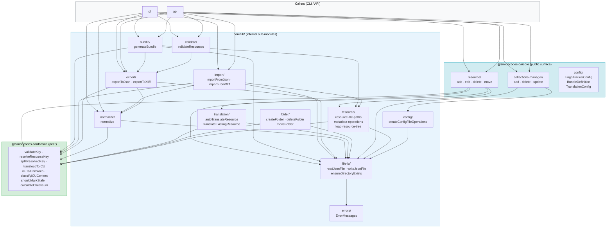
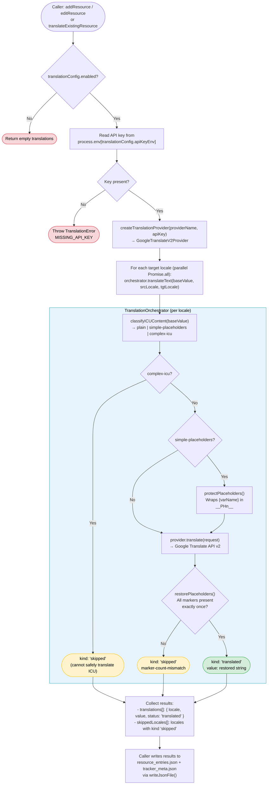

# Core Library (`@simoncodes-ca/core`)

`@simoncodes-ca/core` is the Node.js business-logic layer of LingoTracker. It owns every operation that touches the filesystem, computes checksums, calls external APIs, or orchestrates multi-step pipelines. The library depends on `@simoncodes-ca/domain` for pure logic and types, but is never imported by the browser-facing Tracker UI. All three applications — CLI, API, and the Angular app's server-side operations — call into this library.

Return to [architecture README](README.md).

---

## Table of Contents

- [Module Map](#module-map)
- [Resource CRUD Flows](#resource-crud-flows)
  - [add-resource](#add-resource)
  - [edit-resource](#edit-resource)
  - [delete-resource](#delete-resource)
  - [move-resource](#move-resource)
- [Normalization Pipeline](#normalization-pipeline)
- [Auto-Translation Pipeline](#auto-translation-pipeline)
  - [Provider abstraction](#provider-abstraction)
- [Import Pipeline](#import-pipeline)
- [Export Pipeline](#export-pipeline)
- [Bundle Generation](#bundle-generation)
- [Validation for CI/CD](#validation-for-cicd)

---

## Module Map

`@simoncodes-ca/core` is organized into two root-level groupings and one `lib/` subdirectory that holds the deeper sub-modules.

```
libs/core/src/
├── index.ts                      # Public barrel — re-exports all sub-modules
├── constants.ts                  # Shared filenames (resource_entries.json, tracker_meta.json, etc.)
│
├── config/                       # Config types used at the root of the package
│   ├── lingo-tracker-config.ts   # LingoTrackerConfig interface
│   ├── lingo-tracker-collection.ts # Collection config
│   ├── bundle-definition.ts      # BundleDefinition, CollectionBundleDefinition, EntrySelectionRule
│   └── translation-config.ts     # TranslationConfig (provider name, API key env var)
│
├── resource/                     # Resource CRUD — reads/writes resource_entries.json + tracker_meta.json
│   ├── add-resource.ts           # addResource(): create or overwrite a single entry
│   ├── edit-resource.ts          # editResource(): update value, comment, tags, or locale values
│   ├── delete-resource.ts        # deleteResource(): remove one or more entries by key
│   ├── move-resource.ts          # moveResource(): rename/relocate entries (single or wildcard)
│   ├── checksum.ts               # calculateChecksum(): MD5 via node:crypto
│   ├── resource-entry.ts         # ResourceEntry, ResourceEntries interfaces
│   ├── resource-entry-metadata.ts # ResourceEntryMetadata interface
│   └── tracker-metadata.ts       # TrackerMetadata interface
│
├── collections-manager/          # Collection-level operations (create / delete / update in config)
│   ├── add-collection.ts         # addCollection()
│   ├── delete-collection-by-name.ts # deleteCollectionByName()
│   └── update-collection.ts      # updateCollection()
│
└── lib/                          # Deeper sub-modules
    ├── bundle/                   # Bundle generation pipeline
    │   ├── generate-bundle.ts    # generateBundle(): main entry point
    │   ├── resource-loader.ts    # loadCollectionResources(): flat resource list per locale
    │   ├── hierarchy-builder.ts  # buildHierarchy(): dot-keys → nested JSON object
    │   ├── pattern-matcher.ts    # matchesPattern(): glob-style key filtering
    │   ├── tag-filter.ts         # matchesTags(): AND/OR tag filter logic
    │   └── type-generation/      # TypeScript type file generation from bundle keys
    │
    ├── export/                   # Export pipelines (JSON and XLIFF)
    │   ├── export-common.ts      # loadResourcesFromCollections(): shared resource walker
    │   ├── export-to-json.ts     # JSON export
    │   ├── export-to-xliff.ts    # XLIFF 1.2 export
    │   ├── export-summary.ts     # Human-readable export result summary
    │   └── types.ts              # ExportOptions, FilteredResource, etc.
    │
    ├── import/                   # Import pipeline (JSON and XLIFF)
    │   ├── import-workflow.ts    # setupImportWorkflow(), buildImportResult()
    │   ├── import-from-json.ts   # JSON import: flat / hierarchical / rich object detection
    │   ├── import-from-xliff.ts  # XLIFF 1.2 import
    │   ├── process-resource-group.ts # Per-folder write logic with status determination
    │   ├── resource-grouping.ts  # groupResourcesByFolder(): batches resources by target path
    │   ├── determine-status.ts   # Determines TranslationStatus for each imported value
    │   ├── apply-icu-auto-fix.ts # applyICUAutoFixToResources(): repairs malformed placeholders
    │   ├── normalize-transloco-syntax.ts # {{ x }} → {x} before storage
    │   ├── load-base-locale-values.ts    # Reads current base locale for comparison
    │   ├── reference-resolver.ts # Resolves $ref pointers in XLIFF
    │   ├── import-statistics.ts  # Counts created / updated / skipped / failed
    │   ├── import-summary.ts     # Human-readable import result summary
    │   ├── import-validation.ts  # Validates imported resources before write
    │   └── types.ts              # ImportOptions, ImportResult, ImportStrategy, etc.
    │
    ├── validate/                 # CI/CD validation pipeline
    │   ├── validate-resources.ts # validateResources(): full cross-collection status check
    │   └── generate-validation-summary.ts # Human-readable validation result summary
    │
    ├── normalize/                # Normalization pipeline
    │   ├── normalize.ts          # normalize(): main entry point
    │   ├── normalize-entry.ts    # normalizeEntry(): single-entry checksum + status repair
    │   ├── cleanup-empty-folders.ts # cleanupEmptyFolders(): removes empty directories
    │   ├── iterative-folder-walker.ts # walkFolders(): depth-ordered directory traversal
    │   └── folder-utils.ts       # Path helpers for the walker
    │
    ├── translation/              # Auto-translation provider abstraction
    │   ├── translation-provider.ts       # TranslationProvider interface, TranslationError
    │   ├── translation-provider-factory.ts # createTranslationProvider(): factory by name
    │   ├── google-translate-v2.provider.ts # GoogleTranslateV2Provider implementation
    │   ├── auto-translate-resources.ts   # autoTranslateResource(): orchestrate per-locale calls
    │   ├── translate-existing-resource.ts # translateExistingResource(): translate new/stale entries
    │   ├── placeholder-protector.ts      # protectPlaceholders() / restorePlaceholders()
    │   └── translation-orchestrator.ts   # Wraps provider call with placeholder protection
    │
    ├── folder/                   # Folder-level filesystem operations
    │   ├── create-folder.ts      # createFolder(): mkdir with segment validation
    │   ├── delete-folder.ts      # deleteFolder(): recursive removal
    │   └── move-folder.ts        # moveFolder(): rename + resource re-key
    │
    ├── file-io/                  # Low-level JSON read/write helpers
    │   ├── json-file-operations.ts  # readJsonFile(), writeJsonFile(), typed helpers
    │   └── directory-operations.ts  # ensureDirectoryExists()
    │
    ├── config/                   # Config file operations (reads/writes .lingo-tracker.json)
    │   └── config-file-operations.ts # createConfigFileOperations()
    │
    └── errors/                   # Typed error messages
        └── error-messages.ts     # ErrorMessages: static error string builders
```

<!-- Module relationship graph within @simoncodes-ca/core -->



For the entity types (`ResourceEntry`, `TrackerMetadata`, `LocaleMetadata`) that these modules read and write, see [domain-and-data-model.md](domain-and-data-model.md).

---

## Resource CRUD Flows

Resource CRUD is implemented across four functions in `libs/core/src/resource/`. Each function follows the same structural pattern: resolve the dot-delimited [resource key](glossary.md#resource-key) to a filesystem path, load the current JSON files, apply changes, recompute [checksums](glossary.md#checksum) and [translation status](glossary.md#translation-status), then write both files back atomically.

### add-resource

**Entry point:** `addResource(translationsFolder, params, options)`

Steps:

1. **Resolve paths** — `validateAndResolvePaths()` calls `resolveResourceKey()` and `splitResolvedKey()` from `@simoncodes-ca/domain` to derive `folderPath`, `resourceEntriesPath`, `trackerMetaPath`, and `entryKey`.
2. **Ensure directory** — `ensureDirectoryExists()` creates the folder tree with `mkdirSync({ recursive: true })`.
3. **Load existing files** — `readResourceEntries()` and `readTrackerMetadata()` return the current JSON or empty objects if the files do not exist yet.
4. **Normalize base value** — `translocoToICU()` converts any Transloco `{{ varName }}` syntax in the incoming base value to ICU `{varName}` before storage.
5. **Resolve translations** — three-way priority:
   - Explicit translations in `params.translations` are used as-is.
   - If no explicit translations and `translationConfig` is enabled, `autoTranslateResource()` is called (see [Auto-Translation Pipeline](#auto-translation-pipeline)).
   - Otherwise, the entry is stored with no translations (all locales default to `new` status).
6. **Build metadata** — `createResourceMetadata()` in `lib/resource/metadata-operations.ts` computes MD5 checksums for the base value and each translation, assigns `TranslationStatus` per locale.
7. **Write files** — `writeJsonFile()` writes both `resource_entries.json` and `tracker_meta.json`.

### edit-resource

**Entry point:** `editResource(translationsFolder, options)`

Steps:

1. **Resolve paths and load** — same as add-resource.
2. **Throws if not found** — exits immediately if either JSON file or the specific entry key is absent.
3. **Update base value** (if changed) — `translocoToICU()` normalizes the incoming value; `updateMetadataForBaseValueChange()` recomputes the base checksum and marks every non-base locale as `stale` if their stored `baseChecksum` diverges from the new base checksum.
4. **Update comment/tags** — simple field overwrites with change detection to avoid unnecessary writes.
5. **Update locale values** — for each locale in `options.locales`, normalizes with `translocoToICU()`, recomputes checksum via `calculateChecksum()`, and updates `status` (defaults to `'translated'` if not provided).
6. **Persist initial changes** — writes both files before attempting auto-translation, so the base value change is durable even if the translation API call fails.
7. **Auto-translate on base change** — if `baseValueDidChange` and `translationConfig` is enabled, `autoTranslateResource()` is called for all non-base locales; results are written in a second pass.

### delete-resource

**Entry point:** `deleteResource(translationsFolder, { keys })`

Steps:

1. **Validate each key** — `validateKey()` from `@simoncodes-ca/domain`.
2. **Resolve paths** — `resolveResourcePaths()`.
3. **Load and mutate** — reads `resource_entries.json`, deletes the entry key, reads `tracker_meta.json`, deletes the matching metadata key.
4. **Cleanup empty files** — if `resource_entries.json` is now empty (`Object.keys(entries).length === 0`), both JSON files are deleted with `unlinkSync()`. Otherwise, both are rewritten.
5. **Batch errors** — errors per key are collected and returned; the operation does not stop on first failure.

### move-resource

**Entry point:** `moveResource(translationsFolder, { source, destination, override })`

Two modes:

- **Single key move** (`moveSingleResource`) — validates source and destination keys, checks for collision at destination (returns warning unless `override` is set), calls `addResource()` at the destination with the source entry's existing translations (bypassing auto-translation), then calls `deleteResource()` at the source.
- **Wildcard pattern move** (`moveResourcesByPattern`) — patterns ending with `*` are expanded by `walkFolders()` to enumerate all keys under the prefix, then each key is moved individually using `moveSingleResource()`.

---

## Normalization Pipeline

**Entry point:** `normalize(params)` in `lib/normalize/normalize.ts`

[Normalization](glossary.md#normalization) is a repair and synchronization pass over the entire `translationsFolder`. It is designed to be idempotent and non-destructive — it never removes existing translation values.

Steps:

1. **Walk folders** — `walkFolders()` in `iterative-folder-walker.ts` traverses the directory tree iteratively (not recursively), grouping folders by depth level. Folders at the same depth are processed concurrently (`Promise.all`), but since all I/O inside is synchronous (`fs.readFileSync` / `fs.writeFileSync`), there is no interleaving risk.
2. **Load files per folder** — `loadResourceFiles()` reads `resource_entries.json` and `tracker_meta.json`, skipping folders with invalid JSON and emitting a console warning.
3. **Normalize each entry** — `normalizeEntry()` in `normalize-entry.ts` performs per-entry normalization:
   - Recomputes the base locale checksum and updates `tracker_meta.json` if it changed.
   - For each configured locale: adds a placeholder entry (base value copied, status `new`) if the locale is missing entirely; recomputes the translation checksum; updates status to `stale` if the stored `baseChecksum` no longer matches the current base checksum; converts any Transloco `{{ varName }}` syntax in stored values to ICU via `translocoToICU()` (tracked as `valuesConverted`).
4. **Persist changes** — if any entry in a folder changed, both JSON files are rewritten. If the files did not exist (orphaned folder), they are created.
5. **Dry-run mode** — when `dryRun: true`, all file writes are skipped and counters still reflect what *would* change.
6. **Cleanup empty folders** — after all folders are processed, `cleanupEmptyFolders()` removes any directories that no longer contain `resource_entries.json`.

Returns a `NormalizeResult` with counts: `entriesProcessed`, `localesAdded`, `valuesConverted`, `filesCreated`, `filesUpdated`, `foldersRemoved`.

---

## Auto-Translation Pipeline

**Entry point:** `autoTranslateResource(params)` in `lib/translation/auto-translate-resources.ts`

This pipeline is called from `addResource()` and `editResource()` (on base value change), and also from the standalone `translateExistingResource()` function which targets only entries with `new` or `stale` status.

<!-- Auto-translation pipeline flowchart -->



### Provider abstraction

The `TranslationProvider` interface in `translation-provider.ts` defines the contract that all translation backends must satisfy:

```typescript
interface TranslationProvider {
  translate(requests: TranslateRequest[]): Promise<TranslateResult[]>;
  getCapabilities(): ProviderCapabilities;
}
```

`createTranslationProvider(providerName, apiKey)` in `translation-provider-factory.ts` is the single switch-point that maps a provider name string to a concrete implementation. Today only `'google-translate'` is supported, instantiating `GoogleTranslateV2Provider`. Adding a new provider (e.g. DeepL) requires:

1. Implementing `TranslationProvider`.
2. Adding one `case` branch in `createTranslationProvider()`.
3. Updating `TranslationConfig` to accept the new provider name.

**Why a single factory instead of a plugin registry?** LingoTracker currently has one provider. A plugin-registry pattern (dynamic module loading, registration maps) would add indirection and surface area for no concrete benefit. The factory switch is O(1), statically typed, and the full provider list is visible at a glance. If a second provider ships, the factory grows by four lines. This is "extensible without over-engineering" — the abstraction boundary (`TranslationProvider`) is clean; the wiring (`createTranslationProvider`) is simple until it needs to be otherwise.

The `TranslationOrchestrator` class sits between `autoTranslateResource()` and the provider. It is responsible for:

- Calling `classifyICUContent()` from `@simoncodes-ca/domain` to decide whether the string is safe to send to the provider.
- Calling `protectPlaceholders()` before the provider call and `restorePlaceholders()` after, to prevent the translation engine from mutating ICU variable names.
- Returning a discriminated union (`kind: 'translated' | 'skipped'`) so callers can distinguish success from graceful skip without exception handling.

The [ICU format](glossary.md#icu-format) classification determines safety: `plain` and `simple-placeholders` strings are sent (with placeholder protection for the latter); `complex-icu` strings (containing `plural`, `select`, or `selectordinal`) are skipped entirely because machine translation cannot reliably preserve nested ICU syntax.

---

## Import Pipeline

**Entry points:** `importFromJson(options)` and `importFromXliff(options)` in `lib/import/`.

The import pipeline ingests an external translation file for a single locale and reconciles it with the existing resource tree. Steps common to both formats:

1. **Setup workflow** — `setupImportWorkflow(options)` resolves the base locale from `.lingo-tracker.json`, applies strategy-specific defaults for `createMissing`, `updateComments`, and `updateTags`, and guards against importing into the base locale with a non-`migration` strategy.
2. **Parse source file** — format-specific logic extracts a flat list of `ImportedResource` objects (`key`, `value`, optional `baseValue`, `comment`, `tags`, `status`). JSON import additionally detects whether the source is flat (`{"common.ok": "OK"}`) or hierarchical (`{common: {ok: "OK"}}`) via `detectJsonStructure()`, then flattens hierarchical structures.
3. **Normalize syntax** — `normalizeTranslocoSyntaxInResources()` converts any Transloco `{{ varName }}` in imported values to ICU `{varName}` before further processing.
4. **ICU auto-fix** — `applyICUAutoFixToResources()` repairs malformed ICU placeholder syntax (e.g. wrong brace styles from translation services) using `icuAutoFixer` from `@simoncodes-ca/domain`. Fixes and errors are recorded separately in the result.
5. **Validate** — `validateImportResources()` checks for duplicate keys and other structural problems before any writes.
6. **Group by folder** — `groupResourcesByFolder()` batches resources by their target `resource_entries.json` path, so each file is read and written once.
7. **Process each group** — `processResourceGroup()` reads the existing entries and metadata, applies the imported values according to the chosen [import strategy](glossary.md#import-strategy), calls `determineStatus()` to assign the correct `TranslationStatus` for each entry, and writes both JSON files.
8. **Build result** — `buildImportResult()` assembles counts, status transitions, file lists, warnings, errors, ICU fix records, and the `dryRun` flag into an `ImportResult`.

Import strategies control how the merge behaves:

| Strategy | `createMissing` default | `updateComments` default | Base locale allowed |
|---|---|---|---|
| `translation-service` | false | false | No |
| `verification` | false | false | No |
| `migration` | true | true | Yes |
| `update` | false | false | No |

For the full sequence diagram of an import operation, see [user-flows.md — Import / Export Flow](user-flows.md#2-import--export-flow).

---

## Export Pipeline

**Entry points:** `exportToJson(options)` and `exportToXliff(options)` in `lib/export/`.

Export serializes the current resource tree for one locale into an external file format. The pipeline shares a common resource-loading step:

1. **Load resources** — `loadResourcesFromCollections()` in `export-common.ts` walks the translation folder tree via `walkFolders()`, reading every `resource_entries.json` and its paired `tracker_meta.json`. Each entry becomes a `LoadedResource` object carrying `source`, `translations`, `status`, `tags`, and `comment`.
2. **Filter** — callers may restrict the export by tag or key pattern.
3. **Serialize** — JSON export writes a flat or hierarchical JSON file; XLIFF export writes an XLIFF 1.2 document with `<trans-unit>` elements and optional `<note>` elements for comments.

For the full sequence diagram, see [user-flows.md — Import / Export Flow](user-flows.md#2-import--export-flow).

---

## Bundle Generation

**Entry point:** `generateBundle(params)` in `lib/bundle/generate-bundle.ts`

[Bundle](glossary.md#bundle) generation aggregates resources from one or more collections into a single locale JSON file per configured locale, converting [ICU format](glossary.md#icu-format) to Transloco syntax in the process.

Key steps:

1. **Resolve configuration** — token casing, ICU-to-Transloco transformation flag, and target locales are resolved via a three-level priority chain: CLI override → bundle config → global config → default.
2. **Load resources** — `loadCollectionResources()` reads flat `{key: value}` pairs for the target locale and base locale, falling back to the base locale value when a translation is absent.
3. **Filter entries** — `EntrySelectionRule` objects in the `BundleDefinition` combine pattern matching (`matchesPattern()`) and tag filtering (`matchesTags()`) to include only the relevant subset of resources. Collections set to `'All'` skip filtering.
4. **ICU conversion** — when `transformICUToTransloco` is `true` (the default), `icuToTransloco()` from `@simoncodes-ca/domain` is called on each value. Values with malformed ICU syntax are passed through with a warning.
5. **Build hierarchy** — `buildHierarchy()` converts the flat `{dotKey: value}` map into a nested object matching the Angular Transloco expected structure.
6. **Write output** — `writeBundleFile()` creates the output directory if needed and writes the JSON file at the path defined by `bundleDefinition.dist` + `bundleDefinition.bundleName.replace('{locale}', locale)`.
7. **Type generation** — if `bundleDefinition.typeDist` is configured, `generateBundleTypes()` emits a TypeScript constant file with the translation key tree for use in Angular templates.

For a deep-dive into `BundleDefinition` configuration and the type generation sub-pipeline, see [bundle-generation.md](bundle-generation.md) *(phase 5, coming soon)*.

---

## Validation for CI/CD

**Entry point:** `validateResources(collections, targetLocales, options)` in `lib/validate/validate-resources.ts`

The validation pipeline is designed for headless CI/CD use. It loads all resources from all specified collections via `loadResourcesFromCollections()` (the same shared walker used by the export pipeline), then checks every resource key in every target locale against its stored [translation status](glossary.md#translation-status).

Categorization rules:

| Status | Default result | With `allowTranslated: true` |
|---|---|---|
| `new` | Failure | Failure |
| `stale` | Failure | Failure |
| `translated` | Failure | Warning |
| `verified` | Success | Success |

The function never stops at the first failure — it validates all resources and returns a complete `ResourceValidationResult` so the team has full visibility. The result includes:

- `passed: boolean` — `true` only when `failures.length === 0`
- `failures`, `warnings`, `successes` — `ResourceValidationDetail[]` objects with `key`, `locale`, `collection`, and `status`
- `statusCounts` — aggregate counts per status type
- `totalResourcesValidated`, `totalUniqueKeys`, `localesValidated`, `collectionsValidated`

`generateValidationSummary()` in `generate-validation-summary.ts` converts this result into a human-readable string for CLI output.

The CLI's `validate` command exits with a non-zero code when `passed` is `false`, making it suitable for use as a blocking step in CI pipelines. The `--allow-translated` flag maps directly to `options.allowTranslated`.

For the [staleness](glossary.md#staleness) detection mechanism that produces `stale` status entries in the first place, see [domain-and-data-model.md — Checksum-Driven Staleness Detection](domain-and-data-model.md#checksum-driven-staleness-detection).

For the CLI command signatures and flags that call into this library, see [cli.md](cli.md) *(phase 4, coming soon)*. For the API endpoints that expose these operations over HTTP, see [api.md](api.md) *(phase 4, coming soon)*.
