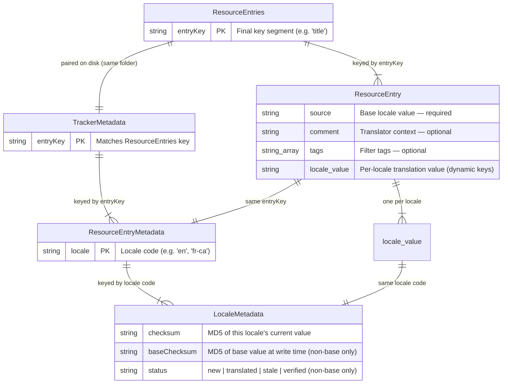
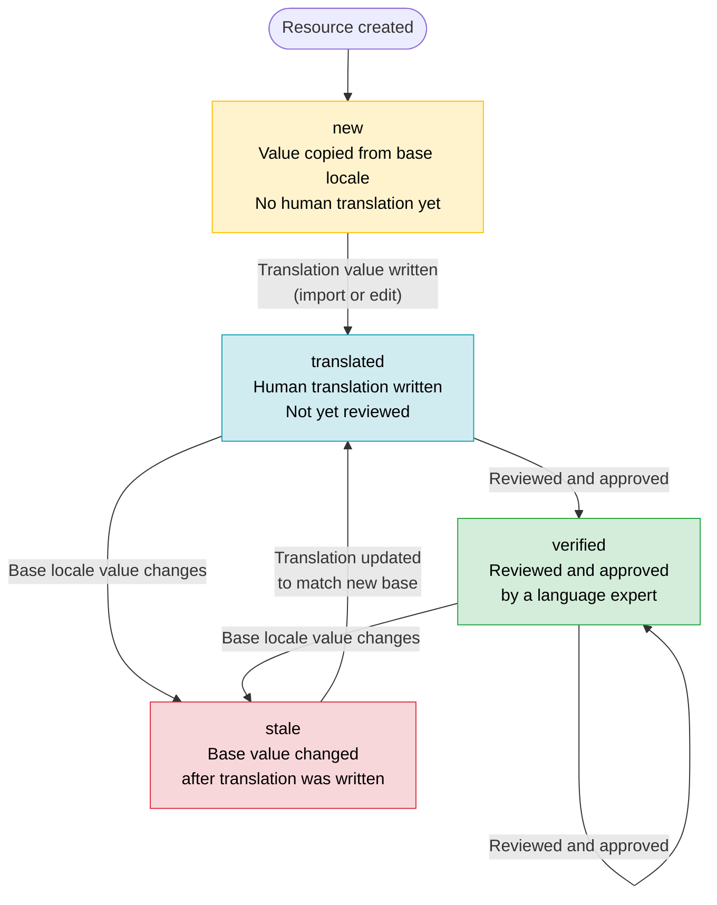

# Domain and Data Model

LingoTracker stores all translation data as plain JSON files on disk, organized by a dot-delimited [resource key](#resource-key-anatomy) that maps directly to a folder hierarchy. This document explains how keys decompose into filesystem paths, what the two JSON files in each folder contain, how the entity relationships are modeled in TypeScript, and how the [ICU format](glossary.md#icu-format) used internally relates to the [Transloco](glossary.md#transloco) format emitted in bundles.

Return to [architecture README](README.md).

---

## Table of Contents

- [Resource Key Anatomy](#resource-key-anatomy)
- [Storage Format on Disk](#storage-format-on-disk)
  - [resource_entries.json](#resource_entriesjson)
  - [tracker_meta.json](#tracker_metajson)
  - [Folder layout example](#folder-layout-example)
- [Entity Diagram](#entity-diagram)
- [ICU vs Transloco Format](#icu-vs-transloco-format)
- [Translation Status Lifecycle](#translation-status-lifecycle)
- [Checksum-Driven Staleness Detection](#checksum-driven-staleness-detection)

---

## Resource Key Anatomy

A [resource key](glossary.md#resource-key) is a dot-delimited string that uniquely identifies a single translatable string within a [collection](glossary.md#collection). Each dot-separated segment may contain only alphanumeric characters, underscores, and hyphens (`[A-Za-z0-9_-]`).

```
apps.common.buttons.ok
│    │      │       └── entryKey   — property name in resource_entries.json
│    │      └────────── folder segment
│    └───────────────── folder segment
└────────────────────── folder segment
```

**The last segment is always the entry key.** All preceding segments are folder path components. The key `apps.common.buttons.ok` resolves to:

```
<translationsFolder>/
└── apps/
    └── common/
        └── buttons/
            ├── resource_entries.json   ← contains the "ok" entry
            └── tracker_meta.json       ← contains checksums and status for "ok"
```

A [resolved key](glossary.md#resolved-key) is formed by prepending an optional [target folder](glossary.md#target-folder): `resolvedKey = targetFolder + "." + key`. For example, key `ok` with target folder `apps.common.buttons` resolves to `apps.common.buttons.ok` before the folder path is computed. The resolution logic lives in `resolveResourceKey()` in `@simoncodes-ca/domain`.

A single-segment key (e.g. `title`) places the entry at the root of the collection's `translationsFolder` — no subdirectory is created.

---

## Storage Format on Disk

Each folder in the translation hierarchy contains exactly two JSON files written side-by-side.

### resource_entries.json

Holds the actual translation values. The top-level object is keyed by entry key (the final segment of the [resource key](glossary.md#resource-key)). Each value is a `ResourceEntry` object:

```typescript
interface ResourceEntry {
  source: string;           // Base locale value — always required
  comment?: string;         // Optional context for translators
  tags?: string[];          // Optional tags for bundle/export filtering
  [locale: string]: string | string[] | undefined;  // Translation values keyed by locale code
}
```

Real example from `apps/tracker/src/i18n/browser/dialog/deleteResource/resource_entries.json`:

```json
{
  "title": {
    "source": "Delete Resource",
    "comment": "Title of the confirmation dialog when deleting a resource",
    "tags": ["browser"],
    "es": "Eliminar recurso",
    "fr-ca": "Supprimer la ressource",
    "ru": "Удалить ресурс",
    "ja": "リソースを削除する",
    "de": "Ressource löschen"
  },
  "messageX": {
    "source": "Are you sure you want to delete the resource \"{key}\"? This action cannot be undone.",
    "comment": "Confirmation message when deleting a resource, interpolated with the resource key",
    "tags": ["browser"],
    "es": "¿Seguro que desea eliminar el recurso \"{key}\"? Esta acción no se puede deshacer.",
    "fr-ca": "Êtes-vous certain de vouloir supprimer la ressource « {key} » ? Cette action est irréversible.",
    "ru": "Вы уверены, что хотите удалить ресурс \"{key}\"? Это действие необратимо.",
    "ja": "リソース「{key}」を削除してもよろしいですか？この操作は元に戻せません。",
    "de": "Sind Sie sicher, dass Sie die Ressource \"{key}\" löschen möchten? Diese Aktion kann nicht rückgängig gemacht werden."
  }
}
```

Note that translation values use [ICU format](glossary.md#icu-format) internally — single braces `{key}` are ICU placeholders, not Transloco syntax.

---

### tracker_meta.json

Holds [tracker metadata](glossary.md#tracker-metadata) — checksums and [translation status](glossary.md#translation-status) — for every entry in the sibling `resource_entries.json`. The structure is a two-level object: entry key → locale code → [`LocaleMetadata`](glossary.md#locale-metadata).

```typescript
// TrackerMetadata  (tracker_meta.json root object)
interface TrackerMetadata {
  [entryKey: string]: ResourceEntryMetadata;
}

// ResourceEntryMetadata  (per-entry object)
interface ResourceEntryMetadata {
  [locale: string]: LocaleMetadata;
}

// LocaleMetadata  (per-locale object — defined in @simoncodes-ca/domain)
interface LocaleMetadata {
  checksum: string;         // MD5 of this locale's current value
  baseChecksum?: string;    // MD5 of the base locale value at write time (non-base only)
  status?: TranslationStatus; // absent for the base locale
}
```

Real example from the same folder (`tracker_meta.json`):

```json
{
  "title": {
    "en": {
      "checksum": "7091aa93a78122401125a34800f9a1ac"
    },
    "es": {
      "checksum": "ee896d033ef40229535db90ef2b19656",
      "baseChecksum": "7091aa93a78122401125a34800f9a1ac",
      "status": "translated"
    },
    "fr-ca": {
      "checksum": "a56e2e5c2d55f4ee33b68aa628d0fa3e",
      "baseChecksum": "7091aa93a78122401125a34800f9a1ac",
      "status": "translated"
    }
  },
  "messageX": {
    "en": {
      "checksum": "ac83571aec2e065433da7fd905696d5f"
    },
    "es": {
      "checksum": "37dc1cb6432bff8549cb94e6f94d5dba",
      "baseChecksum": "ac83571aec2e065433da7fd905696d5f",
      "status": "stale"
    },
    "fr-ca": {
      "checksum": "8c4dc291d4e9879be2c9a5e2faae5df7",
      "baseChecksum": "ac83571aec2e065433da7fd905696d5f",
      "status": "stale"
    }
  }
}
```

Key observations:

- The [base locale](glossary.md#base-locale) entry (`en`) has only `checksum` — no `status` or `baseChecksum`.
- Non-base locale entries carry both `checksum` (MD5 of their own value) and `baseChecksum` (MD5 of the base value at the time they were last written).
- The `messageX` entry for `es` and `fr-ca` has `status: "stale"` because the English source changed after those translations were written, so `baseChecksum` no longer matches the current English `checksum`.

---

### Folder layout example

For a collection with `translationsFolder: "src/i18n"` and resources `browser.dialog.deleteResource.title` and `browser.dialog.deleteResource.messageX`:

```
src/i18n/
└── browser/
    └── dialog/
        └── deleteResource/
            ├── resource_entries.json
            └── tracker_meta.json
```

Both entries live in the same `resource_entries.json` because they share the same folder path (`browser/dialog/deleteResource/`). They are distinguished only by their entry keys (`title` and `messageX`).

---

## Entity Diagram

<!-- ER diagram showing the relationships between the core domain entities -->



`ResourceEntries` and `TrackerMetadata` are always paired: one `resource_entries.json` and one `tracker_meta.json` per folder, never one without the other. The relationship between `ResourceEntry` and `ResourceEntryMetadata` is by shared entry key; the relationship between a locale value in `ResourceEntry` and a `LocaleMetadata` object is by shared locale code.

---

## ICU vs Transloco Format

LingoTracker uses two formats at different points in the pipeline:

| Format | Syntax | Where used |
|---|---|---|
| [ICU format](glossary.md#icu-format) | `Hello {name}`, `{count, plural, one {# item} other {# items}}` | Stored in `resource_entries.json`; used throughout the CLI, API, and Tracker UI |
| [Transloco](glossary.md#transloco) syntax | `Hello {{ name }}` (simple vars only) | Emitted in generated bundle JSON files consumed by Angular apps |

**Why store in ICU format?** ICU is the most expressive and unambiguous format for locale-sensitive strings. Storing ICU internally means the data model is not coupled to Transloco's specific interpolation syntax — it could generate output for other i18n libraries in the future.

**The conversion happens at bundle time**, not at write time. When `core` generates a [bundle](glossary.md#bundle), it calls `icuToTransloco()` from `@simoncodes-ca/domain` on each value before writing the output file. The conversion rules are:

- **Simple placeholders** — `{varName}` (no comma inside the braces) → `{{ varName }}`
- **Complex ICU constructs** — `{count, plural, ...}`, `{gender, select, ...}` — passed through unchanged, because Transloco's messageformat pipe handles these natively
- **ICU quote escaping** — `''` and `'{'...'}'` syntax is unescaped to produce literal characters in the output

**Going the other direction**: when importing external translation files (XLIFF or JSON), `transloco-to-icu.ts` converts Transloco `{{ varName }}` back to ICU `{varName}` before the values are stored.

The `transformICUToTransloco` flag in `BundleDefinition` (default `true`) controls whether conversion happens for a given bundle. Setting it to `false` emits raw ICU format — useful for non-Transloco consumers.

See [bundle-generation.md](bundle-generation.md) *(phase 5, coming soon)* for the full bundle pipeline including how `icuToTransloco()` is called in context.

---

## Translation Status Lifecycle

Every non-base locale entry has a [translation status](glossary.md#translation-status) stored in its `LocaleMetadata`. The base locale has no status — it is always the source of truth.

<!-- State transition diagram for the translation status lifecycle -->



Status in CI validation:

| Status | Default CI result |
|---|---|
| `new` | Failure |
| `translated` | Failure (warning with `--allow-translated` flag) |
| `stale` | Failure |
| `verified` | Pass |

Only `verified` entries pass CI validation without flags. This forces an explicit human review step before a translation is considered production-ready.

The status is stored in `tracker_meta.json` — never in `resource_entries.json`. Separating content from metadata means translation values can be diffed cleanly in Git without checksum noise.

---

## Checksum-Driven Staleness Detection

[Staleness](glossary.md#staleness) is detected automatically by comparing two [checksums](glossary.md#checksum) stored in `tracker_meta.json`:

1. **`checksum`** — MD5 of the entry's own locale value at the last write.
2. **`baseChecksum`** — MD5 of the base locale value at the time this translation was last written.

When the base locale value is updated (via `edit-resource` or import), `core` recomputes the base entry's `checksum`. For every non-base locale, it then compares the stored `baseChecksum` against the new base `checksum`. If they differ, the locale's status is automatically set to `stale` — no separate scan command is needed.

The check happens in `shouldMarkStale()` in `@simoncodes-ca/domain`:

```typescript
function shouldMarkStale(currentMetadata: LocaleMetadata, newBaseChecksum: string): boolean {
  return currentMetadata.baseChecksum !== undefined
    && currentMetadata.baseChecksum !== newBaseChecksum;
}
```

**Why MD5?** LingoTracker uses MD5 solely as a fast, deterministic, fixed-length content fingerprint — not as a cryptographic security primitive. MD5 produces a 32-character hex digest (`calculateChecksum` uses `node:crypto` via `crypto.createHash('md5').update(value).digest('hex')`). Collision resistance is not required here: the values being hashed are human-readable translation strings, and a collision would at worst suppress a stale detection for one entry. MD5 is faster than SHA-256 for this high-frequency, low-risk use case, and its 32-character output is compact enough to keep `tracker_meta.json` files readable in Git diffs.

See [core-library.md](core-library.md) for the CRUD operations that read, compute, and write these checksums as part of `add-resource`, `edit-resource`, and import flows.
