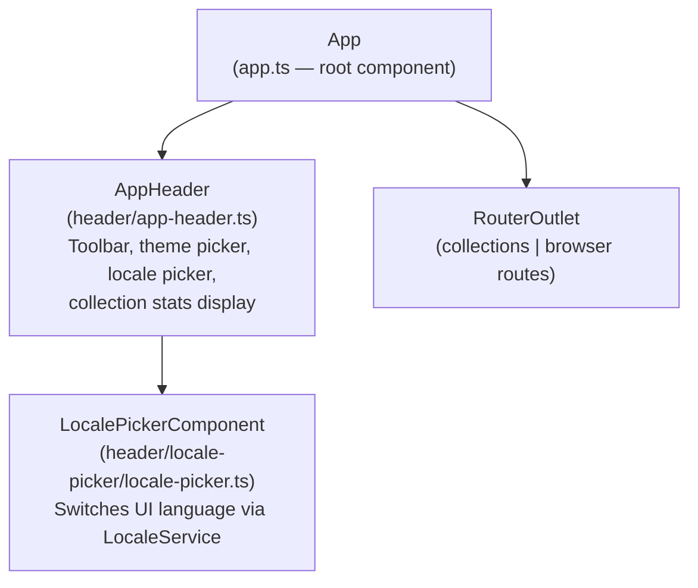
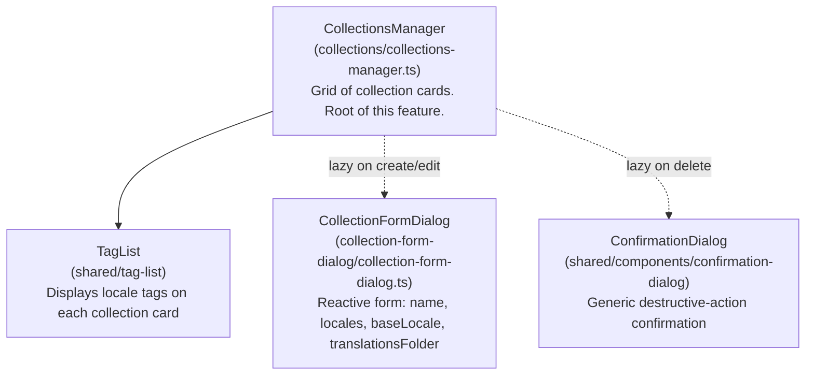
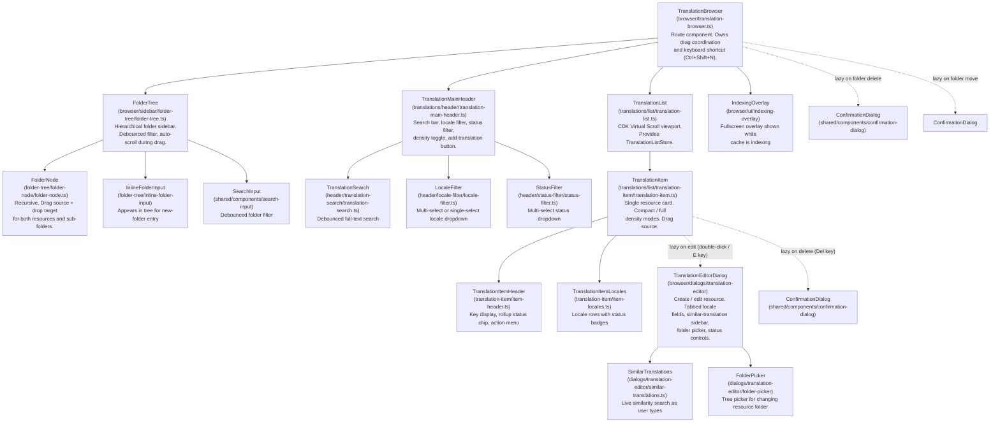
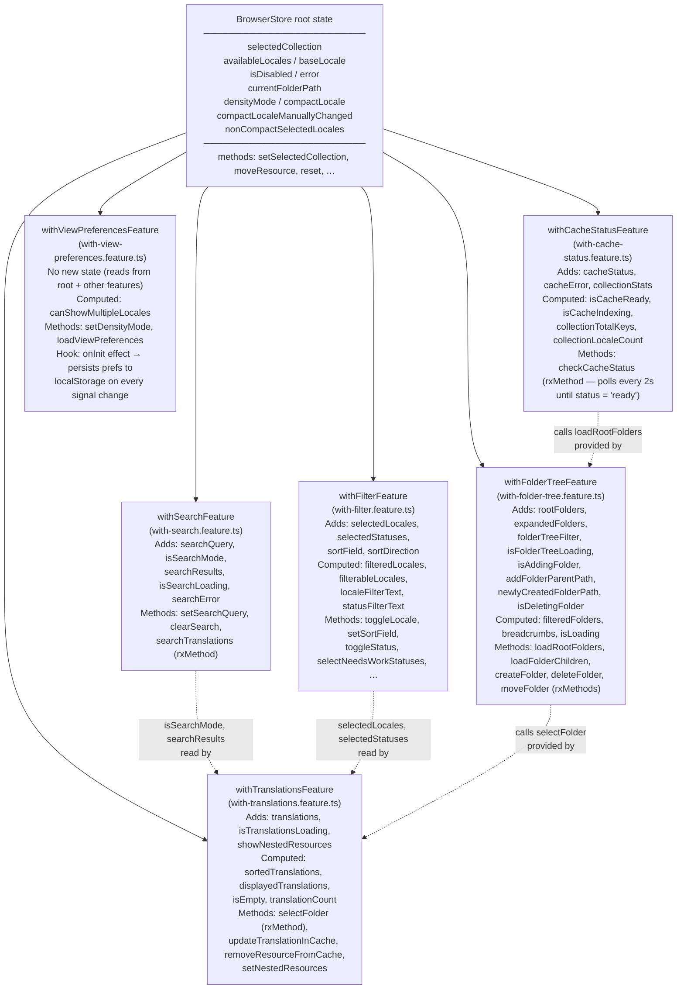

# Frontend Architecture — Tracker UI

The Tracker UI is a standalone Angular 20 SPA served by the NestJS API process. It provides two feature areas — a **collections manager** for creating and configuring translation collections, and a **translation browser** for browsing, filtering, editing, and reorganising resources within a collection. State is managed exclusively with NgRx Signal Store (`signalStore` / `signalStoreFeature`). All components are standalone, signal-based, and use `OnPush` change detection.

Return to [architecture README](README.md).

---

## Table of Contents

- [Route Structure](#route-structure)
- [Component Trees](#component-trees)
  - [App Shell](#app-shell)
  - [Collections Feature](#collections-feature)
  - [Browser Feature](#browser-feature)
- [State Management Architecture](#state-management-architecture)
  - [BrowserStore — Feature Composition](#browserstore--feature-composition)
  - [BrowserStore Feature Breakdown](#browserstore-feature-breakdown)
  - [TranslationListStore](#translationliststore)
  - [CollectionsStore](#collectionsstore)
- [Key UI Patterns](#key-ui-patterns)
  - [Virtual Scrolling](#virtual-scrolling)
  - [Optimistic Updates with Rollback](#optimistic-updates-with-rollback)
  - [Drag-and-Drop — Move Resource and Folder](#drag-and-drop--move-resource-and-folder)
  - [Lazy-Loaded Dialogs](#lazy-loaded-dialogs)
- [Theming System](#theming-system)
- [i18n — Transloco Integration](#i18n--transloco-integration)
- [Cross-Links](#cross-links)

---

## Route Structure

The app shell boots at `/collections`. The translation browser is accessed at `/browser/:collectionName`. Both routes are lazy-loaded via `loadComponent`:

```
/                         → redirect → /collections
/collections              → CollectionsManager (lazy)
/browser/:collectionName  → TranslationBrowser (lazy)
```

---

## Component Trees

### App Shell

<!-- Top-level component hierarchy for the App shell -->



`App` loads `CollectionsStore` on `ngOnInit` so collection data is available before any route resolves. `AppHeader` reads collection context from `HeaderContextService` (a plain injectable signal holder) — `TranslationBrowser` writes into it and `AppHeader` reads from it, decoupling the two without a store dependency.

---

### Collections Feature

<!-- Component hierarchy for the Collections feature (/collections route) -->



`CollectionsManager` reads from `CollectionsStore` (provided in root). Dialogs are opened via `MatDialog.open()` using dynamic `import()` — they are never in the initial bundle.

---

### Browser Feature

<!-- Full component hierarchy for the Translation Browser (/browser/:collectionName route) -->



`TranslationBrowser` wraps the sidebar and list in a `CdkDropListGroup` so drag-and-drop events can cross component boundaries. The `activeDragData` signal on `TranslationBrowser` propagates the currently dragged item to `FolderTree` via an input, enabling drop-target highlighting in the sidebar while an item is dragged from the list.

---

## State Management Architecture

### BrowserStore — Feature Composition

`BrowserStore` is a single `signalStore` provided in root. Its state is split across six `signalStoreFeature` functions that compose sequentially. Cross-cutting state (the fields shared between multiple features) lives in the root `withState()` call; each feature adds its own slice.

<!-- BrowserStore feature composition — how with-* files build up the root store -->



**Composition order matters.** `withFolderTreeFeature` requires `selectFolder` and `setTranslationsLoading` from `withTranslationsFeature`, so `withTranslationsFeature` must appear first. `withCacheStatusFeature` requires `loadRootFolders` from `withFolderTreeFeature`, so it follows. `withViewPreferencesFeature` reads from every other feature's state and is last.

---

### BrowserStore Feature Breakdown

| Feature file | State owned | Key computed signals | Key methods |
|---|---|---|---|
| `with-search.feature.ts` | `searchQuery`, `isSearchMode`, `searchResults`, `isSearchLoading`, `searchError` | — | `setSearchQuery`, `clearSearch`, `searchTranslations` |
| `with-filter.feature.ts` | `selectedLocales`, `selectedStatuses`, `sortField`, `sortDirection` | `filteredLocales`, `filterableLocales`, `localeFilterText`, `statusFilterText`, `isShowingAllLocales`, `isShowingAllStatuses` | `toggleLocale`, `setSelectedLocales`, `setSortField`, `toggleSortDirection`, `toggleStatus`, `selectNeedsWorkStatuses` |
| `with-translations.feature.ts` | `translations`, `isTranslationsLoading`, `showNestedResources` | `sortedTranslations`, `displayedTranslations`, `isEmpty`, `translationCount`, `hasTranslations` | `selectFolder`, `setTranslationsLoading`, `setNestedResources`, `updateTranslationInCache`, `removeResourceFromCache` |
| `with-folder-tree.feature.ts` | `rootFolders`, `expandedFolders`, `folderTreeFilter`, `isFolderTreeLoading`, `isAddingFolder`, `addFolderParentPath`, `newlyCreatedFolderPath`, `isDeletingFolder`, `deletingFolderPath` | `filteredFolders`, `breadcrumbs`, `isLoading` | `loadRootFolders`, `loadFolderChildren`, `createFolder`, `createFolderAt`, `deleteFolder`, `moveFolder`, `toggleFolderExpanded`, `startAddingFolder`, `cancelAddingFolder` |
| `with-cache-status.feature.ts` | `cacheStatus`, `cacheError`, `collectionStats` | `isCacheReady`, `isCacheIndexing`, `collectionTotalKeys`, `collectionLocaleCount`, `hasCollectionStats` | `checkCacheStatus` (polls every 2 s via `interval`, stops when `status === 'ready'`) |
| `with-view-preferences.feature.ts` | (no new state) | `canShowMultipleLocales` | `setDensityMode`, `loadViewPreferences` (reads `localStorage`) |

Root-level methods on `BrowserStore` (not in a feature):

| Method | Purpose |
|---|---|
| `setSelectedCollection` | Switches active collection, restores view preferences from `localStorage`, triggers cache polling |
| `moveResource` | Optimistic remove from `translations` → API call → re-fetch on success, rollback on error |
| `reset` | Clears all state slices back to initial values |
| `setBaseLocale`, `setDisabled`, `clearError` | Simple `patchState` helpers |

---

### TranslationListStore

`TranslationListStore` is a lightweight store provided at the `TranslationList` component level (not root). It composes two features:

- **`withItemUiState`** — tracks `translatingKeys: Set<string>` (in-progress auto-translate calls) and `recentlyUpdatedKey: string | undefined` (drives the 1.5 s flash highlight after a save). Exposes `addTranslatingKey`, `removeTranslatingKey`, `flashRecentlyUpdated`, `isTranslating(key)`, `isRecentlyUpdated(key)`. Cleans up the flash timer `onDestroy`.
- **`withItemActions`** — exposes `editTranslation`, `deleteTranslation`, `translateResource`, `copyKey`. Opens `TranslationEditorDialog` or `ConfirmationDialog` via `MatDialog`. On edit success, delegates cache updates to `BrowserStore.updateTranslationInCache()`.

Because `TranslationListStore` is component-provided, each `TranslationList` instance gets its own store. `TranslationItem` injects it via `inject(TranslationListStore)` — no prop drilling needed.

---

### CollectionsStore

`CollectionsStore` is a flat, root-provided signal store (no feature decomposition). It holds `config: LingoTrackerConfigDto | null`, `isLoading`, and `error`. Computed signals derive `collectionEntries`, `collectionEntriesWithLocales`, `hasCollections`, and `collections`. Methods (`loadCollections`, `createCollection`, `updateCollection`, `deleteCollection`) each reload the full config from the API after mutation rather than doing local optimistic updates — collections change rarely, so this keeps the store simple.

---

## Key UI Patterns

### Virtual Scrolling

The translation list can contain thousands of entries. `TranslationList` wraps items in a `CdkVirtualScrollViewport` (`@angular/cdk/scrolling`).

CDK Virtual Scroll requires a fixed item height. LingoTracker's items are variable in practice (compact mode vs. full mode, number of locale rows). The solution is a `computed` signal — `currentItemSize` — that derives the correct pixel height from the current store state:

- **Compact mode**: `96px` (or `100px` on touch devices) + `4px` margin = `100` / `104`.
- **Full mode**: `80px` base + `min(nonBaseLocaleCount, 4) × 32px` + `12px` margin. For example, with 3 non-base locales: `80 + 3×32 + 12 = 188px`.

The viewport recalculates its size via `viewport.checkViewportSize()` inside `requestAnimationFrame` whenever an item toggles expansion (`handleItemExpansion`). A `trackByKey` function is provided so CDK recycles DOM nodes by resource key.

---

### Optimistic Updates with Rollback

**Move resource** (`BrowserStore.moveResource`):

1. Snapshot current `translations` array.
2. Immediately `patchState` with the resource removed (`optimisticTranslations`).
3. Call `api.moveResource()`.
4. On success: reload folder tree and re-select the current folder.
5. On error: restore the snapshot, set `error`, show an error notification.

**Move folder** (`withFolderTreeFeature.moveFolder`):

1. Show a confirmation dialog (lazy-loaded).
2. On confirm: snapshot `rootFolders`, immediately remove the source folder from the tree.
3. Call `api.moveFolder()`.
4. On success: rebase the folder node's paths and insert it at the destination, expand the destination, reload translations.
5. On error: restore the snapshot, clear `isDisabled` and `isDeletingFolder`, show an error notification.

**Edit translation** (via `TranslationListStore.withItemActions`):

Editing happens inside the dialog. On dialog close with `result.success`, `BrowserStore.updateTranslationInCache` replaces the stale entry in the `translations` array in-place. There is no server round-trip for the cache update — the API response from the save is embedded in `result.resource`. `TranslationListStore.flashRecentlyUpdated` then sets `recentlyUpdatedKey` for 1.5 s to drive the highlight animation.

---

### Drag-and-Drop — Move Resource and Folder

Angular CDK drag-and-drop (`@angular/cdk/drag-drop`) is used for two drag types, distinguished by a `DragData` union type:

```typescript
type DragData =
  | { type: 'resource'; key: string; folderPath: string }
  | { type: 'folder'; path: string };
```

`TranslationBrowser` wraps all drag participants in a `CdkDropListGroup`. `TranslationList` is a drag source only (`noDropPredicate = () => false`). `FolderNode` is both a drag source (folders) and a drop target (accepts resources and folders).

When a drag starts on `TranslationItem`, the `dragStarted` output bubbles up through `TranslationList` → `TranslationBrowser`. `TranslationBrowser` stores the `DragData` in its `activeDragData` signal and passes it to `FolderTree` via an input. `FolderTree` passes it down to `FolderNode` components so they can highlight when a draggable item is over them.

`FolderTree` also implements edge-proximity auto-scroll: a `mousemove` listener during drag checks the cursor position against the folder list's bounding rect. If within `50px` of the top or bottom edge, a `setInterval` scrolls at `15px` per `50ms` until the cursor moves away.

On drop, `FolderTree` calls either `BrowserStore.moveResource` or `BrowserStore.moveFolder`, both of which apply optimistic updates as described above.

---

### Lazy-Loaded Dialogs

No dialog component appears in any component's `imports` array. All dialogs are opened via:

```typescript
import('./path/to/dialog').then((m) => {
  this.#dialog.open(m.SomeDialog, { ... });
});
```

This keeps dialog modules out of the initial bundle entirely. The pattern is used for:

- `CollectionFormDialog` — create / edit collection (from `CollectionsManager`)
- `TranslationEditorDialog` — create / edit resource (from `TranslationMainHeader` and `TranslationListStore.withItemActions`)
- `ConfirmationDialog` — delete collection, delete resource, delete folder, move folder (from multiple call sites)

`TranslationEditorDialog` opens the `FolderPicker` (a nested dialog via `MatDialog`) if the user wants to move the resource to a different folder. `FolderPicker` in turn calls `BrowserStore.createFolderAt` to create folders inline without leaving the dialog.

---

## Theming System

The theme system has three layers:

**1. Angular Material M2 — custom watercolor palette**

Defined in `apps/tracker/src/styles/theme.scss`. A single typography config uses `Nunito` as the font family. Two Material themes are defined:

| Theme | Primary | Accent | Warn |
|---|---|---|---|
| Light | `deep-orange-300` (coral/vermillion) | `light-blue-400` (sky blue) | `red-300` |
| Dark | same palettes | same palettes | same palettes |

Both themes use `density: -1` (slightly more compact than default Material sizing).

**2. ThemeService — signal-based mode selection**

`ThemeService` (`shared/services/theme.service.ts`) manages a `themeMode` signal with type `'light' | 'dark' | 'system'`. An `effectiveTheme` computed signal resolves `'system'` to the actual OS preference by listening to the `prefers-color-scheme` media query. Preference is persisted to `localStorage` under the key `lingo-tracker-theme`.

The service applies the theme by setting the `data-theme` attribute on `document.documentElement`:

| `data-theme` value | Result |
|---|---|
| `'light'` | `:root` — light theme (default) |
| `'dark'` | `[data-theme='dark']` selector — dark theme |
| absent + OS dark | `@media (prefers-color-scheme: dark) :root:not([data-theme])` — dark theme |

`AppHeader` calls `ThemeService.setTheme()` from a menu of three options (Light, Dark, System).

**3. CSS custom properties — design tokens**

`apps/tracker/src/styles/tokens.scss` defines spacing, border-radius, shadow, and colour tokens as CSS custom properties. These are consumed by component SCSS files, keeping component styles theme-agnostic.

---

## i18n — Transloco Integration

The Tracker UI is fully internationalised using [Transloco](https://jsverse.github.io/transloco/).

**Runtime loading**

`TranslocoHttpLoader` (`shared/services/transloco-loader.ts`) fetches `/assets/i18n/{lang}.json` over HTTP. These JSON files are **generated by the LingoTracker bundle pipeline itself** — the Tracker UI is dog-fooded using its own tooling. See [bundle-generation.md](bundle-generation.md) for the full pipeline.

**Typed token constants**

Each call to `transloco.translate()` in the codebase uses a typed constant from `TRACKER_TOKENS` rather than a raw string key. `TRACKER_TOKENS` is defined in `apps/tracker/src/i18n-types/tracker-resources.ts`, which is **auto-generated by `lingo-tracker bundle`** and must not be edited manually:

```typescript
// Auto-generated — do not edit
export const TRACKER_TOKENS = {
  BROWSER: {
    TOAST: {
      RESOURCECREATED: 'browser.toast.resourceCreated',
      // ...
    },
  },
  // ...
};
```

The token file provides compile-time safety: a missing key is a TypeScript error, not a silent runtime blank. When a new translation resource is added via the CLI or the UI, `lingo-tracker bundle` re-generates the token file.

**UI language switching**

`LocaleService` (`shared/services/locale.service.ts`) holds the active UI locale as a signal. `LocalePickerComponent` in the app header calls `TranslocoService.setActiveLang()` to switch languages at runtime without a page reload. The bundle loader fetches the new locale JSON on demand.

---

## Cross-Links

- [api.md](api.md) — all API calls from the frontend go through `BrowserApiService` and `CollectionsApiService`; see the REST endpoint reference for request/response shapes
- [user-flows.md](user-flows.md) — sequence diagrams for browse/edit, full-text search, and drag-and-drop flows (flows 3, 4, 5)
- [bundle-generation.md](bundle-generation.md) — the bundle pipeline that produces `/assets/i18n/*.json` and regenerates `TRACKER_TOKENS`
- [glossary.md](glossary.md) — definitions for [translation status](glossary.md#translation-status), [ICU format](glossary.md#icu-format), and [collection](glossary.md#collection) referenced throughout this document
