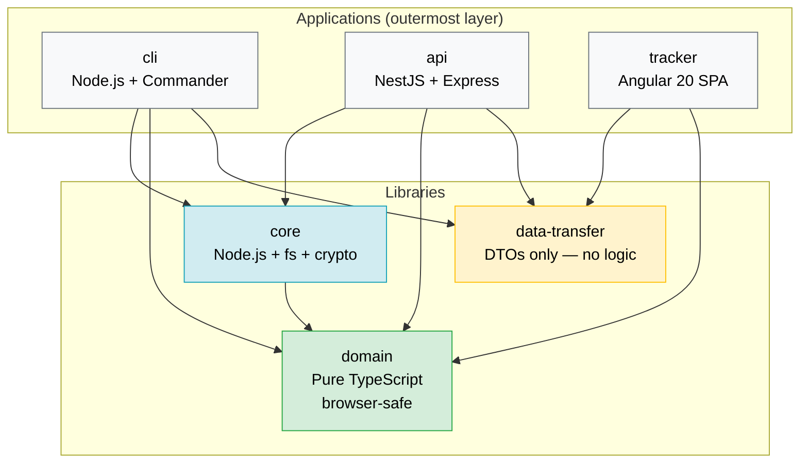

# Monorepo Structure

LingoTracker is an Nx 21.5.3 monorepo containing three applications and three shared libraries. This document covers the directory layout, the unidirectional dependency graph that keeps browser-safe logic isolated from Node.js code, and the Nx workspace configuration highlights that govern how each project is built and tested.

Return to [architecture README](README.md).

---

## Table of Contents

- [Directory Tree](#directory-tree)
- [Dependency Layer Graph](#dependency-layer-graph)
- [Library Responsibilities and Layer Rules](#library-responsibilities-and-layer-rules)
  - [domain — browser-safe pure logic](#domain--browser-safe-pure-logic)
  - [core — Node.js business logic](#core--nodejs-business-logic)
  - [data-transfer — API contract DTOs](#data-transfer--api-contract-dtos)
- [Nx Workspace Configuration Highlights](#nx-workspace-configuration-highlights)
  - [Build targets by project](#build-targets-by-project)
  - [Test runner: Vitest](#test-runner-vitest)
  - [Serve targets](#serve-targets)

---

## Directory Tree

```
lingo-tracker/                         # Nx workspace root
├── apps/
│   ├── cli/                           # Node.js CLI binary (Commander)
│   │   └── src/
│   │       ├── commands/              # One file per CLI command
│   │       └── main.ts                # Entry point; wires Commander tree
│   ├── api/                           # NestJS REST API + static file host
│   │   └── src/
│   │       └── app/
│   │           ├── controllers/       # HTTP route handlers
│   │           ├── mappers/           # Domain model ↔ DTO conversion
│   │           └── services/          # Collection cache, config service
│   └── tracker/                       # Angular 20 SPA (Tracker UI)
│       └── src/
│           ├── app/                   # Routes, feature modules, stores
│           └── i18n/                  # Tracker's own translation resources
│               └── <folder>/          # resource_entries.json + tracker_meta.json
├── libs/
│   ├── domain/                        # Browser-safe pure logic (zero Node.js deps)
│   │   └── src/lib/
│   │       ├── translation-status.ts  # TranslationStatus type
│   │       ├── locale-metadata.ts     # LocaleMetadata interface
│   │       ├── resource-key.ts        # Key validation, resolve, split
│   │       ├── status-helpers.ts      # Checksum-driven status transitions
│   │       ├── icu-to-transloco.ts    # ICU → Transloco syntax conversion
│   │       ├── transloco-to-icu.ts    # Transloco → ICU syntax conversion
│   │       ├── icu-auto-fixer.ts      # ICU quote-escape repair
│   │       ├── icu-classifier.ts      # plain / simple-placeholders / complex-icu
│   │       ├── normalize-transloco-syntax.ts  # {{ x }} → {x} normalizer
│   │       └── validation-utils.ts    # Locale code, key length, conflict checks
│   ├── core/                          # Node.js business logic (file I/O, crypto)
│   │   └── src/
│   │       ├── config/                # LingoTrackerConfig, BundleDefinition, etc.
│   │       ├── collections-manager/   # add-collection, delete-collection, update
│   │       ├── resource/              # add, edit, delete, move resource; checksums
│   │       └── lib/
│   │           ├── bundle/            # Bundle generation, tag filter, hierarchy
│   │           ├── export/            # JSON and XLIFF export pipelines
│   │           ├── import/            # Import pipeline, ICU auto-fix, status determination
│   │           ├── folder/            # create-folder, delete-folder, move-folder
│   │           ├── normalize/         # Cleanup empty folders, normalize entries
│   │           ├── translate/         # Auto-translation, Google Translate provider
│   │           ├── validate/          # Resource validation, summary generation
│   │           ├── file-io/           # JSON read/write, directory operations
│   │           ├── config/            # Config file read/write
│   │           └── errors/            # Typed error classes
│   └── data-transfer/                 # Shared DTOs (no logic)
│       └── src/lib/                   # Request/response shapes for API + CLI + UI
├── sample-translations/               # Example collections used in tests and demos
│   ├── playground/
│   └── mock-design-system/
├── architecture-docs/                 # This documentation hub
├── docs-site/                         # Docusaurus-based published docs site
├── spec/                              # End-to-end / integration test specs
├── nx.json                            # Nx workspace configuration
├── pnpm-workspace.yaml                # pnpm workspace definition
└── .lingo-tracker.json                # Project-level LingoTracker config
```

---

## Dependency Layer Graph

<!-- Unidirectional dependency flow: domain is the innermost layer; apps are the outermost -->



**Arrows point in the direction of the import.** No arrow ever points toward `apps`; no arrow ever points from `domain` to `core`. `data-transfer` has no dependencies on `core` or `domain` — it is a leaf library.

---

## Library Responsibilities and Layer Rules

### domain — browser-safe pure logic

`@simoncodes-ca/domain` is the innermost layer. It contains every piece of logic that must run in both Node.js and the browser:

| Module | What it does |
|---|---|
| `translation-status.ts` | Defines the `TranslationStatus` union type (`'new' \| 'translated' \| 'stale' \| 'verified'`) |
| `locale-metadata.ts` | Defines the `LocaleMetadata` interface (checksum, baseChecksum, status) |
| `resource-key.ts` | Validates, resolves (`resolveResourceKey`), and splits (`splitResolvedKey`) dot-delimited keys |
| `status-helpers.ts` | Pure functions for checksum-driven status transitions (`shouldMarkStale`, `createBaseLocaleMetadata`, etc.) |
| `icu-to-transloco.ts` | Converts ICU `{varName}` to Transloco `{{ varName }}` at bundle time |
| `transloco-to-icu.ts` | Converts Transloco `{{ varName }}` back to ICU `{varName}` at import time |
| `icu-classifier.ts` | Classifies a string as `plain`, `simple-placeholders`, or `complex-icu` |
| `icu-auto-fixer.ts` | Repairs malformed ICU quote escaping |
| `validation-utils.ts` | Locale code format checks, key length limits, hierarchical conflict detection |

**Why zero Node.js dependencies?** The Tracker UI (Angular SPA) imports `@simoncodes-ca/domain` directly in the browser. Any Node.js built-in (`fs`, `path`, `crypto`, `node:*`) would break the Angular build. The zero-dependency constraint is enforced by the Nx project configuration: `domain` declares no Node.js peer dependencies and the dependency graph rules prohibit it from importing `core`.

See [domain-and-data-model.md](domain-and-data-model.md) for the data structures these modules operate on, and [core-library.md](core-library.md) for how `core` extends this logic with file I/O.

---

### core — Node.js business logic

`@simoncodes-ca/core` is the middle layer. It may import `domain` freely but never the reverse. All Node.js built-ins (`node:fs`, `node:path`, `node:crypto`) live here.

Key responsibilities:

- **Resource CRUD**: Reading and writing `resource_entries.json` and `tracker_meta.json` atomically.
- **Checksum calculation**: `calculateChecksum(value)` uses `node:crypto` MD5.
- **Bundle generation**: Aggregating resources across collections, applying tag filters, converting ICU to Transloco syntax, writing locale JSON files.
- **Import/export**: Parsing external XLIFF or JSON, applying ICU auto-fixes, determining translation status on import.
- **Collection management**: Creating and deleting collection entries in `.lingo-tracker.json`.
- **Auto-translation**: Google Translate v2 provider with placeholder protection for ICU variables.
- **Validation**: Per-resource status checks, aggregate validation summaries for CI.

**Why keep this separate from domain?** `core` is never imported by the Tracker UI. Keeping Node.js code out of `domain` means the browser bundle never includes `fs` or `crypto` polyfills.

See [core-library.md](core-library.md) for the full module breakdown.

---

### data-transfer — API contract DTOs

`@simoncodes-ca/data-transfer` is a leaf library: it imports nothing from `core` or `domain`. It contains only TypeScript interfaces and classes that define the shapes of HTTP request bodies, response payloads, and shared view models exchanged between the API, CLI, and Tracker UI.

**Why isolate DTOs in their own library?** API contracts must be stable across all three consumers. Keeping DTOs in a dedicated library with no business logic means:

1. Any consumer can import only the shapes it needs without pulling in Node.js code.
2. Breaking changes to the API surface are localized here and immediately visible to all consumers via TypeScript compilation.
3. The library has no runtime behavior to test, so its `project.json` intentionally has an empty `targets` block.

---

## Nx Workspace Configuration Highlights

### Build targets by project

| Project | Executor | Output |
|---|---|---|
| `cli` | `@nx/esbuild:esbuild` | `dist/apps/cli/` — single bundled CJS file for Node.js |
| `api` | `nx:run-commands` → `webpack-cli build` | `dist/apps/api/` — webpack bundle for NestJS |
| `tracker` | `@angular/build:application` | `dist/apps/tracker/` — Angular production SPA |
| `core` | TypeScript build via `@nx/js/typescript` plugin | Consumed directly from source by dependent apps |
| `domain` | TypeScript build via `@nx/js/typescript` plugin | Consumed directly from source by dependent apps |
| `data-transfer` | No build target (consumed from source) | — |

`core` and `domain` are excluded from the standard `@nx/js/typescript` plugin's build target configuration (the `exclude` list in `nx.json`) and have only `typecheck` enabled through a separate plugin include rule. Apps bundle the library source directly rather than consuming pre-built artifacts.

The `api` build has an explicit `dependsOn: ["^build", "^typecheck"]` which means all library typechecks run before the API bundle is produced.

The `tracker:serve` target has `dependsOn: ["api:serve"]`, so starting the dev server for the Angular UI automatically starts the API process as well.

### Test runner: Vitest

All projects use **Vitest** via the `@nx/vite:test` executor (or `nx:run-commands` wrapping Vitest directly for `cli`). Vitest configuration is co-located with each project. The `@nx/vite/plugin` in `nx.json` registers a `vite:test` target name; projects that need custom options (such as `cli`) override this with an explicit `nx:run-commands` target.

Test output is cached by Nx (`"cache": true` in `targetDefaults.test`), so unchanged projects are skipped on re-runs.

To run a single test file:

```bash
pnpm nx test core --testFile=src/lib/resource/checksum.spec.ts
```

### Serve targets

| Command | What starts |
|---|---|
| `pnpm run serve:cli` | esbuild in watch mode; rebuilds on source change |
| `pnpm run serve:api` | `@nx/js:node` running the webpack output; hot-reloads on rebuild |
| `pnpm run serve:tracker` | Angular dev server on the default port; proxies `/api/*` to the API (via `proxy.conf.json`); starts `api:serve` as a dependency |
