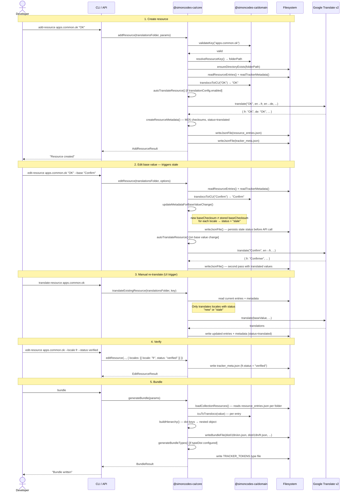
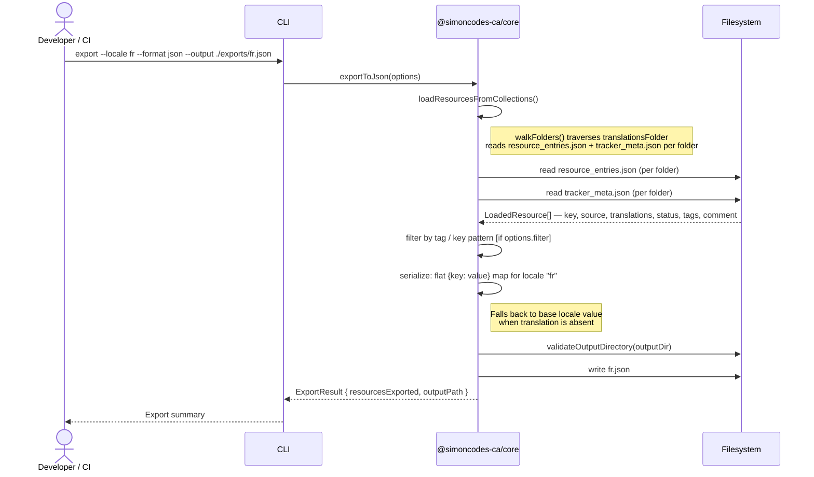
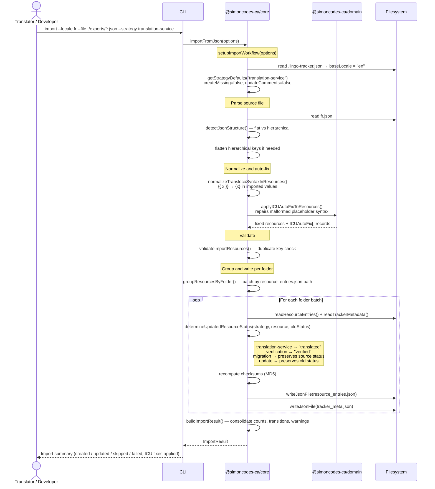
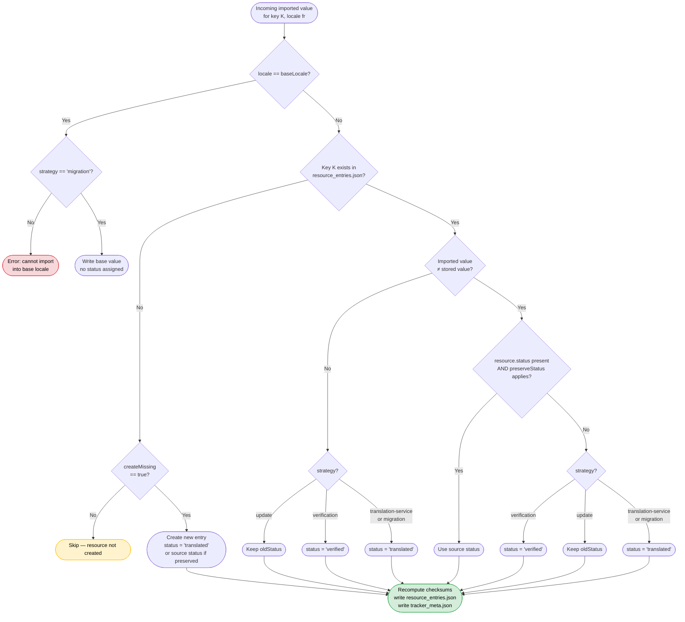
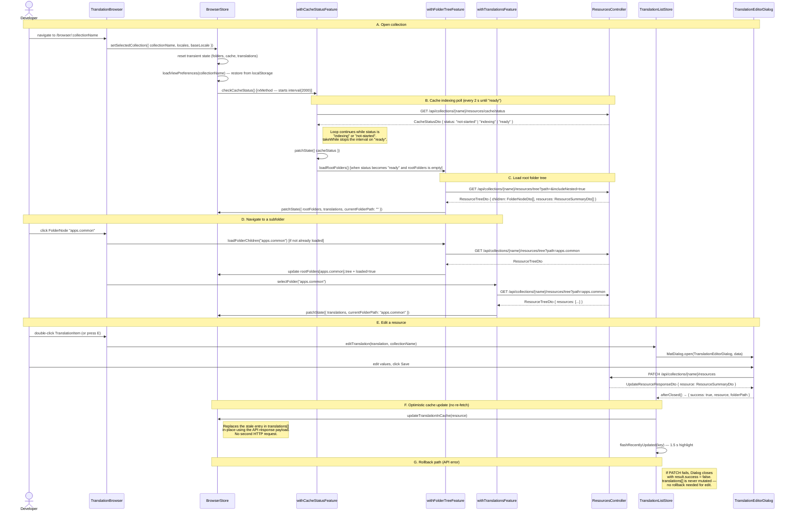
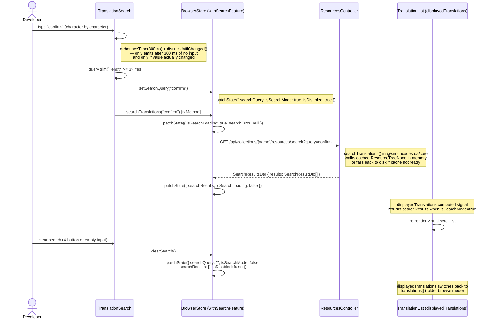
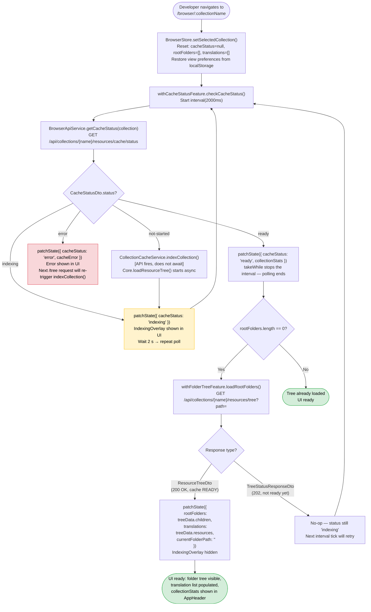

# User Flows

End-to-end sequence diagrams and flowcharts for the six primary user flows in LingoTracker. Each section names the real participants — components, store methods, API controllers, core functions — so the diagrams can be read alongside the code.

Return to [architecture README](README.md).

---

## Table of Contents

- [1. Resource Lifecycle](#1-resource-lifecycle)
- [2. Import / Export Flow](#2-import--export-flow)
  - [Export](#export)
  - [Import](#import)
  - [Import Strategy Decision](#import-strategy-decision)
- [3. Frontend: Browse and Edit](#3-frontend-browse-and-edit)
- [4. Frontend: Search](#4-frontend-search)
- [5. Frontend: Drag-and-Drop Move](#5-frontend-drag-and-drop-move)
- [6. Cache Indexing Flow](#6-cache-indexing-flow)

---

## 1. Resource Lifecycle

The full lifecycle of a [resource](glossary.md#resource-entry) from creation through verification and bundle generation. Each status transition is driven by the [checksum-based staleness mechanism](domain-and-data-model.md#checksum-driven-staleness-detection). The flow ends with `generateBundle()` in [core-library.md — Bundle Generation](core-library.md#bundle-generation).

<!-- Resource lifecycle: create → edit base → auto-translate → stale → re-translate → verify → bundle -->



**Status transitions in this flow:** `new` → `translated` (auto-translate on create) → `stale` (base value change) → `translated` (re-translate) → `verified` (manual approval). See [domain-and-data-model.md — Translation Status Lifecycle](domain-and-data-model.md#translation-status-lifecycle) for the full state diagram.

---

## 2. Import / Export Flow

### Export

Export serializes the current resource tree for one locale to a JSON or XLIFF file for offline translator work. Core functions are documented in [core-library.md — Export Pipeline](core-library.md#export-pipeline).

<!-- Export: filter resources → serialize → write file -->



---

### Import

Import ingests a translated file for one locale and reconciles it with the existing resource tree using the chosen [import strategy](glossary.md#import-strategy). Core functions are documented in [core-library.md — Import Pipeline](core-library.md#import-pipeline).

<!-- Import: parse file → ICU auto-fix → merge per strategy → write files → report status transitions -->



---

### Import Strategy Decision

<!-- Import merge-strategy decision flowchart -->



---

## 3. Frontend: Browse and Edit

Opening a [collection](glossary.md#collection), navigating the folder tree, editing a resource, and the optimistic update / rollback path. Component and store names match [frontend.md — State Management Architecture](frontend.md#state-management-architecture). API endpoints are documented in [api.md — Endpoint Reference](api.md#endpoint-reference).

<!-- Frontend browse-and-edit: collection open → cache poll → folder navigation → edit → optimistic update → confirm / rollback -->



---

## 4. Frontend: Search

Full-text search across a collection via the `TranslationSearch` component, the `withSearchFeature` store method, and the API search endpoint. See [api.md — Endpoint Reference](api.md#endpoint-reference) for the search endpoint and [frontend.md — BrowserStore Feature Breakdown](frontend.md#browserstore-feature-breakdown) for store state details.

<!-- Frontend search: type query → 300 ms debounce → API search → display results -->



**Minimum query length:** 3 characters (enforced in `TranslationSearch` before calling `setSearchQuery`). Queries shorter than 3 characters that are non-empty are silently ignored — only a full clear (empty string) resets search mode.

---

## 5. Frontend: Drag-and-Drop Move

Moving a resource or folder via Angular CDK drag-and-drop, the optimistic update, and the rollback path on API failure. Drag mechanics are described in [frontend.md — Drag-and-Drop](frontend.md#drag-and-drop--move-resource-and-folder); the `moveResource` API endpoint is in [api.md — Endpoint Reference](api.md#endpoint-reference).

<!-- Frontend drag-and-drop: drag resource → drop on folder → optimistic remove → API move → confirm / rollback -->

```mermaid
sequenceDiagram
    actor Dev as Developer
    participant TI as TranslationItem
    participant TB as TranslationBrowser
    participant FN as FolderNode (drop target)
    participant BS as BrowserStore
    participant API as ResourcesController / FoldersController
    participant Cache as CollectionCacheService

    Note over Dev,Cache: A. Drag a resource
    Dev->>TI: dragStart on TranslationItem
    TI->>TB: dragStarted output → activeDragData = { type: "resource", key, folderPath }
    TB->>FN: pass activeDragData as input → FolderNode highlights valid drop targets

    Note over FN,BS: B. Drop on a FolderNode
    Dev->>FN: drop on "apps.navigation" folder
    FN->>BS: moveResource({ sourceKey: "apps.common.ok", destinationFolderPath: "apps.navigation" })

    Note over BS: Check same-folder guard
    BS->>BS: sourceFolderPath == destinationFolderPath? No → proceed

    Note over BS: Optimistic update
    BS->>BS: snapshot currentTranslations[]
    BS->>BS: patchState({ translations: optimisticTranslations })<br/>— resource removed from list immediately
    BS->>BS: patchState({ isDisabled: true })

    BS->>API: POST /api/collections/{name}/resources/move<br/>{ source: "apps.common.ok", destination: "apps.navigation.ok" }
    API->>Cache: clearCache() — wildcard-safe full clear
    Cache-->>API: cache state = NOT_STARTED
    API-->>BS: MoveResourceResponseDto { success: true }

    Note over BS: Success path
    BS->>BS: patchState({ isDisabled: false })
    BS->>BS: notifications.success("Resource moved")
    BS->>BS: loadRootFolders() — refresh sidebar tree
    BS->>BS: selectFolder(currentFolderPath) — reload translation list

    Note over BS: Rollback path (API error)
    alt API call fails
        API-->>BS: HTTP error
        BS->>BS: patchState({ translations: snapshotTranslations })<br/>— restore removed item
        BS->>BS: patchState({ isDisabled: false, error: errorMessage })
        BS->>BS: notifications.error(errorMessage)
    end

    Note over Dev,Cache: C. Drag a folder (abbreviated — same pattern)
    Dev->>FN: dragStart on FolderNode (type: "folder")
    Dev->>FN: drop on destination FolderNode
    FN->>BS: moveFolder({ sourceFolderPath, destinationFolderPath })
    BS->>BS: open ConfirmationDialog (lazy import)
    Dev->>BS: confirm
    BS->>BS: snapshot rootFolders[]
    BS->>BS: patchState({ rootFolders: optimisticFolders })<br/>— source removed immediately from sidebar
    BS->>API: POST /api/collections/{name}/folders/move
    API-->>BS: MoveFolderResponseDto
    BS->>BS: rebaseFolderPaths(sourceNode, destinationFolderPath)<br/>insertFolderIntoTree(rootFolders, rebasedFolder, dest)
    BS->>BS: retry GET /tree for movedFolderPath (up to 5×, 1 s delay)
    Note right of BS: Folder move clears API cache;<br/>retry waits for READY before loading translations.
    alt API call fails
        API-->>BS: HTTP error
        BS->>BS: patchState({ rootFolders: snapshotFolders })<br/>isDisabled=false, isDeletingFolder=false
        BS->>BS: notifications.error(errorMessage)
    end
```

---

## 6. Cache Indexing Flow

The sequence from opening a collection to having a fully populated resource tree in the browser store. This flow is driven by `withCacheStatusFeature.checkCacheStatus` (which polls every 2 seconds using `interval(2000)`) and `CollectionCacheService` on the API. The cache state machine is documented in [api.md — Cache State Machine](api.md#cache-state-machine).

<!-- Cache indexing flowchart: app opens collection → poll cache status → wait for READY → load tree into store -->



**Key timing details:**
- Poll interval: `2000 ms` (hard-coded in `withCacheStatusFeature` via `interval(2000)`)
- The interval uses `takeWhile(..., true)` — the final `"ready"` emission is included before the stream completes, which is what triggers `loadRootFolders()`
- There is no WebSocket or server-sent event. The retry loop is entirely client-driven.
- `CollectionCacheService` holds at most one collection at a time. Switching collections immediately discards the previous collection's tree from memory. See [api.md — Single-Collection Design](api.md#single-collection-design).
