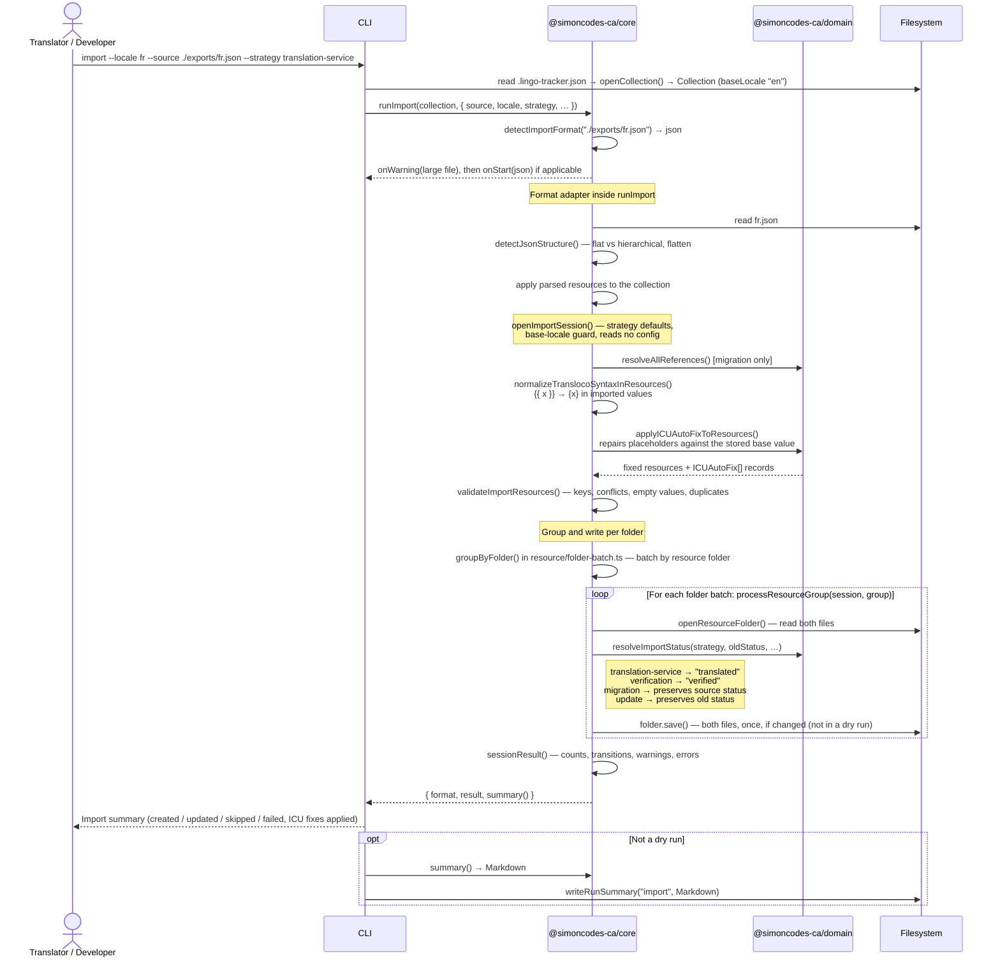
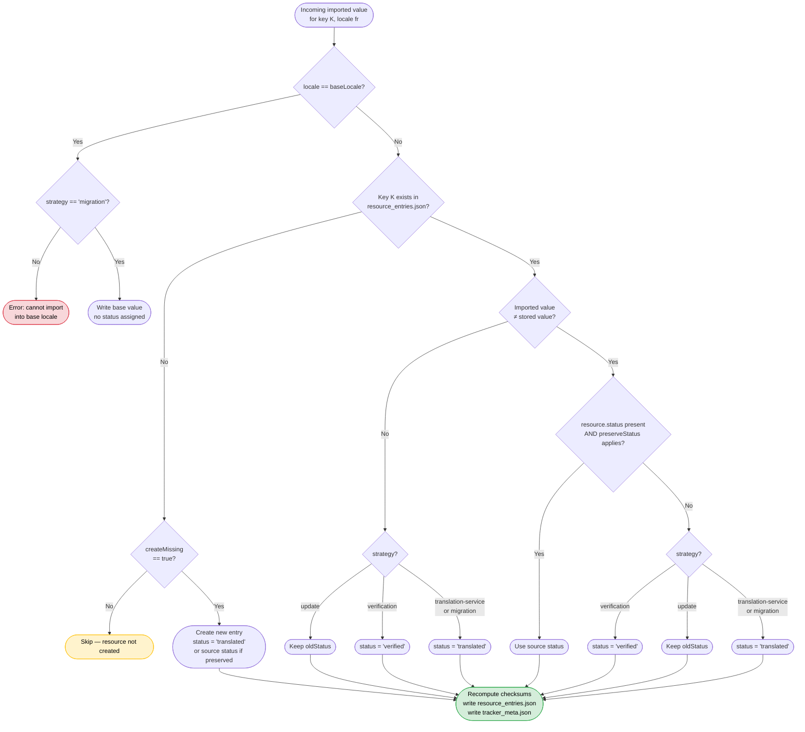
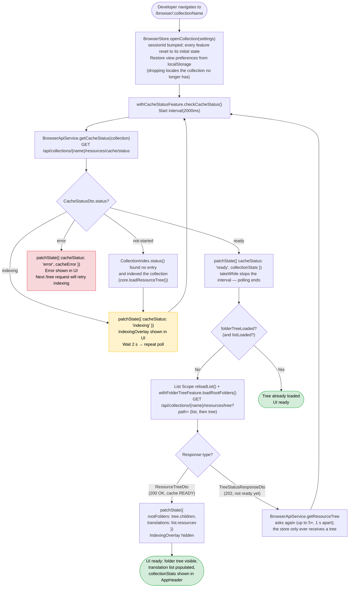

# User Flows

End-to-end sequence diagrams and flowcharts for the six primary user flows in LingoTracker. Each section names the real participants — components, store methods, API controllers, core functions — so the diagrams can be read alongside the code.

Return to [architecture README](README.md).

---

## Table of Contents

- [1. Resource Lifecycle](#1-resource-lifecycle)
- [2. Import / Export Flow](#2-import--export-flow)
  - [Export](#export)
  - [Import](#import)
  - [Import Strategy Decision](#import-strategy-decision)
- [3. Frontend: Browse and Edit](#3-frontend-browse-and-edit)
- [4. Frontend: Search](#4-frontend-search)
- [5. Frontend: Drag-and-Drop Move](#5-frontend-drag-and-drop-move)
- [6. Cache Indexing Flow](#6-cache-indexing-flow)

---

## 1. Resource Lifecycle

The full lifecycle of a [resource](glossary.md#resource-entry) from creation through verification and bundle generation. Each status transition is driven by the [checksum-based staleness mechanism](domain-and-data-model.md#checksum-driven-staleness-detection). The flow ends with `generateBundle()` in [core-library.md — Bundle Generation](core-library.md#bundle-generation).

<!-- Resource lifecycle: create → edit base → auto-translate → stale → re-translate → verify → bundle -->

```mermaid
sequenceDiagram
    actor Dev as Developer
    participant CLI as CLI / API
    participant Core as @simoncodes-ca/core
    participant Domain as @simoncodes-ca/domain
    participant FS as Filesystem
    participant Provider as Google Translate v2

    Note over Dev,FS: 1. Create resource
    Dev->>CLI: add-resource apps.common.ok "OK"
    CLI->>Core: addResource(collection, params)
    Core->>Domain: validateKey("apps.common.ok")
    Domain-->>Core: valid
    Core->>Domain: resolveResourceKey() → folderPath
    Core->>FS: ensureDirectoryExists(folderPath)
    Core->>FS: openResourceFolder(folderPath) — reads resource_entries.json + tracker_meta.json
    Core->>Domain: translocoToICU("OK") → "OK"
    Core->>Core: seedLocales() — auto-translate if collection.translationConfig is enabled, else copy base as new
    Core->>Provider: translate("OK", en→fr, en→de, ...)
    Provider-->>Core: { fr: "OK", de: "OK", ... }
    Core->>Core: ResourceFolder.setBase() + setTranslation() — MD5 checksums, status=translated
    Core->>FS: ResourceFolder.save() — writes resource_entries.json + tracker_meta.json
    Core-->>CLI: AddResourceResult
    CLI-->>Dev: "Resource created"

    Note over Dev,FS: 2. Edit base value — triggers stale
    Dev->>CLI: edit-resource apps.common.ok "OK" --base "Confirm"
    CLI->>Core: editResource(collection, key, changes)
    Core->>FS: openResourceFolder(folderPath) — reads resource_entries.json + tracker_meta.json
    Core->>Domain: translocoToICU("Confirm") → "Confirm"
    Core->>Core: ResourceFolder.setBase() — applies the Staleness rule
    Note right of Core: new baseChecksum ≠ stored baseChecksum<br/>for each locale → status = "stale"
    Core->>Core: ResourceFolder.setTranslation() / setStatus() [explicit locale edits]
    Core->>FS: ResourceFolder.save() — persists stale status before API call
    Core->>Core: seedLocales() [on base value change; auto-translate when enabled]
    Core->>Provider: translate("Confirm", en→fr, ...)
    Provider-->>Core: { fr: "Confirmer", ... }
    Core->>FS: ResourceFolder.setTranslation() + save() — second pass with translated values

    Note over Dev,FS: 3. Manual re-translate (UI trigger)
    Dev->>CLI: translate-resource apps.common.ok
    CLI->>Core: translateExistingResource(collection, key)
    Core->>FS: read current entries + metadata
    Note right of Core: Only translates locales with status<br/>"new" or "stale"
    Core->>Provider: translate(baseValue, ...)
    Provider-->>Core: translations
    Core->>FS: write updated entries + metadata (status=translated)

    Note over Dev,FS: 4. Verify
    Dev->>CLI: edit-resource apps.common.ok --locale fr --status verified
    CLI->>Core: editResource(collection, key, { translations: { fr: { value, status: "verified" } } })
    Core->>FS: write tracker_meta.json (fr.status = "verified")
    Core-->>CLI: EditResourceResult

    Note over Dev,FS: 5. Bundle
    Dev->>CLI: bundle
    CLI->>Core: generateBundle({ ..., cwd })
    Core->>Core: resolveBundleCollections() — open each collection once
    Core->>FS: selectBundleEntries() per locale — readCollection(), once per collection
    Core->>Domain: icuToTransloco(value) — per selected entry
    Core->>Core: buildHierarchy() — dot-keys → nested object
    Core->>FS: writeBundleFile(dist/i18n/en.json, dist/i18n/fr.json, ...)
    Core->>Core: generateBundleTypes(base keys) [if typeDistFile configured]
    Core->>FS: write TRACKER_TOKENS type file
    Core-->>CLI: BundleResult
    CLI-->>Dev: "Bundle written"
```

**Status transitions in this flow:** `new` → `translated` (auto-translate on create) → `stale` (base value change) → `translated` (re-translate) → `verified` (manual approval). See [domain-and-data-model.md — Translation Status Lifecycle](domain-and-data-model.md#translation-status-lifecycle) for the full state diagram.

---

## 2. Import / Export Flow

### Export

Export writes the resources of the chosen collections to one JSON or XLIFF file per target locale, for offline translator work. The CLI opens the collections and calls one core function, `runExport`. Core functions are documented in [core-library.md — Export Pipeline](core-library.md#export-pipeline).

<!-- Export: open collections → runExport (load → filter per locale → serialize) → render → write summary -->

```mermaid
sequenceDiagram
    actor Dev as Developer / CI
    participant CLI as CLI
    participant Core as @simoncodes-ca/core
    participant FS as Filesystem

    Dev->>CLI: export --locale fr --format json --output ./exports
    CLI->>FS: read .lingo-tracker.json → openCollection() per collection
    CLI->>Core: runExport(collections, options + protected terms)
    Core->>Core: validate options; resolve output directory and target locales
    Core-->>CLI: onStart({ outputDirectory, locales }) → print the plan
    Core->>Core: loadResources(collection) for each collection
    Note right of Core: readCollection() (Collection Reader) walks each translationsFolder<br/>and opens every folder through ResourceFolder
    Core->>FS: read resource_entries.json + tracker_meta.json (per folder)
    loop For each target locale
        Core->>Core: filterResources() — collections with this target locale,<br/>status and tag filters, protected-term annotation
        Core->>FS: write fr.json (JSON or XLIFF exporter; skipped in a dry run)
    end
    Core-->>CLI: ExportRunResult { totals, locales, localeResults, summary }
    CLI-->>Dev: Per-locale lines + export summary
    CLI->>FS: write the summary file (printed instead in a dry run)
```

---

### Import

Import ingests a translated file for one locale and reconciles it with the existing resource tree using the chosen [import strategy](glossary.md#import-strategy). The CLI prompts use domain's default strategy and importable-locale rule for their choices; the import session enforces the same rule. `runImport` detects and parses the file, then applies the resources. Core functions are documented in [core-library.md — Import Pipeline](core-library.md#import-pipeline).

<!-- Import: parse file → resolve / normalize / auto-fix → validate → merge per strategy per folder → report -->

```mermaid
sequenceDiagram
    actor Translator as Translator / Developer
    participant CLI as CLI
    participant Core as @simoncodes-ca/core
    participant Domain as @simoncodes-ca/domain
    participant FS as Filesystem

    Translator->>CLI: import --locale fr --source ./exports/fr.json --strategy translation-service
    CLI->>FS: read .lingo-tracker.json → openCollection() → Collection (baseLocale "en")
    CLI->>Core: runImport(collection, { source, locale, strategy, … })
    Core->>Core: detectImportFormat("./exports/fr.json") → json
    Core-->>CLI: onWarning(large file), then onStart(json) if applicable
    Note over Core: Format adapter inside runImport
    Core->>FS: read fr.json
    Core->>Core: detectJsonStructure() — flat vs hierarchical, flatten
    Core->>Core: apply parsed resources to the collection
    Note over Core: openImportSession() — strategy defaults,<br/>base-locale guard, reads no config
    Core->>Domain: resolveAllReferences() [migration only]
    Core->>Core: normalizeTranslocoSyntaxInResources()<br/>{{ x }} → {x} in imported values
    Core->>Domain: applyICUAutoFixToResources()<br/>repairs placeholders against the stored base value
    Domain-->>Core: fixed resources + ICUAutoFix[] records
    Core->>Core: validateImportResources() — keys, conflicts, empty values, duplicates

    Note over Core: Group and write per folder
    Core->>Core: groupByFolder() in resource/folder-batch.ts — batch by resource folder
    loop For each folder batch: processResourceGroup(session, group)
        Core->>FS: openResourceFolder() — read both files
        Core->>Domain: resolveImportStatus(strategy, oldStatus, …)
        Note right of Core: translation-service → "translated"<br/>verification → "verified"<br/>migration → preserves source status<br/>update → preserves old status
        Core->>FS: folder.save() — both files, once, if changed (not in a dry run)
    end

    Core->>Core: sessionResult() — counts, transitions, warnings, errors
    Core-->>CLI: { format, result, summary() }
    CLI-->>Translator: Import summary (created / updated / skipped / failed, ICU fixes applied)
    opt Not a dry run
        CLI->>Core: summary() → Markdown
        CLI->>FS: writeRunSummary("import", Markdown)
    end
```

---

### Import Strategy Decision

<!-- Import merge-strategy decision flowchart -->

```mermaid
flowchart TD
    START([Incoming imported value\nfor key K, locale fr]) --> IS_BASE{"locale == baseLocale?"}

    IS_BASE -- Yes --> IS_MIGRATION{"strategy == 'migration'?"}
    IS_MIGRATION -- No --> REJECT([Error: cannot import\ninto base locale])
    IS_MIGRATION -- Yes --> WRITE_BASE([Write base value\nno status assigned])

    IS_BASE -- No --> EXISTS{"Key K exists in\nresource_entries.json?"}

    EXISTS -- No --> CREATE_ALLOWED{"createMissing\n== true?"}
    CREATE_ALLOWED -- No --> SKIP([Skip — resource not created])
    CREATE_ALLOWED -- Yes --> CREATE_NEW

    EXISTS -- Yes --> VALUE_CHANGED{"Imported value\n≠ stored value?"}

    VALUE_CHANGED -- No --> UNCHANGED_STATUS{"strategy?"}
    UNCHANGED_STATUS -- update --> KEEP_OLD([Keep oldStatus])
    UNCHANGED_STATUS -- verification --> MARK_VERIFIED([status = 'verified'])
    UNCHANGED_STATUS -- translation-service\nor migration --> MARK_TRANSLATED_U([status = 'translated'])

    VALUE_CHANGED -- Yes --> HAS_SOURCE_STATUS{"resource.status present\nAND preserveStatus applies?"}

    HAS_SOURCE_STATUS -- Yes --> USE_SOURCE([Use source status])
    HAS_SOURCE_STATUS -- No --> STRATEGY_STATUS{"strategy?"}

    STRATEGY_STATUS -- verification --> STATUS_VERIFIED([status = 'verified'])
    STRATEGY_STATUS -- update --> STATUS_OLD([Keep oldStatus])
    STRATEGY_STATUS -- translation-service\nor migration --> STATUS_TRANSLATED([status = 'translated'])

    CREATE_NEW([Create new entry\nstatus = 'translated'\nor source status if preserved])

    USE_SOURCE --> WRITE([Recompute checksums\nwrite resource_entries.json\nwrite tracker_meta.json])
    MARK_VERIFIED --> WRITE
    KEEP_OLD --> WRITE
    MARK_TRANSLATED_U --> WRITE
    STATUS_VERIFIED --> WRITE
    STATUS_OLD --> WRITE
    STATUS_TRANSLATED --> WRITE
    CREATE_NEW --> WRITE

    style SKIP fill:#fff3cd,stroke:#ffc107,color:#000
    style REJECT fill:#f8d7da,stroke:#dc3545,color:#000
    style WRITE fill:#d4edda,stroke:#28a745,color:#000
```

---

## 3. Frontend: Browse and Edit

Opening a [collection](glossary.md#collection), navigating the folder tree, editing a resource, and the optimistic update / rollback path. Component and store names match [frontend.md — State Management Architecture](frontend.md#state-management-architecture). API endpoints are documented in [api.md — Endpoint Reference](api.md#endpoint-reference).

<!-- Frontend browse-and-edit: collection open → cache poll → folder navigation → edit → optimistic update → confirm / rollback -->

```mermaid
sequenceDiagram
    actor Dev as Developer
    participant TB as TranslationBrowser
    participant BS as BrowserStore
    participant CS as withCacheStatusFeature
    participant FT as withFolderTreeFeature
    participant TS as withTranslationsFeature
    participant API as ResourcesController
    participant TLS as TranslationListStore
    participant Dialog as TranslationEditorDialog

    Note over Dev,Dialog: A. Open collection
    Dev->>TB: navigate to /browser/:collectionName
    TB->>BS: openCollection(settings) — resolveCollectionSettings(config, name)
    BS->>BS: bump sessionId; reset every feature to its initial state
    BS->>BS: restoreViewPreferences(collectionName) — restore from localStorage,<br/>dropping any saved locale the collection no longer has
    BS->>CS: checkCacheStatus() [rxMethod — starts interval(2000)]

    Note over CS,API: B. Cache indexing poll (every 2 s until "ready")
    CS->>API: GET /api/collections/{name}/resources/cache/status
    API-->>CS: CacheStatusDto { status: "not-started" | "indexing" | "ready" }
    Note right of CS: Loop continues while status is<br/>"indexing" or "not-started".<br/>takeWhile stops the interval on "ready".
    CS->>CS: patchState({ cacheStatus })
    CS->>TS: reloadList() [when status becomes "ready" and no list has loaded yet]
    CS->>FT: loadRootFolders() [when status becomes "ready" and folderTreeLoaded is false]

    Note over FT,API: C. Load the root folder tree and the root list
    TS->>API: GET /api/collections/{name}/resources/tree?path=&includeNested=true
    API-->>TS: ResourceTreeDto { resources: ResourceSummaryDto[] }
    TS->>BS: patchState({ translations, loadedFolderPath: "", shownScope })
    FT->>API: GET /api/collections/{name}/resources/tree?path=&includeNested=false
    API-->>FT: ResourceTreeDto { children: FolderNodeDto[] }
    FT->>BS: patchState({ rootFolders, folderTreeLoaded: true })

    Note over Dev,TS: D. Navigate to a subfolder
    Dev->>TB: click FolderNode "apps.common"
    TB->>FT: loadFolderChildren("apps.common") [if not already loaded]
    FT->>API: GET /api/collections/{name}/resources/tree?path=apps.common
    API-->>FT: ResourceTreeDto
    FT->>BS: update rootFolders[apps.common].tree + loaded=true
    TB->>TS: showFolder("apps.common") [List Scope]
    TS->>BS: patchState({ listScope: folder, currentFolderPath: "apps.common", isListLoading: true })
    TS->>API: GET /api/collections/{name}/resources/tree?path=apps.common
    API-->>TS: ResourceTreeDto { resources: [...] }
    TS->>BS: patchState({ translations, isListLoading: false })

    Note over Dev,Dialog: E. Edit a resource
    Dev->>TB: double-click TranslationItem (or press E)
    TB->>TLS: editTranslation(translation, collectionName)
    TLS->>Dialog: MatDialog.open(TranslationEditorDialog, data) [via TranslationEditorLauncher]
    Dev->>Dialog: edit values, click Save
    Dialog->>Dialog: toUpdateDto(draft, original) [resource-entry-draft.ts]
    Dialog->>BS: updateResource(collectionName, dto) [withEntryWritesFeature]
    BS->>API: PATCH /api/collections/{name}/resources
    API-->>BS: UpdateResourceResponseDto { resource: ResourceSummaryDto }

    Note over BS: F. Cache patch (no re-fetch)
    BS->>BS: patch translations[] and searchResults[] (both by fullKey)
    Note right of BS: Uses the API response payload.<br/>No second HTTP request.
    BS-->>Dialog: response
    Dialog-->>TLS: afterClosed() → { kind: 'saved', fullKey, skippedLocales } [Editor Outcome, read by TranslationEditorLauncher: toast]
    TLS->>TLS: flashRecentlyUpdated(key) — 1.5 s highlight

    Note over BS,Dialog: G. Error path
    Note right of BS: If PATCH fails, the store does not<br/>change the caches. The error reaches<br/>the dialog, which shows it and stays open.<br/>No rollback is needed.
```

---

## 4. Frontend: Search

Full-text search across a collection via the `TranslationSearch` component, the [List Scope](glossary.md#list-scope) (`withListScopeFeature`), and the API search endpoint. See [api.md — Endpoint Reference](api.md#endpoint-reference) for the search endpoint and [frontend.md — BrowserStore Feature Breakdown](frontend.md#browserstore-feature-breakdown) for store state details.

<!-- Frontend search: type query → 300 ms debounce → API search → display results -->

```mermaid
sequenceDiagram
    actor Dev as Developer
    participant TS as TranslationSearch
    participant BS as BrowserStore (withListScopeFeature)
    participant API as ResourcesController
    participant TL as TranslationList (displayedTranslations)

    Dev->>TS: type "confirm" (character by character)
    TS->>TS: #searchSubject.next(query) on each keystroke
    Note right of TS: debounceTime(300ms) + distinctUntilChanged()<br/>— only emits after 300 ms of no input<br/>and only if value actually changed

    TS->>TS: query.trim().length >= 3? Yes
    TS->>BS: showQuery("confirm")
    Note right of BS: patchState({ listScope: { kind: "search", query }, isListLoading: true, listError: null })<br/>isSearchMode, searchQuery, isSearchLoading and isDisabled are derived from it.<br/>The switchMap cancels any list load still in flight.
    BS->>API: GET /api/collections/{name}/resources/search?query=confirm
    Note right of API: CollectionIndex.searchPage() runs Resource Search (text mode)<br/>over the indexed tree (treeResources)<br/>or the disk (readCollection) if not indexed;<br/>every match is ranked, then maxResults applies

    API-->>BS: SearchResultsDto { results: SearchResultDto[] }
    BS->>BS: patchState({ searchResults, isListLoading: false })
    Note right of BS: A failed search is the list's listError<br/>(error view with Retry, which runs the query again).

    Note over TL: displayedTranslations computed signal<br/>returns searchResults when isSearchMode=true
    TL->>TL: re-render virtual scroll list

    Dev->>TS: clear search (X button or empty input)
    TS->>BS: clearSearch()
    BS->>BS: patchState({ listScope: { kind: "folder", path: currentFolderPath } })
    Note over TL: displayedTranslations switches back to translations[]<br/>(no request when they were loaded for that folder;<br/>otherwise the folder is loaded again)
```

**Minimum query length:** 3 characters (enforced in `TranslationSearch` before calling `showQuery`). Queries shorter than 3 characters that are non-empty are silently ignored — only a full clear (empty string) resets search mode.

---

## 5. Frontend: Drag-and-Drop Move

Moving a resource or folder via Angular CDK drag-and-drop, the optimistic update, and the rollback path on API failure. Drag mechanics are described in [frontend.md — Drag-and-Drop](frontend.md#drag-and-drop--move-resource-and-folder); the `moveResource` API endpoint is in [api.md — Endpoint Reference](api.md#endpoint-reference).

<!-- Frontend drag-and-drop: drag resource → drop on folder → optimistic remove → API move → confirm / rollback -->

```mermaid
sequenceDiagram
    actor Dev as Developer
    participant TI as TranslationItem
    participant TB as TranslationBrowser
    participant FN as FolderNode (drop target)
    participant BS as BrowserStore
    participant API as ResourcesController / FoldersController
    participant Core as Core write
    participant Index as CollectionIndex

    Note over Dev,Index: A. Drag a resource
    Dev->>TI: dragStart on TranslationItem
    TI->>TB: dragStarted output → activeDragData = { type: "resource", key, folderPath }
    TB->>FN: pass activeDragData as input → FolderNode highlights valid drop targets

    Note over FN,BS: B. Drop on a FolderNode
    Dev->>FN: drop on "apps.navigation" folder
    FN->>BS: moveResource({ sourceKey: "apps.common.ok", destinationFolderPath: "apps.navigation" })

    Note over BS: Check same-folder guard
    BS->>BS: sourceFolderPath == destinationFolderPath? No → proceed

    Note over BS: Optimistic update
    BS->>BS: snapshot currentTranslations[]
    BS->>BS: patchState({ translations: optimisticTranslations })<br/>— resource removed from list immediately
    BS->>BS: movesInFlight + 1 — isMoving, so isDisabled is true

    BS->>API: POST /api/collections/{name}/resources/move<br/>{ source: "apps.common.ok", destination: "apps.navigation.ok" }
    API->>Core: moveResource(..., { onMutation: index.sink })
    Core->>Index: onMutation(remove at source)
    Core->>Index: onMutation(upsert at destination)
    API-->>BS: MoveResourceResponseDto { success: true }

    Note over BS: Success path
    BS->>BS: notifications.success("Resource moved")
    BS->>BS: loadRootFolders() — refresh sidebar tree (the tree only)
    BS->>BS: reloadList() — the List Scope reloads the folder it shows
    BS->>BS: movesInFlight - 1 — isDisabled is false again

    Note over BS: Rollback path (API error)
    alt API call fails
        API-->>BS: HTTP error
        BS->>BS: patchState({ translations: snapshotTranslations })<br/>— restore removed item
        BS->>BS: patchState({ error: errorMessage }); movesInFlight - 1
        BS->>BS: notifications.error(errorMessage)
    end

    Note over Dev,Index: C. Drag a folder (abbreviated — same pattern)
    Dev->>FN: dragStart on FolderNode (type: "folder")
    Dev->>FN: drop on destination FolderNode
    FN->>BS: moveFolder({ sourceFolderPath, destinationFolderPath })
    BS->>BS: open ConfirmationDialog (lazy import)
    Dev->>BS: confirm
    BS->>BS: snapshot rootFolders[]
    BS->>BS: patchState({ rootFolders: optimisticFolders })<br/>— source removed immediately from sidebar
    BS->>API: POST /api/collections/{name}/folders/move
    API-->>BS: MoveFolderResponseDto
    BS->>BS: rebaseFolderPaths(sourceNode, destinationFolderPath)<br/>insertFolderIntoTree(rootFolders, rebasedFolder, dest)
    BS->>BS: showFolder(movedFolderPath) — the List Scope loads it
    Note right of BS: Folder move clears API cache;<br/>BrowserApiService retries a 202 (up to 5×, 1 s delay)<br/>before handing the tree over. A failure follows<br/>the List Scope's one error rule.
    alt API call fails
        API-->>BS: HTTP error
        BS->>BS: patchState({ rootFolders: snapshotFolders })<br/>isDeletingFolder=false; movesInFlight - 1
        BS->>BS: notifications.error(errorMessage)
    end
```

---

## 6. Cache Indexing Flow

The sequence from opening a collection to having a fully populated resource tree in the browser store. This flow is driven by `withCacheStatusFeature.checkCacheStatus` (which polls every 2 seconds using `interval(2000)`) and the [Collection Index](glossary.md#collection-index) (`CollectionIndex`) on the API. The state machine is documented in [api.md — Index State Machine](api.md#index-state-machine).

<!-- Cache indexing flowchart: app opens collection → poll cache status → wait for READY → load tree into store -->

```mermaid
flowchart TD
    START([Developer navigates to\n/browser/:collectionName]) --> SET_COLLECTION

    SET_COLLECTION["BrowserStore.openCollection(settings)\nsessionId bumped; every feature reset to its initial state\nRestore view preferences from localStorage\n(dropping locales the collection no longer has)"]

    SET_COLLECTION --> POLL_START["withCacheStatusFeature.checkCacheStatus()\nStart interval(2000ms)"]

    POLL_START --> CALL_STATUS["BrowserApiService.getCacheStatus(collection)\nGET /api/collections/{name}/resources/cache/status"]

    CALL_STATUS --> STATUS_CHECK{"CacheStatusDto.status?"}

    STATUS_CHECK -- "not-started" --> TRIGGER_INDEX
    STATUS_CHECK -- "indexing" --> WAIT_LOOP

    TRIGGER_INDEX["CollectionIndex.status() found no entry\nand indexed the collection\n(core.loadResourceTree())"]

    TRIGGER_INDEX --> WAIT_LOOP

    WAIT_LOOP["patchState({ cacheStatus: 'indexing' })\nIndexingOverlay shown in UI\nWait 2 s → repeat poll"]

    WAIT_LOOP --> POLL_START

    STATUS_CHECK -- "error" --> SHOW_ERROR
    SHOW_ERROR["patchState({ cacheStatus: 'error', cacheError })\nError shown in UI\nNext /tree request will retry indexing"]

    STATUS_CHECK -- "ready" --> MARK_READY["patchState({ cacheStatus: 'ready', collectionStats })\ntakeWhile stops the interval — polling ends"]

    MARK_READY --> HAS_FOLDERS{"folderTreeLoaded?\n(and listLoaded?)"}

    HAS_FOLDERS -- No --> LOAD_TREE
    HAS_FOLDERS -- Yes --> DONE_INDEXED([Tree already loaded\nUI ready])

    LOAD_TREE["List Scope reloadList() + withFolderTreeFeature.loadRootFolders()\nGET /api/collections/{name}/resources/tree?path= (list, then tree)"]

    LOAD_TREE --> TREE_RESPONSE{"Response type?"}

    TREE_RESPONSE -- "ResourceTreeDto\n(200 OK, cache READY)" --> POPULATE["patchState({\n  rootFolders: tree.children,\n  translations: list.resources\n})\nIndexingOverlay hidden"]

    TREE_RESPONSE -- "TreeStatusResponseDto\n(202, not ready yet)" --> LOAD_TREE_RETRY["BrowserApiService.getResourceTree\nasks again (up to 5×, 1 s apart);\nthe store only ever receives a tree"]

    LOAD_TREE_RETRY --> POLL_START

    POPULATE --> DONE([UI ready: folder tree visible,\ntranslation list populated,\ncollectionStats shown in AppHeader])

    style SHOW_ERROR fill:#f8d7da,stroke:#dc3545,color:#000
    style DONE fill:#d4edda,stroke:#28a745,color:#000
    style DONE_INDEXED fill:#d4edda,stroke:#28a745,color:#000
    style WAIT_LOOP fill:#fff3cd,stroke:#ffc107,color:#000
```

**Key timing details:**
- Poll interval: `2000 ms` (hard-coded in `withCacheStatusFeature` via `interval(2000)`)
- The interval uses `takeWhile(..., true)` — the final `"ready"` emission is included before the stream completes, which is what triggers the first list load (`reloadList()`) and `loadRootFolders()`
- There is no WebSocket or server-sent event. The retry loop is entirely client-driven.
- `CollectionIndex` holds up to `LINGO_TRACKER_MAX_CACHED_COLLECTIONS` (default 4) collections and evicts the least recently used one. Switching back to a recently opened collection does not re-index it. See [api.md — Bounded Multi-Collection Design](api.md#bounded-multi-collection-design).
