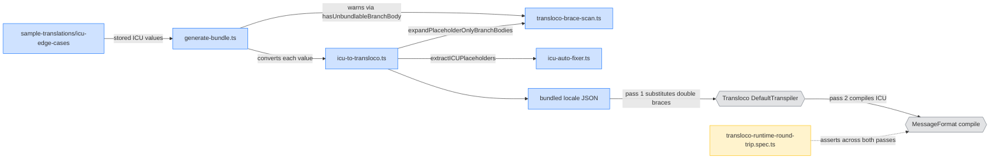

# Emit the branch-body brace pair for a Transloco consumer

## Overview

LingoTracker stores translations in ICU and converts them to Transloco form when `bundle` writes
files for a consuming Angular app. This spec fixes the outbound conversion so that an ICU
`plural` or `select` branch whose body is nothing but an argument survives the
Transloco runtime. It serves the consuming applications that read bundled locale files, and the
translation authors who write these values.

A branch body of that shape reaches the runtime as `=1 {{itemName}}`. Transloco applies its own
`{{…}}` interpolation before handing the message to the ICU compiler, and that first pass consumes
the branch's opening brace along with the argument. The ICU compiler then receives a branch with no
body and rejects the whole message, so nothing renders in any locale. Emitting one extra brace on
each side, `=1 {{{itemName}}}`, leaves the branch wrapper standing and adds no character to the
rendered output.

## Goals

- A branch body that is exactly one argument renders correctly in a Transloco consumer, for
  `plural` and `select`, at any nesting depth.
- The bundle warning fires only on the shape that genuinely cannot be carried, so authors are not
  told to restructure text that now works.
- A test compiles bundled values through both runtime passes, so a future regression in this area
  fails a test rather than reaching a consumer.

## Non-Goals

- Storage format does not change. Values stay in ICU with the single-brace branch body. Only the
  bundled output changes.
- The inbound direction is untouched. `convertTranslocoPlaceholders`, `translocoToICU`, and
  `normalizeTranslocoSyntax` keep the behaviour they have today, including the triple-to-double
  normalize path.
- Affected translation values are not restructured. Authors do not need to move shared text into
  each branch. The encoding change makes the existing values work as written.
- The format-carrying residual stays a warning. A branch body that is an argument with a format,
  `{count, plural, =1 {{n, number}} other {# items}}`, is not rewritten. The emitter's gate excludes
  it, `bundle` warns, and the exit code stays 0.
- `selectordinal` classification is out of scope and tracked in [#69](https://github.com/simoncodes-ca/lingo-tracker/issues/69). Today `parsePlaceholder`
  has no case for it, so the group is labelled `'simple'` and `icuToTransloco` replaces it with
  `{{ rank }}`. That is an independent defect with an independent fix. **This spec must ship first**
  — see Background.
- No new validation rules are added. This spec adds a test harness, not a `validate` rule.

## Background & Decisions

> **What we're building:** A third walker in `transloco-brace-scan.ts` that expands
> placeholder-only branch bodies on the way out, wired into `icuToTransloco`, plus a
> runtime round-trip test.
>
> **For whom:** Consuming Angular applications reading bundled locale files, and the translation
> authors writing these values.
>
> **Key decisions:**
>
> - Triple braces, not space padding. Padding the body to `{ {name}}` also survives both passes,
>   but adds a space to the rendered text. The triple adds nothing. Transloco's interpolation matcher
>   is `/{{([^{}]*?)}}/g` (`resolveMatcher`, `node_modules/@jsverse/transloco/fesm2022/jsverse-transloco.mjs:187-190`);
>   the character class forbids the `{` that follows the first brace, so the matcher cannot start on a
>   run of three. It matches the inner pair only, and the outer brace stays as the branch wrapper.
> - The claim that this shape cannot be carried is corrected here. Commit `c82e2d1` added a bundle
>   warning stating the only fix is authoring the shared text into each branch
>   (`libs/domain/src/lib/transloco-brace-scan.ts:258-291`). That assessment evaluated space padding
>   and did not evaluate the triple. The warning and its doc comment are rewritten in Phase 3.
> - `selectordinal` is split into its own change ([#69](https://github.com/simoncodes-ca/lingo-tracker/issues/69)), and this one lands first. `parsePlaceholder`
>   (`libs/domain/src/lib/icu-auto-fixer.ts:283-296`) has branches for `plural`, `select`, `number`,
>   `date`, and `time` but none for `selectordinal`, so the group is labelled `'simple'` and
>   `icuToTransloco` replaces it with `{{ rank }}`. Order matters. Landing the classification fix
>   alone would emit `one {{itemName}}` unchanged, and that throws at pass 2 — turning a
>   wrong-but-visible value into a blank one. Landing this spec first changes nothing for
>   `selectordinal`, and the classification change then picks up the triple emission for free.
> - The round-trip harness lands before the fix. A string-equality test is what let this shape
>   ship. Phase 1 builds a harness that runs values through both runtime passes and reports the
>   current form as a failure; Phase 2 flips it green. That gives Phase 2 an observable gate rather
>   than an assertion about strings.
> - The harness replicates Transloco's transpile loop rather than `String.replaceAll`.
>   `DefaultTranspiler.transpile` (`jsverse-transloco.mjs:99-115`) runs
>   `while ((m = matcher.exec(parsedValue)) !== null) parsedValue = parsedValue.replace(m[0], fn)` —
>   a fresh `RegExp` per iteration (`interpolationMatcher` at `:92-94` is a getter), so it re-scans
>   the whole string from index 0 after every substitution and replaces the first occurrence of the
>   matched text, not the one `exec` found. A test using `replaceAll` would pass on inputs the real
>   runtime fails.
> - `@messageformat/core` needs an explicit devDependency. Version 3.4.0 is in the pnpm store as a
>   transitive dependency of `@jsverse/transloco-messageformat`, but is not linked at the top level, so
>   a direct import from a test does not resolve.

### Evidence

The behaviour above was measured by running the two passes directly — `@messageformat/core` 3.4.0
plus a replica of `DefaultTranspiler.transpile`'s `exec` and `replace` loop:

| Emitted | After pass 1 | Rendered |
|---|---|---|
| `Cannot delete {itemCount, plural, =1 {{itemName}} other {items}}` | `… =1 Flood Risk other {items}` | throws, `invalid syntax at line 1 col 35` |
| `Cannot delete {itemCount, plural, =1 {{{itemName}}} other {items}}` | `… =1 {Flood Risk} other {items}` | `Cannot delete Flood Risk` |
| `{riskCount, plural, =1 {{nameExists, select, hasName {{name}} other {it}}} other {# risks}}` | branch loses its brace | throws, `invalid syntax at line 1 col 46` |
| `{riskCount, plural, =1 {{nameExists, select, hasName {{{name}}} other {it}}} other {# risks}}` | inner branch keeps its wrapper | `Flood` |
| `{itemCount, plural, =1 {{itemName} contains} other {…}} children` | unchanged by pass 1 | `Flood Risk contains children` |
| `x {c, plural, =1 {{n, number}} other {# items}}` | `x {c, plural, =1  other {# items}}` | throws, `invalid syntax at line 1 col 15` |

The last row is the residual this spec does not rewrite. Its failure mode is a throw, not an empty
substitution — the whole message fails to render, not just that branch.

### Reported scope

A consumer's reporting project reports 27 values across 3 keys affected in all 13 of its locales,
covering both `plural` and `select`. That project is not in this repository, so the figure is
carried as reported rather than verified. The design-system project in this repository has no
affected values today; the exposure there is latent.

---

## Architecture Diagram

Edges show data flow through the pipeline, left to right.



---

## Phase 1: Build the runtime round-trip harness

### Goal

Add a test that runs a bundled value through both Transloco runtime passes and asserts on what
renders. Landing it before the fix gives Phase 2 a real gate: the harness reports the current form
as a failure, and Phase 2 turns it green.

### Acceptance Criteria

- [x] `@messageformat/core` resolves from a domain test.
- [x] A local helper reproduces `DefaultTranspiler.transpile`'s `exec` and `replace` loop, with a
      comment naming `node_modules/@jsverse/transloco/fesm2022/jsverse-transloco.mjs:99-115`.
- [x] The harness takes a stored value, its parameters, and its locale, and returns either the
      rendered string or the compile error.
- [x] `Cannot delete {itemCount, plural, =1 {{itemName}} other {items}}` is reported as failing —
      the ICU compile throws. This expectation is asserted explicitly and is inverted in Phase 2.
- [x] `{deleteCount, plural, =1 {Delete {itemName}} other {Delete # items}}?` renders correctly and
      passes.
- [x] A rendered result is asserted to contain the parameter's **value**, not its name.

### Files to Create/Modify

- `package.json` — add `"@messageformat/core": "3.4.0"` to `devDependencies` *(modify)*
- `libs/domain/src/lib/transloco-runtime-round-trip.testing.ts` — the harness, excluded from the lib
  build so its `@messageformat/core` import stays out of the browser-safe bundle *(create)*
- `libs/domain/src/lib/transloco-runtime-round-trip.spec.ts` — the case table and its first cases *(create)*
- `libs/domain/tsconfig.lib.json` — exclude `src/**/*.testing.ts` *(modify)*

### Implementation Details

- Pin the exact version already in the pnpm store, `3.4.0`, so the direct dependency and the
  transitive one under `@jsverse/transloco-messageformat` resolve to one copy.
- The harness is three steps: `icuToTransloco(stored)`, then the pass 1 replica, then
  `new MessageFormat(locale).compile(result)(params)`.
- Do not use `String.replaceAll` for pass 1. The runtime re-scans the whole string from index 0 after
  every single substitution, and replaces the first occurrence of the matched text rather than the one
  `exec` located, which reaches inputs `replaceAll` does not. Keep the loop shape identical to the
  source and cite it in a comment.
- Pass 1 substitutes an empty string for an unresolved name — that is the runtime's behaviour, and
  the harness must reproduce it rather than throwing or leaving the token in place.
- Compile each value under the locale it is stored for, not a single shared formatter.
- Error behaviour: a compile throw is an expected outcome for some inputs, so the harness catches it
  and returns it as a result rather than letting it escape. Cases assert on either a rendered string
  or a thrown compile error, never on an unhandled exception.
- Structure the cases as a table so Phase 2 and Phase 4 add rows rather than new test bodies.

### Tests

- `libs/domain/src/lib/transloco-runtime-round-trip.spec.ts` — the harness itself plus the two cases
  above. This file is the phase's deliverable and its test.

### Deliverables

- [x] `@messageformat/core` is a resolvable devDependency.
- [x] A round-trip harness exists and demonstrably distinguishes the broken shape from a working one.

---

## Phase 2: Emit the triple at branch-body positions

### Goal

Add the outbound walker that expands a placeholder-only branch body to the triple, and wire it into
`icuToTransloco`, so the affected values render in a Transloco consumer.

### Acceptance Criteria

- [x] `icuToTransloco('Cannot delete {itemCount, plural, =1 {{itemName}} other {items}}')` emits
      `=1 {{{itemName}}}`.
- [x] The same holds for a `select` branch body.
- [x] A qualifying position nested inside another group is rewritten:
      `{riskCount, plural, =1 {{nameExists, select, hasName {{name}} other {it}}} other {# risks}}`
      emits `hasName {{{name}}}`.
- [x] A second qualifying position later in the same value is also rewritten.
- [x] These shapes are returned unchanged: a body that is a placeholder plus text; a body that is
      text plus a placeholder; a body that is a nested group; a body that is an argument carrying a
      format; a `{{` at the top level; a `{{` inside an ICU quoted section.
- [x] `number`, `date`, and `time` groups are returned unchanged.
- [x] Unbalanced input is returned unchanged and the walker does not throw.
- [x] The Phase 1 harness now reports the previously-failing value as rendering correctly, and the
      previously-passing values still render correctly.

### Files to Create/Modify

- `libs/domain/src/lib/transloco-brace-scan.ts` — add `PLACEHOLDER_ONLY_BODY_PATTERN` and
  `expandPlaceholderOnlyBranchBodies` *(modify)*
- `libs/domain/src/lib/icu-to-transloco.ts` — call the walker in the non-simple branch at `:157`, and
  update the module doc comment *(modify)*
- `libs/domain/src/lib/transloco-brace-scan.spec.ts` — a fixture table for the new walker *(modify)*
- `libs/domain/src/lib/icu-to-transloco.spec.ts` — the three real values through the public function *(modify)*
- `libs/domain/src/lib/transloco-runtime-round-trip.spec.ts` — invert the Phase 1 expectation and add
  the `select` value *(modify)*

### Implementation Details

**The walker.** `expandPlaceholderOnlyBranchBodies(value: string): string` is the third walker beside
the two that exist:

| Function | Direction | Role |
|---|---|---|
| `convertTranslocoPlaceholders` | Transloco to ICU | inbound, added by `c82e2d1` |
| `hasUnbundlableBranchBody` | predicate | bundle warning, added by `c82e2d1` |
| `expandPlaceholderOnlyBranchBodies` | ICU to Transloco | outbound, this phase |

It is the predicate's walk (`transloco-brace-scan.ts:292`) with a rewrite in place of the early
`return true`. Reuse `opensSubMessageBody` (`:110`), `SUB_MESSAGE_ARGUMENT_PATTERN` (`:35`),
`isQuoteToggle`, and the existing `OpenBrace` stack (`:46`). Keep the `''` handling and quoted-section
skipping exactly as the predicate has them.

**The gate.** One sticky pattern serves as both the match and the safety gate:

```ts
/** A branch body that is exactly one bare argument: `{{name}}` or `{{ a.b }}`. */
const PLACEHOLDER_ONLY_BODY_PATTERN = /\{\{\s*\w+(?:\.\w+)*\s*\}\}/y;
```

Anchoring on `\{\{` followed by `\s*\w` means it cannot start on a run of three braces, and `\w`
excludes the comma in `{{count, number}}`, so an argument carrying a format is left alone. It is
strictly narrower than the `TRANSLOCO_INTERPOLATION_PATTERN` (`:256`) the predicate uses.

**The rewrite.** At a `{` where the pattern matches and `opensSubMessageBody` returns true:

```ts
result += `{${match[0]}}`;
i = PLACEHOLDER_ONLY_BODY_PATTERN.lastIndex;
```

Do not touch the brace stack across the consumed run. The run is two opens and two closes, so the
stack is unchanged by construction — the branch-body brace it opened is the one its second `}`
closes. State that in a comment; it is the non-obvious part of the walker. Continue scanning past the
run so later qualifying positions are also rewritten.

**Why nesting works.** `extractICUPlaceholders` is flat, so `fullText` for a nested case is the whole
outer group. The walk over `fullText` is what descends into it. No recursion is needed.

**The call site.** The non-simple branch in `icu-to-transloco.ts:157` becomes:

```ts
} else {
  // plural, select, selectordinal, number, date, time — structure passes through, but a
  // branch body that is only an argument needs the extra brace pair so Transloco's
  // interpolation consumes the argument and leaves the branch wrapper standing.
  result += expandPlaceholderOnlyBranchBodies(placeholder.fullText);
}
```

`number`, `date`, and `time` have no branch bodies, so the walker is a no-op on them and no type
check is needed. The module doc comment at `icu-to-transloco.ts:1-21` currently states that complex
constructs are passed through unchanged; correct it.

**Error behaviour.** The walker is total: it never throws and returns the input unchanged when
nothing qualifies. `icuToTransloco`'s existing early return when extraction fails is untouched, so a
malformed value still reaches the bundle as-is.

**No export edit.** `libs/domain/src/index.ts:9` already re-exports the whole module.

### Behaviour table

| Stored | Emitted | Why |
|---|---|---|
| `Cannot delete {itemCount, plural, =1 {{itemName}} other {items}}` | `… =1 {{{itemName}}} …` | placeholder-only branch body |
| `This will delete {nameExists, select, hasName {{name}} other {this item}} …` | `… hasName {{{name}}} …` | same, `select` |
| `{itemCount, plural, =1 {{itemName} contains} other {…}}` | unchanged | placeholder plus text |
| `{deleteCount, plural, =1 {Delete {itemName}} other {…}}?` | unchanged | text plus placeholder |
| `{a, plural, =1 {{b, plural, one {p} other {q}}} other {z}}` | unchanged | body is a nested group |
| `{count, plural, =1 {{n, number}} other {# items}}` | unchanged | argument carries a format, see Phase 3 |
| `Hello {name}` | `Hello {{ name }}` | existing top-level conversion |
| `'{'name'}'` | unchanged by the walker; `{name}` through `icuToTransloco` | quoted section — the walker leaves the quotes standing, `unescapeIcuLiterals` strips them ahead of it |
| extraction fails | unchanged | existing early return |

### Tests

- `libs/domain/src/lib/transloco-brace-scan.spec.ts` — a table for the new walker covering every row
  above, plus unbalanced input and an `offset:N` clause. Build it by mirroring the existing tables
  rather than inventing cases: `CONSUMER_FIXTURES` (`:24-75`) holds the seven real consumer shapes and
  `FIXTURES` (`:77-207`, which spreads `CONSUMER_FIXTURES` at `:169`) enumerates the rest, both with
  `expected` written for the inbound direction. Reuse the `parseICU` / `isPureICU` / `argumentNames` /
  `stripContext` oracle helpers at `:300-368`.
- `libs/domain/src/lib/icu-to-transloco.spec.ts` — the three real values through the public function,
  with the existing `plural` and `select` pass-through cases asserted unchanged.
- `libs/domain/src/lib/transloco-runtime-round-trip.spec.ts` — the Phase 1 case now renders; the
  must-not-touch shapes still render correctly through the same round trip.

### Deliverables

- [x] `expandPlaceholderOnlyBranchBodies` is exported from `@simoncodes-ca/domain`.
- [x] `icuToTransloco` emits the triple at branch-body positions, including nested ones.
- [x] The round-trip harness is green on every shape except the format-carrying residual.

---

## Phase 3: Narrow the bundle warning to the residual shape

### Goal

The emitter now carries every shape the warning fires on except one. Narrow the predicate to that
residual so `bundle` stops telling authors to restructure text that works, and rewrite the warning to
describe the real limitation.

### Acceptance Criteria

- [x] `bundle` emits no branch-body warning for
      `This will delete {nameExists, select, hasName {{name}} other {this item}} and cannot be undone.`
      and its bundled output is the triple.
- [x] `bundle` still warns for `{count, plural, =1 {{n, number}} other {# items}}`.
- [x] `bundle` still warns for `{a, plural, one {{some text}} other {z}}` — the triple does not rescue
      it either, because `some text` is not a resolvable parameter name.
- [x] The warning names the limitation as a branch body that is an argument the emitter cannot
      rewrite, and states that the value will not render.
- [x] The warning fires once per locale, as it does today, and the exit code stays 0.
- [x] `bundle` still emits no warning when ICU-to-Transloco transformation is off.

### Files to Create/Modify

- `libs/domain/src/lib/transloco-brace-scan.ts` — rename `hasPlaceholderOnlyBranchBody` to
  `hasUnbundlableBranchBody`, narrow it, and rewrite its doc comment at `:258-291` *(modify)*
- `libs/core/src/lib/bundle/generate-bundle.ts` — new warning message at `:257-263` *(modify)*
- `libs/core/src/lib/bundle/generate-bundle.spec.ts` — retarget the block at `:981` *(modify)*
- `libs/domain/src/lib/transloco-brace-scan.spec.ts` — re-label `DETECTOR_FIXTURES` (`:208-299`) *(modify)*

### Implementation Details

- The narrowed condition is exactly "a branch body the emitter cannot rewrite": the position test
  passes, `TRANSLOCO_INTERPOLATION_PATTERN` matches, and `PLACEHOLDER_ONLY_BODY_PATTERN` does not.
- Rewrite the doc comment rather than editing around it. It must describe the triple as the encoding,
  name space padding as the rejected alternative and why, and scope the predicate to the
  format-carrying residual. Drop the claim that the only fix is authoring the shared text into each
  branch.
- The warning text must say the value fails to render, not that the argument substitutes empty. Pass 1
  does substitute empty, and the resulting branch-less message is then rejected by the ICU compiler, so
  the whole message is lost — the residual's observed failure is a compile throw.
- `DETECTOR_FIXTURES` re-labelling: the four bare-identifier rows currently `flagged: true` become
  `flagged: false`. `'{a, plural, one {{some text}} other {z}}'` stays `flagged: true` and joins
  `{{count, number}}` as the second residual.
- `FIXTURES` and `DETECTOR_FIXTURES` have no `{{count, number}}` case at all. Add it to both.
- Rename call sites rather than keeping an alias export — `hasPlaceholderOnlyBranchBody` has one
  consumer, `generate-bundle.ts:257`.
- Run the `audience-pass` skill over the rewritten doc comment and warning text before committing.

### Tests

- `libs/core/src/lib/bundle/generate-bundle.spec.ts` — the block at `:981` currently asserts the
  warning fires on `UNBUNDLABLE_VALUE`, the `select` value that is now bundled correctly. Retarget it:
  `UNBUNDLABLE_VALUE` becomes the format-carrying shape; the old value moves into `SAFE_VALUES` and
  gains an assertion that its bundled output is the triple. Keep the once-per-locale,
  transformation-off, and file-generated cases.
- `libs/domain/src/lib/transloco-brace-scan.spec.ts` — `DETECTOR_FIXTURES` re-labelled and extended,
  driving the existing flagged and not-flagged loops at `:437` and `:443`.

### Deliverables

- [x] `hasUnbundlableBranchBody` reports only the format-carrying residual and the
      non-parameter-name case.
- [x] The `bundle` warning describes the real limitation and its real consequence.

---

## Phase 4: Close the fixture gaps

### Goal

Extend the `icu-edge-cases` collection so the shapes this spec turns on, and the one it deliberately
leaves warning, are pinned by real stored data bundled end to end — not only by in-spec tables.

### Acceptance Criteria

- [x] A value whose branch body is an argument carrying a format exists in the fixture collection and
      raises the Phase 3 warning.
- [x] `errors.restrictedChildren` carries a `ja` value whose `=1` branch body is the bare placeholder
      while its `source` keeps placeholder-plus-text, so the two shapes sit under one key and a rule
      keyed on the key rather than the position would fail.
- [x] `icuEdgeCases` includes `ja`, and bundling the collection produces a `ja` file.
- [x] `normalize` over the fixture collection reports `valuesConverted: 0`.
- [x] A test bundles the fixture collection and runs the Phase 1 harness over every emitted value,
      under the locale that value was bundled for.
- [x] Every added value carries a `comment` naming the shape it pins.

### Files to Create/Modify

- `.lingo-tracker.json` — `icuEdgeCases.locales` becomes `["en", "fr-ca", "ja"]` *(modify)*
- `sample-translations/icu-edge-cases/status/resource_entries.json` — add the format-carrying
  value *(modify)*
- `sample-translations/icu-edge-cases/status/tracker_meta.json` — matching metadata *(modify)*
- `sample-translations/icu-edge-cases/errors/resource_entries.json` — add the `ja` value on
  `restrictedChildren` *(modify)*
- `sample-translations/icu-edge-cases/errors/tracker_meta.json` — matching metadata *(modify)*
- `sample-translations/icu-edge-cases/dialogs/resource_entries.json` — the `ja` values `normalize`
  seeds *(modify)*
- `sample-translations/icu-edge-cases/dialogs/tracker_meta.json` — matching metadata *(modify)*
- `sample-translations/icu-edge-cases/maps/resource_entries.json` — the `ja` value on
  `unmatchedFeatures` *(modify)*
- `sample-translations/icu-edge-cases/maps/tracker_meta.json` — matching metadata *(modify)*
- `libs/core/src/lib/bundle/generate-bundle.spec.ts` — the end-to-end round-trip test over the
  bundled collection *(modify)*

### Implementation Details

**Audit before adding.** Most of the coverage this spec needs already exists — seven values across
four namespaces, each with a `comment` naming its shape:

| Value | Shape | Role here |
|---|---|---|
| `dialogs.deleteConfirm` | `select`, `hasName {{name}}` | must become the triple |
| `errors.cannotDelete` | `plural`, `=1 {{itemName}}` | must become the triple |
| `errors.restrictedChildren` | `=1 {{itemName} contains}` | must stay unchanged |
| `dialogs.deleteCountConfirm` | `=1 {Delete {itemName}}` | must stay unchanged |
| `dialogs.deleteAssociations`, `maps.unmatchedFeatures`, `status.activeItemCount` | top-level arguments beside groups | must stay unchanged |

Both failure shapes are already present, so no new namespace is needed and no existing value should
be edited except to add the `ja` entry.

**The `ja` discriminator.** `cannotDelete` and `restrictedChildren` carry the two shapes as separate
keys, so a rule keyed on the key rather than the position would still pass. Putting both shapes under
`errors.restrictedChildren` closes that:

```
source  {itemCount, plural, =1 {{itemName} contains} other {Selected items contain}} children …
        placeholder plus text, must stay unchanged
ja      {itemCount, plural, =1 {{itemName}} other {選択したアイテム}}に、…
        placeholder alone, must become the triple
```

Use the exact selector `=1` in the `ja` value, matching the `source`.

**Metadata.** Do not hand-edit `tracker_meta.json` checksums. Add and edit the values through the CLI
(`add-resource`, `edit-resource`) so `baseChecksum`, `checksum`, and status are computed the same way
the rest of the collection's metadata was.

**Adding `ja` to the collection** backfills it everywhere. `ensureLocaleEntryExists` writes the base
value into every key that has no entry for the new locale, at status `new`, so each fixture key gains
a `ja` copy of its `source` rather than staying absent.

A seeded copy is valid ICU, but not necessarily valid ICU *for the target locale*. A `plural` group
names the categories the locale defines, and the set differs per locale: `@messageformat/core`
defaults to `strictPluralKeys`, and Japanese has only `other`. So a `source` that selects on
`one`/`other` compiles under `en` and throws under `ja`. Any key whose seeded `ja` copy would throw
needs a hand translation using the categories `ja` defines.

**Error behaviour.** The end-to-end test asserts that bundling the collection exits 0 and produces
one file per locale. The format-carrying value must raise its warning without failing the bundle.

### Tests

- `libs/core/src/lib/bundle/generate-bundle.spec.ts` — bundles the `icuEdgeCases` collection, then
  runs every emitted value through the Phase 1 harness under its own locale. Asserts that only the
  format-carrying value is reported as unrenderable, and that it is the only value that warned.

### Deliverables

- [x] The fixture collection covers the format-carrying residual and both shapes under one key
      across locales.
- [x] A single test proves the bundled output of the whole collection reaches a Transloco runtime
      intact.

---

## Verification

```bash
pnpm nx test domain --testFile=src/lib/transloco-brace-scan.spec.ts
pnpm nx test domain --testFile=src/lib/icu-to-transloco.spec.ts
pnpm nx test domain --testFile=src/lib/transloco-runtime-round-trip.spec.ts
pnpm nx test core --testFile=src/lib/bundle/generate-bundle.spec.ts
```

Regression checks — `c82e2d1`'s inbound behaviour and the triple-to-double normalize path
(`transloco-brace-scan.spec.ts:47` and `:172`) must not move:

```bash
pnpm nx test domain --testFile=src/lib/normalize-transloco-syntax.spec.ts
pnpm nx test domain --testFile=src/lib/transloco-to-icu.spec.ts
```

End to end against the fixtures:

```bash
pnpm nx run cli:build
node dist/apps/cli/main.js normalize    # expect valuesConverted: 0
node dist/apps/cli/main.js bundle       # expect exit 0, warning only on the format-carrying value
```

Then grep the generated bundle for `{{{` and confirm every hit sits at a branch-body position.

## Commit and release

```
fix(domain): emit the branch-body brace pair for a Transloco consumer
```

The body states: the shape affected; that both `plural` and `select` are affected; the correction to
the `c82e2d1` claim that the shape cannot be carried; and that storage form is unchanged.

Patch release on top of whatever carries `c82e2d1`. Release notes must say a consumer needs **both**
changes: taking the normalize fix alone converges these values to the double and leaves the bundler
emitting a form the runtime cannot render, turning a latent break into a live one.
